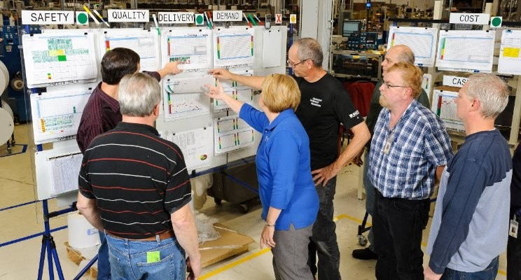

# El análisis de datos de producción en el entorno industrial.

<<<<<<< HEAD
{.column-page-inset-right}

::: callout-note
#### Objetivos de aprendizaje

Al terminar este capítulo, el alumno debe ser capaz de:

-   Explicar qué es el método científico y por qué es la base del trabajo técnico riguroso en la industria.
-   Describir el concepto de variabilidad y distinguir entre variación normal y variación que indica un problema real en un proceso.
-   Enunciar los tres principios del pensamiento estadístico y aplicarlos al análisis de situaciones industriales concretas.
-   Identificar y diferenciar los tres tipos de estudio según el origen de los datos —retrospectivo, observacional y experimental— y reconocer las ventajas y limitaciones de cada uno.
-   Valorar la calidad de los datos como condición previa a cualquier análisis, y reconocer las principales fuentes de error en los datos históricos.

Los conceptos clave introducidos en este capítulo son: **variabilidad**, **pensamiento estadístico**, **método científico**, **ciclo PDCA**, **datos estructurados y no estructurados**, **estudio retrospectivo**, **estudio observacional**, **experimento diseñado**, y **calidad de los datos**.
:::

## El método científico y la variabilidad

En el trabajo industrial, los problemas rara vez tienen una causa única ni una solución inmediata. La forma más eficaz de abordarlos es mediante el **método científico**: observar lo que está ocurriendo, formular una hipótesis sobre sus causas, diseñar pruebas para verificarla, analizar los resultados y extraer conclusiones. Este ciclo —observación, hipótesis, experimentación, conclusión— no es exclusivo de la investigación académica; es el fundamento del trabajo técnico riguroso en cualquier industria.

Lo que hace útil al método científico en el entorno industrial es que obliga a basar las decisiones en datos reales y no en intuiciones o en la experiencia acumulada de forma no sistemática. La experiencia es valiosa, pero puede engañar: un proceso que "siempre ha funcionado así" puede estar ocultando problemas que solo se hacen visibles cuando se analizan los datos con rigor.

El concepto central que conecta el método científico con el análisis de datos industriales es la **variabilidad**. En cualquier proceso industrial, las sucesivas observaciones de una misma variable no dan exactamente el mismo resultado: el peso de una pieza varía ligeramente de una unidad a otra, el pH de una cuba no es idéntico en cada fabricación, el rendimiento quesero fluctúa de un día a otro. Esta variación no es un fallo ni una anomalía: es inherente a cualquier proceso real. Lo importante es saber distinguir cuándo la variación es normal —es decir, atribuible a causas comunes y aleatorias— y cuándo indica un problema real que requiere intervención.

::: callout-important
El objetivo principal de la **mejora industrial** es la **reducción de la variabilidad**.
:::

La estadística proporciona las herramientas para analizar esa variabilidad: identificar sus fuentes, cuantificar su magnitud, determinar qué factores tienen mayor impacto y decidir sobre cuáles actuar. Pero las herramientas estadísticas solo tienen sentido dentro de un contexto: los datos son números dentro de un proceso, y para interpretarlos correctamente es imprescindible el conocimiento tecnológico de ese proceso. En un análisis de la producción de un queso, los valores de pH, temperatura o humedad significan poco sin comprender cómo interactúan en la fabricación; la estadística describe, pero es el conocimiento del proceso el que explica.

## El pensamiento estadístico como filosofía de trabajo

El pensamiento estadístico va más allá del uso de herramientas concretas: es una forma de entender y abordar los procesos industriales. Se apoya en tres principios fundamentales:

-   Todo proceso industrial está compuesto por procesos interconectados.
-   La variabilidad existe y es inherente a esos procesos.
-   Entender y reducir la variabilidad es la clave de la mejora y el éxito.

Aplicar estos principios en el trabajo diario significa tomar decisiones basadas en datos en lugar de en suposiciones, cuantificar la incertidumbre en lugar de ignorarla, y comunicar los resultados de forma clara y fundamentada. No se trata de aplicar fórmulas mecánicamente, sino de desarrollar un juicio analítico que permita distinguir lo relevante de lo accesorio, y la causa real del efecto aparente.

En la práctica, el pensamiento estadístico se materializa en ciclos de mejora continua: cada análisis genera conocimiento sobre el proceso, ese conocimiento orienta las acciones de mejora, y los resultados de esas acciones se convierten en nuevos datos que realimentan el ciclo. Las metodologías más extendidas en la industria alimentaria —*Lean Manufacturing*, *Six Sigma*— están construidas sobre este principio: la mejora no es un evento puntual sino un proceso continuo de aprendizaje organizacional basado en evidencia.

::: callout-important
#### El pensamiento estadístico en la toma de decisiones industriales

En el entorno industrial, el pensamiento estadístico es esencial para:

-   **Tomar decisiones basadas en datos**, evitando conclusiones basadas en intuiciones o suposiciones.

-   **Evaluar riesgos**, cuantificando la incertidumbre y permitiendo tomar decisiones que los minimicen.

-   **Mejorar el conocimiento de los procesos** para una toma de decisiones más eficaz.

-   **Comunicar resultados** de manera clara, precisa y verificable.
=======
{.column-page-inset-right}

## Introducción

¿Alguna vez te has preguntado cómo podemos resolver problemas en el trabajo de forma sistemática y ordenada? La estadística y el método científico nos ayudan a hacerlo, y son más sencillos de lo que parece.

El método científico es como una receta que seguimos para resolver problemas: primero observamos qué está pasando, luego pensamos qué puede estar causando el problema, después hacemos pruebas para comprobarlo, y finalmente sacamos conclusiones y tomamos acciones orientadas a eliminar el problema o conseguir una mejora, aunque sea parcial, y repetimos el ciclo. La estadística nos ayuda a entender si nuestras pruebas funcionaron o no, usando números y datos reales.

Pensar de forma estadística significa entender que todo lo que hacemos en el trabajo está conectado, y que es normal que las cosas cambien o varíen un poco. Lo importante es saber cuándo estos cambios son normales y cuándo indican un problema real. Es como cuando cocinamos: sabemos que cada plato puede salir un poco diferente, pero reconocemos cuando algo ha salido realmente mal.

En las fábricas y talleres, estas herramientas son muy útiles. Por ejemplo, si una máquina empieza a producir piezas defectuosas, podemos:

1.  Observar qué está pasando
2.  Pensar en posibles causas
3.  Hacer pruebas controladas para encontrar el problema
4.  Usar números y datos para confirmar si lo hemos solucionado

La experimentación es muy importante en la industria. En vez de cambiar las cosas al azar, hacemos pruebas organizadas para ver qué funciona mejor. Es como cuando ajustas la temperatura del horno y el tiempo de cocción para que un pastel salga perfecto: pruebas diferentes combinaciones y anotas los resultados.

Lo mejor de todo es que cada vez que hacemos estos experimentos, aprendemos algo nuevo. Incluso si algo no funciona como esperábamos, esa información nos ayuda a mejorar la próxima vez. Es un proceso continuo de aprendizaje y mejora.

Esta forma de trabajar nos ayuda a:

-   Resolver problemas de forma ordenada
-   Tomar mejores decisiones basadas en datos reales
-   Mejorar la calidad de nuestro trabajo
-   Ahorrar tiempo y dinero evitando errores

Recuerda: no necesitas ser un genio de las matemáticas para usar estas herramientas. Lo importante es ser organizado, observar bien lo que pasa y anotar los resultados de lo que hacemos. Así, poco a poco, podemos mejorar nuestro trabajo y resolver problemas de forma más eficiente.

Los métodos estadísticos nos ayudan a describir y comprender la **variabilidad**. Cuando hablamos de variabilidad queremos decir que sucesivas observaciones de un mismo proceso o sistema no dan exactamente los mismos resultados. Por ejemplo, el consumo de gasolina de un coche no es siempre igual, sino que varía de manera considerable. Esta variación depende de muchos factores, como la forma de conducir, el tipo de carretera, la situación del propio vehículo (presión de neumáticos, compresión del motor, ...), la marca de la gasolina, el octanaje, o incluso las condiciones meteorológicas. Todos estos factores son causas de **variabilidad** en el consumo de gasolina. La estadística nos permite analizar estos **factores** y determinar cuáles son los más importantes o tienen mayor impacto en el consumo; una vez conocidos, podemos actuar sobre ellos.

En este libro aprenderemos a utilizar herramientas diversas, tanto estadísticas como de la ciencia de datos, para realizar nuestro análisis. Para aprender de los datos necesitamos más que los simples números; para interpretarlos necesitaremos siempre el conocimiento del proceso industrial que estamos analizando.En un análisis de la producción de un producto lácteo, por ejemplo, los números significan poco sin un conocimiento del proceso; los valores de pH, temperatura o concentración de lactosa influyen en el resultado del proceso de forma diferente. Los datos son números dentro de un contexto, y necesitamos conocer este contexto para dar sentido a los números.

::: {.callout-important .content-visible when-format="html"}
El objetivo principal de la **mejora industrial** es la **reducción de la variabilidad**.
:::

## El pensamiento estadístico y el método científico.

La estadística y el método científico mantienen una relación fundamental que impulsa el avance del conocimiento y la innovación. El método científico, con sus pasos de observación, hipótesis, experimentación y conclusiones, encuentra en la estadística las herramientas necesarias para validar o refutar hipótesis de manera objetiva y cuantificable.

El pensamiento estadístico es una filosofía de aprendizaje y acción basada en tres principios fundamentales:

-   que todo proceso industrial está compuesto a su vez por procesos interconectados,
-   que la variabilidad existe y es inherente a estos procesos, y
-   que entender y reducir la variación es clave para la mejora y el éxito

En el entorno industrial, esta integración entre estadística y método científico ha revolucionado los procesos de mejora continua. Por ejemplo, cuando una línea de producción enfrenta problemas de calidad, el método científico guía la investigación sistemática: se observa el proceso, se formulan hipótesis sobre las causas del problema, se diseñan experimentos controlados, y se analizan los resultados estadísticamente para determinar la validez de las soluciones propuestas.

La experimentación industrial, particularmente a través del diseño de experimentos (DOE), se ha convertido en una herramienta fundamental para la mejora continua. En lugar de modificar procesos basándose en intuiciones o experiencias pasadas, las empresas pueden realizar experimentos controlados que:

-   Optimizan múltiples variables simultáneamente
-   Identifican interacciones entre factores que afectan el proceso
-   Reducen el tiempo y costo de las mejoras
-   Proporcionan conclusiones respaldadas por evidencia estadística

Al realizar experimentos controlados, las empresas pueden probar hipótesis que permitan evaluar el impacto de diferentes variables en los procesos y productos y determinar los valores óptimos de los parámetros de los procesos para maximizar la calidad y la eficiencia. Esto genera conocimiento valioso sobre los procesos y productos, permite tomar decisiones más informadas, y ayuda a crear y mantener una ventaja competitiva.

La experimentación, combinada con el análisis estadístico, permite a las empresas implementar ciclos de mejora continua, donde los resultados de cada experimento se utilizan para refinar los procesos y productos.

Al integrar el pensamiento estadístico con el método científico en el entorno industrial, las organizaciones pueden desarrollar una cultura de mejora continua basada en la evidencia de los datos y no en suposiciones o intuiciones. En una cultura industrial basada en el método científico, cada problema es una oportunidad para experimentar, aprender y optimizar. Esta aproximación sistemática no solo mejora la calidad y eficiencia de los procesos, sino que también fomenta la innovación y el aprendizaje organizacional continuo.

La clave del éxito radica en entender que la experimentación no es un evento aislado, sino un proceso continuo de aprendizaje y mejora. Cada experimento, exitoso o no, aporta información valiosa que, analizada correctamente mediante métodos estadísticos, contribuye al conocimiento colectivo de la organización y sienta las bases para futuras mejoras. La estadística y el método científico no solo son pilares fundamentales para la investigación académica, sino que también desempeñan un papel crucial en el entorno industrial. La aplicación sistemática del método científico, respaldada por herramientas estadísticas, permite a las empresas optimizar procesos, mejorar la calidad de sus productos y servicios, y fomentar la innovación.

::: {.callout-important .content-visible when-format="html"}
## El pensamiento estadístico en la toma de decisiones industriales

En el entorno industrial, el pensamiento estadístico es esencial para:

-   **Tomar decisiones basadas en datos,** evitando decisiones basadas en intuiciones o suposiciones.
-   **Evaluar riesgos,** cuantificando la incertidumbre y permitiendo tomar decisiones que minimicen los riesgos.
-   **Mejorar el conocimiento** de los procesos para una toma de decisiones más eficaz.\
-   **Comunicar resultados,** presentando los resultados de los análisis de manera clara y concisa.

La integración del método científico y el pensamiento estadístico en la cultura empresarial impulsa la innovación, la eficiencia y la competitividad.
>>>>>>> 508126e9fb31336481e7210747cee01fbc3147da
:::

## Los datos industriales

<<<<<<< HEAD
En el entorno industrial los datos pueden clasificarse atendiendo a dos criterios: su estructura y su origen.

### Clasificación según la estructura

**Datos estructurados** son los organizados en un formato definido —tablas, hojas de cálculo, archivos CSV— que facilita su análisis y consulta. Son los más habituales en el control de producción: lecturas de sensores, registros de fabricación, datos de control de calidad, información de inventario.

**Datos no estructurados** no tienen un formato predefinido: textos, imágenes, audio, vídeo. Su análisis requiere técnicas más avanzadas, como el procesamiento de lenguaje natural o la visión artificial. En el entorno industrial aparecen como registros de mantenimiento, informes de incidentes, imágenes de inspección visual o grabaciones de maquinaria.

**Datos semiestructurados** tienen cierta organización pero con mayor flexibilidad que los estructurados. Los archivos XML o JSON y los registros de eventos son ejemplos habituales.

En el contexto de la Industria 4.0, la cantidad y variedad de datos industriales crece de forma exponencial, con una incorporación creciente de datos no estructurados procedentes de sensores, cámaras y sistemas conectados.

### Clasificación según el origen

La forma en que se obtienen los datos determina en gran medida qué tipo de conclusiones pueden extraerse de ellos. Esta distinción es fundamental para interpretar correctamente cualquier análisis.

#### Estudios retrospectivos o históricos

Un **estudio retrospectivo** utiliza datos recogidos en el pasado durante un período determinado. Su objetivo puede ser investigar relaciones entre variables, explorar la calidad de la información disponible, construir un modelo que describa el proceso tal como es actualmente, o detectar si el proceso se ha desviado de su comportamiento habitual. Los modelos construidos a partir de datos históricos se denominan **modelos empíricos**, porque se basan en los propios datos del proceso y no en una formulación teórica.

La principal ventaja de los estudios retrospectivos es la disponibilidad inmediata de una gran cantidad de datos ya recogidos. Sin embargo, presentan limitaciones importantes que conviene tener presentes:

-   Puede ser imposible determinar si las condiciones en que se obtuvieron los datos históricos son comparables con la situación actual del proceso.
-   Es frecuente que falten variables clave que no se recogieron en su momento, o que se recogieran de forma defectuosa.
-   La fiabilidad y validez de los datos históricos no siempre puede verificarse, especialmente si provienen de fuentes diversas o de períodos con procedimientos de registro diferentes.
-   Las notas explicativas sobre valores anómalos suelen ser insuficientes o inexistentes, y los recuerdos de quienes participaron en esos procesos se pierden o distorsionan con el tiempo.
-   Los datos históricos se recogieron con una finalidad determinada, y pueden no ser adecuados para los objetivos del análisis actual.

Por estas razones, los estudios retrospectivos suelen requerir una fase previa de preparación y depuración de datos que puede ser larga y laboriosa. Se estima que en muchos proyectos de análisis de datos, esta fase puede ocupar hasta el 60 % del tiempo total. Las herramientas de análisis son de gran ayuda en esta fase, aunque en muchas ocasiones será necesario un trabajo manual de recolección a partir de papel, hojas de cálculo diversas y otras fuentes. Este trabajo, aunque tedioso, tiene un valor añadido: mejora el conocimiento de cómo se originan y almacenan los datos del proceso, lo que siempre es útil para mejorar los procedimientos de captura futuros.

#### Estudios observacionales

Un **estudio observacional** observa el proceso durante un período de operación en condiciones normales de rutina, interfiriendo lo mínimo posible en él. El objetivo es recoger información relevante sin alterar el proceso, lo que proporciona datos que reflejan fielmente las condiciones reales de trabajo.

Si se planifican con cuidado, los estudios observacionales ofrecen datos fiables, precisos y completos para documentar un proceso. Su limitación principal es que el rango de variación de las variables observadas durante el período de estudio puede no cubrir todas las situaciones posibles —en particular, las condiciones extraordinarias o los valores extremos—, lo que restringe las conclusiones que pueden extraerse sobre las relaciones entre variables.

#### Experimentos diseñados

Los **experimentos diseñados** son la forma más rigurosa de obtener información sobre un proceso. En ellos, el técnico o ingeniero introduce cambios deliberados en las variables que controla —denominadas **factores**— observa el resultado y determina qué variables son responsables de los cambios observados.

La diferencia fundamental respecto a los estudios históricos y observacionales es que en los experimentos diseñados las combinaciones de factores se aplican de forma aleatoria sobre las unidades experimentales. Esta aleatorización es lo que permite establecer con precisión las relaciones de causa y efecto, algo que no es posible con los otros dos tipos de estudio, donde las variables no están bajo el control del analista.

Los experimentos diseñados requieren más planificación y recursos que los estudios retrospectivos u observacionales, pero proporcionan conclusiones mucho más sólidas y directamente accionables para la mejora del proceso.

## La calidad de los datos como condición previa al análisis

El ciclo de mejora continua descrito en la sección anterior —conocido en la industria como ciclo **PDCA** (*Plan-Do-Check-Act* o Planificar-Hacer-Verificar-Actuar), también llamado **ciclo de Deming**— está en la base de las metodologías de mejora más extendidas en el sector alimentario, desde la gestión de la calidad ISO hasta el *Six Sigma* o el *Lean Manufacturing*. Su lógica es simple: planificar una acción de mejora, ejecutarla, verificar sus resultados mediante datos, y actuar en consecuencia para consolidar la mejora o reiniciar el ciclo. Los datos son el elemento que hace funcionar este ciclo: sin datos fiables, no hay verificación posible, y sin verificación el ciclo se rompe.

Esto conduce a una condición previa que con frecuencia se subestima: **la calidad de los datos**. Un análisis es tan bueno como los datos en que se basa. Datos incorrectos, incompletos o mal recogidos producen conclusiones incorrectas, independientemente de la sofisticación del método estadístico utilizado. En el ámbito anglosajón de la ciencia de datos esto se resume con la expresión *garbage in, garbage out* —basura entra, basura sale—, que describe con precisión el problema: ninguna herramienta de análisis, por potente que sea, puede compensar la mala calidad de los datos de partida.

::: callout-important
La calidad del análisis depende directamente de la calidad de los datos. Antes de analizar, conviene siempre verificar que los datos son fiables, completos y pertinentes para el objetivo del estudio.
:::

Esta advertencia es especialmente relevante en el trabajo con datos históricos, como se ha visto en la sección anterior, pero se aplica a cualquier tipo de estudio. Por esa razón, la organización, la depuración y la verificación de los datos antes del análisis es un paso metodológico imprescindible, y no un trámite previo que pueda obviarse. El capítulo 4 desarrolla con detalle los principios y herramientas para organizar correctamente los datos antes de analizarlos.

## Resumen del capítulo

Este capítulo ha presentado los fundamentos conceptuales del análisis de datos en el entorno industrial. El punto de partida es el **método científico**: una forma sistemática de resolver problemas que obliga a basar las decisiones en datos y no en intuiciones. El concepto central que articula todo el capítulo es la **variabilidad**: todo proceso industrial varía, y el objetivo de la mejora es entender y reducir esa variación.

El **pensamiento estadístico** es la filosofía de trabajo que integra estos principios en el día a día industrial. Se materializa en el **ciclo PDCA** —planificar, hacer, verificar, actuar—, que es la base de las metodologías de mejora continua más extendidas en el sector alimentario.

Los datos industriales pueden clasificarse por su estructura —estructurados, no estructurados y semiestructurados— y por su origen. Esta segunda clasificación es especialmente relevante para el análisis: los **estudios retrospectivos** trabajan con datos históricos y ofrecen abundancia de información pero con limitaciones de fiabilidad; los **estudios observacionales** recogen datos en condiciones reales de operación sin intervenir en el proceso; y los **experimentos diseñados** son la forma más rigurosa de establecer relaciones de causa y efecto, al introducir cambios controlados y aleatorizar las condiciones.

Finalmente, cualquier análisis parte de una condición previa ineludible: la **calidad de los datos**. Datos incorrectos o incompletos producen conclusiones incorrectas independientemente del método utilizado. La organización y depuración de los datos antes del análisis, que se desarrolla en el capítulo 4, es un paso metodológico tan importante como el análisis mismo. 
=======
En el entorno industrial, podemos organizar los datos en varias categorías, considerando tanto su naturaleza como la forma en que se obtienen:

**Según su estructura:**

-   **Datos estructurados:**
    -   Son datos organizados en un formato definido, como tablas de bases de datos, hojas de cálculo o archivos CSV. Su estructura facilita el análisis y la consulta.
    -   Ejemplos: lecturas de sensores, registros de producción, datos de control de calidad, información de inventario.
-   **Datos no estructurados:**
    -   Son datos que no tienen un formato predefinido, como texto, imágenes, audio o video.Su análisis requiere técnicas más avanzadas, como el procesamiento de lenguaje natural o la visión artificial.
    -   Ejemplos: registros de mantenimiento, informes de incidentes, imágenes de inspección visual, grabaciones de audio de maquinaria.
-   **Datos semiestructurados:**
    -   Son datos que tienen cierta estructura, pero no tan rígida como los datos estructurados, y permiten una mayor flexibilidad en el almacenamiento y el intercambio de información.
    -   Ejemplos: archivos XML o JSON, registros de eventos.

**Según su origen y método de obtención:**

-   **Datos históricos (Estudios retrospectivos):**
    -   Son datos recopilados en el pasado, que se utilizan para analizar tendencias, identificar patrones y predecir el comportamiento futuro. Permiten comprender la evolución de los procesos.
    -   Ejemplos: registros de producción de años anteriores, datos de fallos de maquinaria, históricos de ventas.
-   **Datos observacionales (Estudios observacionales):**
    -   Son datos recopilados mediante la observación de procesos o sistemas, sin intervenir en ellos. Permiten identificar relaciones entre variables y comprender el comportamiento de los procesos en condiciones reales.
    -   Ejemplos: mediciones de temperatura, vibración o presión de maquinaria, registros de tiempo de ciclo de producción.
-   **Datos experimentales (Experimentos diseñados):**
    -   Son datos recopilados mediante la realización de experimentos controlados, en los que se manipulan variables para evaluar su efecto. Permiten establecer relaciones de causa y efecto, estudiar las interacciones entre las variables y optimizar el rendimiento de los procesos.
    -   Ejemplos: datos de pruebas de rendimiento de nuevos materiales, resultados de experimentos de optimización de procesos.
-   **Datos de monitorización o control de procesos en tiempo real:**
    -   son datos que se recaban de manera instantanea, y permiten actuar de manera casi inmediata en los procesos; permiten implementar el mantenimiento predictivo, y evitar perdidas de produccion.
    -   Ejemplos: datos de sensores que detectan fallos en maquinaria, alarmas de procesos fuera de control.

En el contexto de la Industria 4.0, la cantidad y variedad de datos industriales está aumentando exponencialmente.

### Estudios retrospectivos o históricos

Un **estudio retrospectivo o histórico** es el que utiliza una muestra o todos los datos históricos de un proceso, recogidos en el pasado durante un período determinado de tiempo. El objetivo de un estudio de este tipo puede ser la investigación sobre la relación entre algunas variables, o explorar la calidad de la información disponible, o construir un modelo que permita explicar el proceso tal como es actualmente, o saber si se ha desviado. Estos modelos del proceso se denominan **modelos empíricos**, porque están basados en los propios datos del proceso y no en una formulación teórica sobre el mismo.

Un estudio retrospectivo tiene la ventaja de tener a su disposición un gran número de datos que ya han sido recogidos, minimizando el esfuerzo de obtenerlos. Sin embargo, tiene varios problemas potenciales:

1.  Si no disponemos de detalles suficientes, es posible que no podamos determinar si las condiciones de variación de los valores obtenidos responden a las mismas causas que en la situación actual.
2.  Es posible que nos falte algún valor clave que no haya sido recogido o que lo haya sido de manera defectuosa
3.  Algunas veces, la fiabilidad y validez de los datos de proceso históricos son dudosas, o al menos, cuestionables.
4.  Los datos históricos no siempre se han recogido con la perspectiva actual del proceso, y es posible que no nos proporciones explicaciones adecuadas del proceso en su situación actual.
5.  A veces queremos utilizar los datos históricos de proceso para fines que no estaban previstos cuando se recogieron
6.  Las notas sobre los valores del proceso, incluyendo los valores anormales, pueden ser insuficientes o inexistentes, y no tenemos ninguna explicación sobre los posibles valores anómalos que detectamos en el análisis.

Usar datos históricos siempre tiene el riesgo de que, por la razón que sea, no se hayan recogido datos importantes, o que estos datos se hayan perdido, o se hayan transcrito de forma inadecuada o incorrecta. Es decir, los datos históricos pueden tener problemas de calidad de datos.

El hecho de que algunos datos se hayan recogido históricamente no siempre quiere decir que estos datos sean relevantes o útiles. Cuando el grado de conocimiento del proceso no es suficiente, o no se basa en un análisis metódico y riguroso de los datos, es posible que no se hayan recogido algunos datos que pueden ser importantes para el proceso, a veces simplemente porque son complejos o difíciles de analizar. Los datos históricos no pueden proporcionar la información que buscamos si la información de las variables clave nunca se ha recogido o se ha hecho sin una buena base experimental.

El propósito del análisis de los datos industriales es aislar las causas que están detrás de los sucesos que afectan e influyen en los procesos. En los datos históricos, estos sucesos pueden haber ocurrido semanas, meses o incluso años antes, sin que haya registros ni notas que hayan intentado explicar estas causas, y los recuerdos de las personas que han participado en ellos se pierden con el tiempo, o se alteran involuntariamente, proporcionando explicaciones supuestamente válidas pero que en realidad son incorrectas. Por eso, con frecuencia, el análisis de los datos históricos puede poner de manifiesto hechos interesantes, pero sus causas quedan sin explicar.

Los estudios históricos pueden requerir una fase previa de preparación y depuración de datos que puede llegar a ser muy larga y tediosa. Se estima que en muchos estudios de ciencia de datos, el tiempo de preparación de los datos puede llegar al $60\%$ del tiempo total empleado en el estudio. Las herramientas de análisis de datos son de gran ayuda en esta fase del proceso, aunque en muchas ocasiones será necesario un trabajo manual de recolección de datos en papel, hojas de cálculo diversas y otras fuentes. Esta fase es muy útil no sólo para la preparación de datos para el estudio, sino para mejorar el conocimiento de los datos, cómo se originan y cómo se almacenan. Este conocimiento siempre es de gran utilidad para mejorar los procedimientos actuales de captura de datos, facilitando la fiabilidad de los análisis futuros.

### Estudios observacionales

Como su nombre indica, un **estudio observacional** simplemente observa un proceso durante un tiempo de operación en rutina. Normalmente, el ingeniero o técnico interfiere lo mínimo posible en el proceso; sólo lo suficiente para recoger la información que necesita, si piensa que esa información puede ser relevante. En muchas ocasiones, el estudio no forma parte de los controles de rutina, y representa un trabajo adicional.

Si se planifican adecuadamente, los estudios observacionales proporcionan datos fiables, precisos y completos para documentar un proceso. Por otra parte, estos estudios proporcionan una información limitada sobre las relaciones entre las variables del proceso, porque es posible que durante el tiempo limitado de observación, el rango de variación de las variables no recoja todas las situaciones posibles; por ejemplo, las situaciones extraordinarias.

### Experimentos diseñados

La tercera forma de recoger información de un proceso son los **experimentos diseñados**. En un experimento de este tipo, el ingeniero o técnico hace un cambio deliberado en las variables que controla (llamadas **factores**), observa el resultado, y toma una decisión respecto a qué variable o variables son responsables de los cambios que observa en el proceso.

Una diferencia importante respecto a los estudios históricos y los observacionales es que las diferentes combinaciones de factores se aplican al azar sobre un conjunto de unidades experimentales. Esto permite establecer con precisión las relaciones causa-efecto, cosa que no suele ser posible ni en los estudios históricos ni en los observacionales.
>>>>>>> 508126e9fb31336481e7210747cee01fbc3147da
