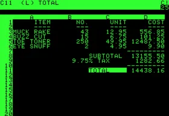
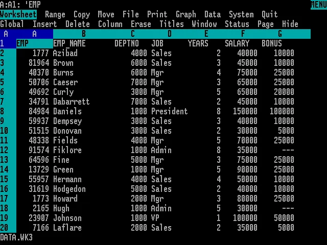
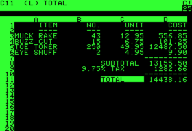
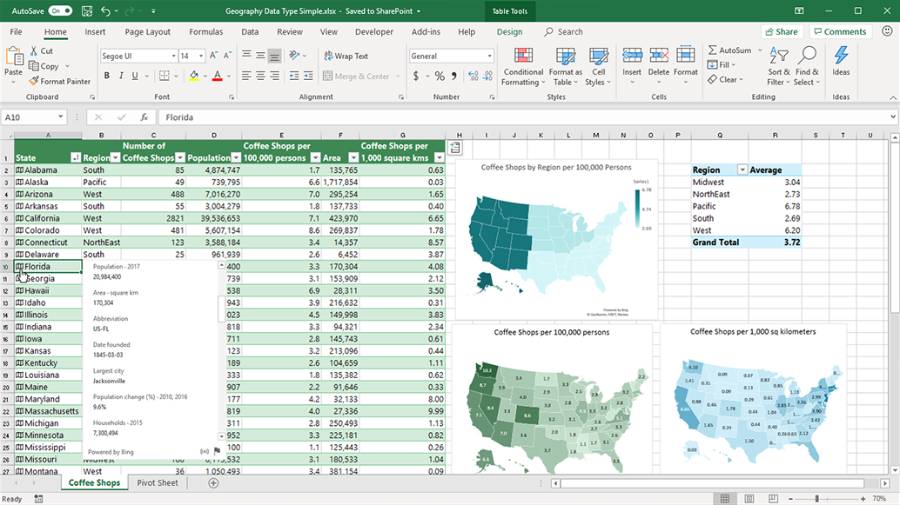

# Herramientas para el análisis. La reproducibilidad.

<<<<<<< HEAD
::: callout-note
#### Objetivos de aprendizaje

Al terminar este capítulo, el alumno debe ser capaz de:

-   Identificar las principales herramientas disponibles para el análisis de datos industriales y explicar las razones por las que se eligen Python y R como herramientas principales en este libro.
-   Describir los usos habituales de la hoja de cálculo en el entorno industrial y reconocer sus limitaciones para el análisis reproducible.
-   Explicar el concepto de reproducibilidad y distinguirlo del de repetibilidad, y argumentar por qué es relevante en el análisis de datos industriales.
-   Comparar el uso de scripts frente al uso de hojas de cálculo desde el punto de vista de la transparencia, la trazabilidad y la reproducibilidad del análisis.

Los conceptos clave introducidos en este capítulo son: **hoja de cálculo**, **lenguaje de programación**, **script**, **reproducibilidad**, **repetibilidad**, **flujo de trabajo reproducible**, **datos rectangulares**.
:::

## Introducción

En el capítulo anterior vimos que el análisis de datos industriales requiere rigor metodológico y datos de calidad. En este capítulo abordamos las herramientas con las que vamos a trabajar a lo largo del libro: la hoja de cálculo Microsoft Excel y los lenguajes de programación **Python** y **R**. Veremos también por qué la elección de la herramienta no es indiferente cuando se trata de garantizar que un análisis sea verificable y reproducible, un requisito cada vez más exigido tanto en el ámbito industrial como en el académico.

## La hoja de cálculo

La hoja de cálculo es una herramienta presente hoy en todos los ámbitos de trabajo y educativos. Desde la aparición de [VisiCalc](https://es.wikipedia.org/wiki/VisiCalc) en 1978, ha contribuido a la gestión de miles de empresas y se ha utilizado de manera general en el análisis de datos. En la década de los años 80, [Lotus 1-2-3](https://es.wikipedia.org/wiki/Lotus_1-2-3) fue la aplicación más utilizada en los ordenadores IBM-PC y compatibles; con la llegada de Microsoft Windows a finales de esa década, Microsoft Excel se convirtió en la hoja de cálculo dominante, posición que mantiene hasta hoy.

### Usos de la hoja de cálculo en el análisis industrial

La hoja de cálculo es especialmente útil para:

-   La introducción, edición y almacenamiento de datos.
-   El filtrado y la corrección de errores básicos.
-   La manipulación de datos mediante tablas dinámicas.
-   La preparación de gráficos para la presentación de resultados.

En este libro trabajaremos exclusivamente con lo que llamaremos **datos rectangulares**: grupos de valores asociados a una o más variables y a varias observaciones, organizados en tablas. Es la forma más habitual de almacenar datos industriales, y la base del principio de los **datos arreglados** (*tidy data*) que se desarrolla en el capítulo siguiente.

La tendencia actual en la industria es recoger los datos de forma automática o mediante sistemas informatizados, lo que elimina el papel y reduce los errores de transcripción. En todos los casos, es imprescindible que los sistemas de información puedan exportar sus datos a ficheros de texto plano o CSV, de modo que puedan importarse tanto en Excel como en Python o R.

### Limitaciones de la hoja de cálculo

A pesar de su utilidad y su enorme difusión, la hoja de cálculo presenta limitaciones importantes cuando se usa como herramienta principal de análisis:

-   Los cálculos se realizan mediante fórmulas embebidas en las celdas, que son difíciles de rastrear y verificar por terceros, lo que compromete la transparencia del análisis.
-   Los gráficos disponibles son relativamente limitados en comparación con los que ofrecen los lenguajes de programación.
-   No está diseñada específicamente para el análisis estadístico, y puede mostrar inexactitudes en algunos métodos, como la regresión lineal.
-   La falta de transparencia dificulta la auditoría de los análisis, un requisito cada vez más frecuente en entornos de calidad certificada.

Por estas razones, en este libro usaremos Excel principalmente para el almacenamiento de datos y el análisis básico, y Python o R para el análisis gráfico y estadístico más detallado.

## Python y R: las herramientas principales

**Python** es actualmente el lenguaje de programación más utilizado en el mundo y el de referencia en inteligencia artificial y ciencia de datos. Para el análisis de datos industriales ofrece una combinación de simplicidad, potencia y un ecosistema de bibliotecas muy completo:

-   `pandas` para la manipulación de datos tabulares: registros de producción, análisis de lotes, control de calidad.
-   `matplotlib` y `seaborn` para la generación de gráficos de alta calidad: tendencias, distribuciones, correlaciones.
-   `numpy` para cálculos numéricos precisos sobre arrays de datos.

**R** es el lenguaje de referencia en estadística y análisis de datos. Dispone de algunas de las bibliotecas gráficas más potentes disponibles —en particular `ggplot2`— y cubre toda la gama de métodos estadísticos, desde la estadística descriptiva básica hasta los modelos más avanzados. Es el lenguaje más utilizado en investigación estadística y en análisis de datos en ciencias de la salud, biología y, en general, en cualquier disciplina con fuerte componente cuantitativo.

Ambos lenguajes son **gratuitos y de código abierto**, cuentan con comunidades de usuarios enormes y están respaldados por una documentación extensa. A lo largo del libro, los ejemplos de código se presentan en pestañas alternativas Python/R, de modo que el lector puede seguir el lenguaje de su elección.

## Otras herramientas del ecosistema

Más allá de Python, R y Excel, existen otras herramientas relevantes en el análisis de datos y la estadística industrial que conviene conocer, aunque no se desarrollen en este libro.

**Matlab** es un entorno de cálculo numérico muy potente, ampliamente utilizado en ingeniería y en aplicaciones científicas que requieren alto rendimiento computacional. Su sintaxis está orientada al álgebra matricial y es especialmente adecuado para simulación, procesamiento de señales y control de sistemas. Su principal limitación para nuestros objetivos es su coste elevado: se trata de software propietario con licencias de precio significativo.

**Minitab** es un software estadístico diseñado específicamente para la calidad industrial y la mejora de procesos. Es muy utilizado en entornos *Six Sigma* y en certificaciones de calidad por su facilidad de uso y sus herramientas específicas para el control estadístico de procesos. Como Matlab, es software propietario y su coste puede ser un obstáculo para su uso en formación.

**Julia** es un lenguaje de programación más reciente, diseñado para el cálculo numérico de alto rendimiento. Ofrece velocidades comparables a lenguajes compilados como C, con una sintaxis cercana a Python y R. Está ganando popularidad en la comunidad científica, especialmente en aplicaciones donde el rendimiento computacional es crítico. Sin embargo, su ecosistema para el análisis de datos es todavía menos maduro que el de Python y R, y su uso en formación es aún limitado.

**Google Sheets** y **LibreOffice Calc** son alternativas gratuitas a Microsoft Excel, casi totalmente compatibles, que pueden usarse cuando no se dispone de licencia de Office.

La elección de Python y R como herramientas principales de este libro responde, por tanto, a tres criterios combinados: son gratuitas y de código abierto, tienen el ecosistema más rico y maduro para el análisis de datos y la estadística, y son las que mejor responden al requisito de reproducibilidad que se desarrolla en la sección siguiente.

## El concepto de reproducibilidad

La **reproducibilidad** de un análisis o experimento es la capacidad de obtener los mismos resultados al replicarlo utilizando los mismos datos, la misma metodología y, en su caso, el mismo código informático. En otras palabras, un análisis es reproducible cuando otra persona —o el propio autor en un momento posterior— puede verificar los resultados y llegar a las mismas conclusiones partiendo de los datos originales.

Conviene distinguir la reproducibilidad de un concepto relacionado pero diferente: la **repetibilidad** o **replicabilidad**, que se refiere a la capacidad de obtener resultados consistentes al replicar un estudio con un conjunto *distinto* de datos, pero obtenidos siguiendo el mismo diseño. La repetibilidad responde a la pregunta "¿se confirman estos resultados con nuevos datos?"; la reproducibilidad responde a "¿puede otra persona verificar este análisis con los mismos datos?".

El químico irlandés **Robert Boyle**, en el siglo XVII, fue uno de los primeros en subrayar la importancia de la reproducibilidad en la ciencia. Sostenía que el conocimiento científico debía basarse en hechos experimentales que pudieran volverse creíbles para la comunidad científica precisamente por su reproducibilidad. La bomba de aire de Boyle dio lugar a una de las primeras disputas documentadas sobre la reproducibilidad de un fenómeno científico.

### La crisis de reproducibilidad

En las últimas décadas ha crecido la preocupación por la falta de reproducibilidad en resultados científicos publicados [@ryssdal2013; @krugman2013; @garicano2013; @ferrero2018]. Muchos estudios no pueden reproducirse porque los datos originales no están disponibles, el código de análisis no se ha conservado o documentado, o los procedimientos no se describen con suficiente detalle. Esta situación, conocida como **crisis de reproducibilidad**, afecta a disciplinas tan diversas como la psicología, la biomedicina o la economía, y ha llevado a un cambio en las exigencias de publicación y auditoría en muchos campos.

En el entorno industrial, las consecuencias de un análisis no reproducible pueden ser igualmente serias: una decisión tomada sobre la base de un análisis que no puede verificarse ni auditarse es una decisión con un riesgo oculto.

### Reproducibilidad en metrología

En metrología, el término tiene un significado más específico: la reproducibilidad es la capacidad de un instrumento de dar el mismo resultado en mediciones diferentes realizadas en las mismas condiciones a lo largo de períodos prolongados de tiempo. Esta acepción, que se desarrollará con más detalle en el capítulo dedicado al análisis del sistema de medición, es distinta de la reproducibilidad del análisis de datos, aunque comparten el mismo principio de fondo: la confianza en los resultados depende de su consistencia y verificabilidad.

## Scripts frente a hoja de cálculo: ventajas para la reproducibilidad

La diferencia fundamental entre trabajar con scripts y trabajar con hojas de cálculo, desde el punto de vista de la reproducibilidad, es la **transparencia**. En un script, cada operación realizada sobre los datos está escrita de forma explícita y secuencial: cualquier persona que lea el código puede seguir exactamente qué se ha hecho, en qué orden y con qué parámetros. En una hoja de cálculo, las operaciones están embebidas en fórmulas dispersas por las celdas, a menudo sin documentación, y el flujo del análisis no es visible de forma directa.

Las ventajas concretas de los scripts para la reproducibilidad son:

-   **Trazabilidad completa**: el código documenta cada paso del análisis, desde la carga de los datos hasta la generación de los gráficos y los resultados finales.
-   **Verificabilidad**: cualquier persona con acceso al código y a los datos originales puede reproducir el análisis y comprobar los resultados.
-   **Reutilización**: un script bien documentado puede adaptarse fácilmente a nuevos conjuntos de datos o a variaciones del análisis.
-   **Control de versiones**: el código puede gestionarse con herramientas como Git, que registran el historial completo de cambios realizados sobre los archivos, permiten recuperar versiones anteriores y facilitan la colaboración entre varios analistas sin riesgo de sobrescribir el trabajo ajeno. Git es una herramienta cada vez más presente en entornos industriales y técnicos, y su conocimiento es un valor añadido en cualquier perfil profesional orientado a los datos.

Conviene distinguir dos formas de trabajar con scripts. El **análisis interactivo** —en entornos como Google Colab o RStudio— es exploratorio y provisional: el analista prueba, ajusta y descarta opciones hasta encontrar el enfoque adecuado. El **informe automatizado** es el resultado final documentado: combina en un único documento el código, los comentarios del autor y los resultados del análisis, generado de forma reproducible cada vez que se ejecuta. Herramientas como [Quarto](https://quarto.org/) o Google Colab permiten producir este tipo de documentos en Python o R, lo que facilita tanto la auditoría del análisis como su presentación y comunicación. La combinación de scripts bien documentados y datos correctamente organizados constituye la base de un **flujo de trabajo reproducible**, concepto que se desarrolla en detalle en el capítulo siguiente.

::: callout-important
Utilizar código en lugar de clics de ratón no es solo una cuestión de eficiencia: es la forma más fiable de garantizar que un análisis sea transparente, verificable y reproducible.
:::

## Resumen del capítulo

Este capítulo ha presentado las herramientas de análisis que se utilizarán a lo largo del libro y ha introducido el concepto de reproducibilidad como criterio fundamental para elegir entre ellas.

La **hoja de cálculo** —Microsoft Excel principalmente— es la herramienta dominante en la empresa y resulta muy útil para el almacenamiento, la edición y el análisis básico de datos. Sin embargo, sus limitaciones en transparencia y trazabilidad la hacen insuficiente como herramienta única de análisis cuando se requiere rigor y verificabilidad.

**Python** y **R** son los lenguajes de programación elegidos como herramientas principales: gratuitos, de código abierto, con ecosistemas maduros para el análisis de datos y la estadística, y con una comunidad de usuarios amplia y activa. Otras herramientas —Matlab, Minitab, Julia— tienen sus nichos de aplicación, pero su coste o su menor madurez las hacen menos adecuadas para los objetivos de este libro.

La **reproducibilidad** es la capacidad de verificar y replicar un análisis utilizando los mismos datos y el mismo código. Es un requisito cada vez más exigido en la industria y en la investigación, y ha cobrado relevancia ante la llamada crisis de reproducibilidad que afecta a múltiples disciplinas. La **repetibilidad**, concepto relacionado, se refiere en cambio a la consistencia de los resultados al usar nuevos datos con el mismo diseño.

Los **scripts** ofrecen ventajas decisivas frente a la hoja de cálculo en reproducibilidad: documentan cada paso del análisis, son verificables por terceros y pueden reutilizarse y gestionarse con herramientas de control de versiones. Los **informes automatizados** con Quarto o Colab llevan este principio un paso más allá, integrando código, comentarios y resultados en un único documento auditable. La combinación de ambos, sobre datos bien organizados, constituye la base de un flujo de trabajo reproducible, concepto que se desarrolla en el capítulo siguiente.
=======
## Introducción
En este capítulo veremos las herramientas que utiizaremos en el análisis de datos industriales. Nos enfocaremos en dos de ellas: la hoja de cálculo Microsoft Excel, y el lenguaje de programación `Python`. Ambas herramientas están ampliamente extendidas en las empresas y en las instituciones docentes de todo el mundo. `Python` es, además del lenguaje de programación más utilizado en el mundo, un software libre, y por lo tanto, con un coste de adquisición cero, lo que facilita su utilización. Microsoft Excel tiene versiones web que se pueden utilizar para un uso básico también sin coste. No son las únicas opciones: hay otros programas estadísticos y de análisis muy utilizados y potentes, tales como [Matlab](https://es.mathworks.com/products/matlab.html) o [Minitab](https://www.minitab.com/en-us/), que son de gran interés en ingeniería, aunque tienen un coste bastante elevado, y hojas de cálculo como Google Docs o LibreOffice, casi totalmente compatibles con Microsoft Excel.

## La hoja de cálculo
La hoja de cálculo es una herramienta presente hoy día en todos los ámbitos de trabajo y educativos. Desde la aparición de [Visicalc](https://es.wikipedia.org/wiki/VisiCalc), en 1978, ha contribuido a la gestión de miles de empresas, se ha utilizado de manera general en análisis de datos y sus gráficos se han utilizado y se utilizan en publicaciones e informes de todas clases. En la década de los años 80 del pasado siglo, la hoja de cálculo [Lotus 1-2-3](https://es.wikipedia.org/wiki/Lotus_1-2-3) fue la aplicación más utilizada en los ordenadores IBM-PC y compatibles, y consiguió facturaciones millonarias para la empresa matriz. Lotus 1-2-3 dominó el mercado hasta la aparición de Microsoft Windows a finales de los años 80; este nuevo sistema operativo favoreció la implantación de Microsoft Excel, que desde entonces se convirtió en la hoja de cálculo dominante.

::: {layout="[[1,1], [1]]"}

:::

### Aplicaciones de la hoja de cálculo

Las **hojas de cálculo** son muy útiles para recoger la información de un conjunto de observaciones.
Entre sus principales usos, están:

- La introducción, edición y almacenamiento datos. 
- El filtrado y corrección de errores.
- La manipulación básica, por ejemplo, mediante tablas dinámicas
- La preparación y edición de gráficos, incluyendo gráficos dinámicos
- La presentación de la información, con el apoyo opcional de herramientas adicionales como Microsoft PowerPoint.

Los datos se pueden recoger y guardar de múltiples formas. Cuando la recogida de datos se hace de forma manual en papel, es necesario registrar en el ordenador los datos recogidos. Lo más frecuente es que este registro se haga en hojas de cálculo, como [Microsoft Excel](https://www.microsoft.com/es-es/microsoft-365/excel) o [Google Sheets](https://www.google.es/intl/es/sheets/about/). En algunos casos, el almacenamiento se hace sobre bases de datos, genéricas o desarrolladas a medida.

Actualmente, la tendencia es recoger los datos o bien de forma automática, o bien de forma manual sobre sistemas informatizados (pantallas), lo que permite eliminar el papel y disponer directamente de los datos en un formato digitalizado.

En la actualidad, la mayoría de los equipos y líneas de producción se interconectan con los sistemas de información  (ver IoT)  y almacenan en tiempo real todos los datos necesarios, lo que libera al operario de la pesada tarea de reintroducirlos manualmente, a la vez que reduce los errores debidos a la imputación incorrecta.

En todos los casos, es imprescindible asegurar que los sistemas de información pueden exportar sus datos a ficheros de texto tipo *fichero plano* o tipo CSV, de forma que podamos importarlos tanto a Excel como a R, como veremos más adelante. Estos sistemas de exportación de datos deben diseñarse de forma flexible y abierta, para que tanto la captura como la exportación puedan modificarse y adaptar la recogida de la información a las necesidades de cada momento.

En este libro trataremos exclusivamente de lo que llamaremos **datos rectangulares**: grupos de valores que están asociados a una o más variables, y a varias observaciones. Hay muchos más datos que no se ajustan a esta organización tabular,  es el caso de imágenes, sonidos o archivos documentales de texto. Pero la forma más común de almacenar datos industriales es la de las tablas rectangulares, organizadas según el principio de los **datos arreglados**, que detallaremos en el siguiente capítulo.

## Los lenguajes de programación

### `Python` en el análisis de datos industriales: una herramienta versátil

Python se ha convertido en el lenguaje de referencia para el análisis de datos en entornos industriales por su combinación de simplicidad, potencia y ecosistema científico. En industrias alimentarias, donde se manejan grandes volúmenes de datos de producción, calidad, trazabilidad y consumo energético, Python ofrece ventajas clave:

#### Ventajas técnicas
- **Sintaxis clara y accesible**: ideal para estudiantes sin experiencia previa en programación.
- **Bibliotecas especializadas**:
  - `pandas` para manipulación de datos tabulares (ej. registros de producción, análisis de lotes).
  - `matplotlib` y `seaborn` para gráficos de control, tendencias y correlaciones.
  - `numpy` para cálculos numéricos precisos (temperaturas, tiempos, concentraciones).
- **Automatización de tareas repetitivas**: generación de informes, limpieza de datos, detección de anomalías.

#### Aplicaciones concretas en industrias alimentarias
- **Control de calidad**: análisis de desviaciones en parámetros críticos (pH, humedad, temperatura).
- **Optimización de procesos**: visualización de curvas de cocción, enfriamiento, fermentación.
- **Trazabilidad**: seguimiento de lotes desde materia prima hasta producto final.
- **Seguridad alimentaria**: detección de patrones en alertas sanitarias o fallos de producción.

#### ¿Por qué incluir `Python` en la Formación Profesional?

Un módulo básico de Python y gráficos en programas de formación profesional en industrias alimentarias permite:

#### Desarrollo de competencias clave
- **Alfabetización digital aplicada**: no solo usar software, sino entender cómo se procesan los datos.
- **Pensamiento lógico y estructurado**: útil para resolver problemas técnicos y documentar procesos.
- **Autonomía en el análisis**: no depender exclusivamente de hojas de cálculo o software cerrado.

#### Enfoque pedagógico sugerido
- **Aprendizaje basado en proyectos**: por ejemplo, analizar datos reales de producción o simular un sistema de trazabilidad.
- **Visualización como herramienta de comprensión**: enseñar a interpretar gráficos de dispersión, histogramas, series temporales.
- **Modularidad y reproducibilidad**: fomentar el uso de scripts anotados y reutilizables, alineado con tu enfoque docente.

## Otras herramientas: R, Julia

### El software estadístico R

R es un lenguaje de programación y un entorno de software utilizado para el análisis estadístico, la visualización de datos y la modelización. Algunas de las características clave de R son:

1. **Amplio espectro de funcionalidades**: R abarca una amplia gama de herramientas y paquetes diseñados para realizar diversos análisis estadísticos, exploración de datos y modelización.

2. **Herramientas gráficas**: R dispone de algunas de las bibliotecas gráficas más potentes para la exploración y descripción de datos.

3. **Estadística descriptiva**: R ofrece funciones para calcular estadísticas descriptivas básicas, como la media, mediana, desviación estándar, varianza, rango, cuartiles y percentiles. Estas funciones son esenciales para explorar y resumir datos.

4. **Contrastes de hipótesis**: R proporciona funciones para realizar pruebas estadísticas, como t-tests, test chi-cuadrado, ANOVA y pruebas no paramétricas. Estas pruebas permiten evaluar hipótesis y comparar grupos de datos.

5. **Distribuciones de probabilidad**: R incluye una amplia variedad de funciones para trabajar con distribuciones de probabilidad (por ejemplo, normal, uniforme, binomial, Poisson). Esto es útil para generar números aleatorios, calcular probabilidades y cuantiles.

6. **Bibliotecas de funciones (librerías)**: Además de las amplias funciones básicas de las que dispone, R es capaz de utilizar bibliotecas de funciones (llamadas *librerías*) que han sido desarrolladas por los propios usuarios, y que amplían sus funcionalidades a todos los campos imaginables, desde el análisis genético al análisis de riesgos bancarios o el control estadístico de procesos.

#### Usos y aplicaciones de R en la estadística industrial
En el contexto de la estadística industrial, R se utiliza para:

- **Control de calidad**: R permite analizar datos de procesos industriales, identificar desviaciones y controlar la calidad de los productos.

- **Optimización de procesos**: Mediante técnicas estadísticas avanzadas, R ayuda a optimizar procesos industriales, reducir costos y mejorar la eficiencia.

- **Análisis de fiabilidad**: R se utiliza para evaluar la confiabilidad de sistemas y componentes en la industria.

### El lenguaje Julia

**Julia** es un lenguaje de programación más reciente, diseñado específicamente para el cálculo numérico y la ciencia de datos. Ofrece un rendimiento cercano al de lenguajes de bajo nivel como C, pero con la sintaxis y facilidad de uso de lenguajes de alto nivel como Python y R. Julia es especialmente útil en aplicaciones donde el rendimiento es crítico, como en simulaciones industriales y análisis de grandes volúmenes de datos.

- **Ventajas**

  - **Rendimiento:** Diseñado específicamente para computación numérica de alto rendimiento, Julia ofrece velocidades comparables a lenguajes compilados como C o Fortran, pero con una sintaxis más cercana a los lenguajes de scripting. Es excelente para cálculos numéricos intensivos y proporciona soporte nativo para paralelismo y computación distribuida.

  - **Sintaxis expresiva:** Su sintaxis es intuitiva y similar a la de lenguajes matemáticos, lo que facilita la escritura de código conciso y legible.

  - **Interoperabilidad:** Permite llamar a código escrito en otros lenguajes como C, Python o R, lo que facilita la integración con herramientas existentes.

  - **En crecimiento:** Aunque más joven que Python y R, Julia está ganando rápidamente popularidad en la comunidad científica y de datos.

En resumen, mientras que R sigue siendo una opción poderosa y preferida para la estadística industrial, Python y Julia se presentan como alternativas viables y, en algunos casos, superiores, dependiendo de los requisitos específicos del proyecto.

## El concepto de reproducibilidad

La **reproducibilidad** de un ensayo o experimento es la capacidad  de ser reproducido o replicado por otros, en particular, por la comunidad científica. La reproducibilidad se refiere a la capacidad de obtener resultados consistentes al replicar un estudio o experimento *utilizando los mismos datos*, metodología original y, en su caso, el mismo código informático empleado para los análisis.En otras palabras, cuando se replica un análisis de datos o un experimento, los resultados deben ser alcanzados nuevamente con un alto grado de confiabilidad.

La **repetibilidad** o **replicabilidad** se refiere a la posibilidad de obtener resultados consistentes al replicar un estudio con un *conjunto distinto de datos*, pero obtenidos siguiendo el mismo diseño experimental. Implica obtener resultados consistentes utilizando nuevos datos o nuevos resultados computacionales para responder a la misma pregunta científica.

El químico irlandés **Robert Boyle**, en el siglo XVII, subrayó la importancia de la reproducibilidad en la ciencia. Boyle sostenía que los fundamentos del conocimiento debían basarse en hechos producidos experimentalmente, que pudieran volverse creíbles para la comunidad científica por su reproducibilidad.
La **bomba de aire de Boyle**, un aparato científico complicado y costoso en ese momento, condujo a una de las primeras disputas documentadas sobre la reproducibilidad de un fenómeno científico.

### Importancia en la Ciencia
La reproducibilidad es esencial para la investigación científica, ya que permite validar y verificar los resultados obtenidos. En las últimas décadas, ha habido una creciente preocupación por la falta de reproducibilidad en muchos resultados científicos publicados(@ryssdal2013, @krugman2013, @garicano2013, @ferrero2018), lo que ha llevado a una crisis de reproducibilidad o replicación. La reproducibilidad garantiza que los resultados científicos sean confiables y puedan ser validados por otros investigadores. Es un pilar fundamental para el avance del conocimiento en todas las disciplinas.

### Reproducibilidad en metrología
En metrología, la reproducibilidad es la capacidad de un instrumento de dar el mismo resultado en mediciones diferentes, realizadas en las mismas condiciones a lo largo de periodos dilatados de tiempo. Esta cualidad debe evaluarse a largo plazo. 

## Ventajas de los lenguajes de programación en scripts frente a la hoja de cálculo en la reproducibilidad de un análisis
Las ventajas de utilizar un lenguaje de scripts en lugar de hojas de cálculo tradicionales (como Microsoft Excel) incluyen:

1. **Código abierto (*scripts*)**: los lenguajes permiten crear flujos de trabajo basados en código, lo que mejora la reproducibilidad de los análisis y facilita la colaboración entre investigadores. Puedes escribir scripts en `Python` para automatizar tareas y asegurar la reproducibilidad. Los scripts son transparentes y pueden ser compartidos y verificados por otros investigadores.
2. **Flexibilidad estadística**: `Python` es especialmente útil para técnicas avanzadas de análisis, lo que lo convierte en una excelente opción para investigadores que buscan análisis de vanguardia, como es el caso de los modelos de inteligencia artificial (IA)
3. **Gráficos muy potentes y completos**: Los gráficos disponibles en estos lenguajes son una de sus fortalezas, no sólo por su variedad sino también por su flexibilidad.
4. **Capacidad para tratar grandes cantidades de datos**: pueden manejar grandes conjuntos de datos sin problemas, lo que es fundamental en la estadística industrial.
5. **Precisión**: Aunque no está diseñado específicamente para el análisis estadístico, como sí es el caso de **R**, `Python` puede realizar todos los análisis que se necesitan en el entorno industrial, y es más preciso que **Excel** en ciertos casos, como en análisis de regresión lineal.
6.   **Capacidad avanzada**: `Python` ofrece una amplia gama de librerías y funciones para realizar análisis estadísticos avanzados, como modelos lineales, series temporales, análisis multivariante y más.

Por su parte, la hoja de cálculo tiene una *curva de aprendizaje* más sencilla y es en general más fácil de usar, pero tiene algunos inconvenientes:

7.   **Inexactitudes**: Estudios han demostrado que **Excel** puede mostrar ciertas inexactitudes en análisis de regresión lineal y otros métodos estadísticos.
8.  **Limitaciones gráficas**: Los gráficos de **Excel** son bastante limitados cuando se trata de presentar información sobre un análisis de datos.
9.  **Limitaciones estadísticas**: **Excel** no está diseñado específicamente para análisis estadístico avanzado, por lo que puede carecer de algunas capacidades necesarias para investigaciones más complejas.
10.   **Falta de transparencia para la auditoría**: Las fórmulas y cálculos en **Excel** pueden ser difíciles de rastrear y verificar, lo que afecta la reproducibilidad.

Por estas razones usaremos Excel para el almacenamiento  de datos y el análisis básico, y usaremos `Python` para el análisis gráfico más detallado y el análisis numérico y estadístico.
>>>>>>> 508126e9fb31336481e7210747cee01fbc3147da
