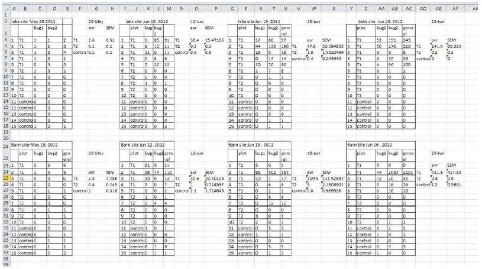
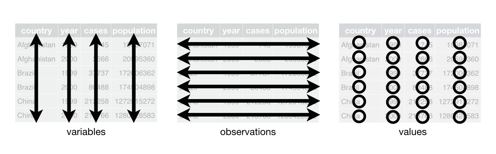
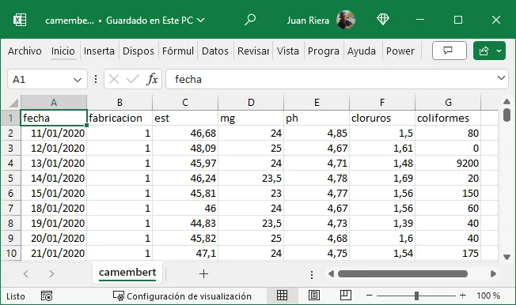
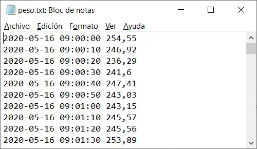
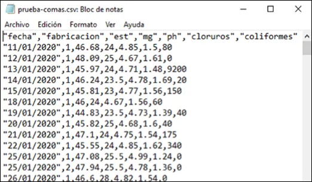
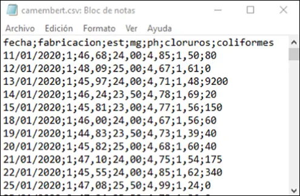

# Conceptos fundamentales, organización de datos y flujo de trabajo

::: callout-note
#### Objetivos de aprendizaje

Al terminar este capítulo, el alumno debe ser capaz de:

-   Definir y distinguir los conceptos de población, muestra, parámetro y estadístico, y aplicarlos a situaciones de análisis industrial concretas.
-   Identificar y clasificar los tipos de variables —cualitativas y cuantitativas— y asignar nombres válidos a variables según las convenciones establecidas.
-   Describir las etapas de un flujo de trabajo estructurado de análisis de datos y explicar por qué es importante seguirlo.
-   Reconocer y corregir estructuras incorrectas de almacenamiento de datos en hojas de cálculo, aplicando los principios de los datos ordenados (*tidy data*).
-   Crear, exportar e importar ficheros CSV desde Excel, y comprender su papel en el intercambio de datos entre herramientas.

Los conceptos clave introducidos en este capítulo son: **población**, **muestra**, **parámetro**, **estadístico**, **variable cualitativa**, **variable cuantitativa**, **caso**, **flujo de trabajo**, **datos ordenados** (*tidy data*), **fichero plano**, **fichero CSV**, **DataFrame**.
:::

## Introducción

En el capítulo anterior vimos que trabajar con scripts en lugar de hojas de cálculo es la base de un análisis reproducible. Pero la reproducibilidad no depende solo de la herramienta: depende también de cómo están organizados los datos. Un script impecable aplicado sobre datos mal estructurados produce resultados incorrectos o ininterpretables. Este capítulo aborda precisamente eso: cómo organizar los datos de forma que sean útiles para el análisis, y cómo estructurar el proceso de trabajo para que sea ordenado, eficiente y reproducible.

Antes de entrar en el flujo de trabajo y la organización de los datos, es necesario establecer un vocabulario común. Las definiciones que siguen son la base conceptual sobre la que se apoya todo el análisis de datos.

## Conceptos básicos: datos, variables y casos

### Variables y casos

A los objetos descritos en un conjunto de datos los llamamos **casos**. Cuando esos objetos son personas, podemos llamarlos **individuos**; en el entorno industrial, donde los casos suelen ser fabricaciones, lotes, muestras o mediciones, utilizamos la nomenclatura genérica de caso.

Una **variable** es una característica de un caso que puede ser medida u observada, y que puede tomar diferentes valores en diferentes casos. Por ejemplo, el pH de una muestra de leche, la temperatura de una cuba de cuajado o el peso de un envase son variables. El conjunto de variables medidas sobre cada caso constituye la información que vamos a analizar.

### Tipos de variables

No todas las variables son del mismo tipo, y esa diferencia es importante porque determina qué operaciones pueden realizarse con ellas y qué gráficos son apropiados para representarlas.

| Variables cualitativas o categóricas |   | Variables cuantitativas o métricas |   |
|-------------------|------------------|------------------|-------------------|
| **Nominales** | **Ordinales** | **Discretas** | **Continuas** |
| Valores en categorías arbitrarias | Valores en categorías ordenadas | Valores enteros en escala numérica | Valores continuos en escala numérica |
| Sin unidades | Sin unidades | Unidades contadas | Unidades medidas |

Una **variable cualitativa** o **categórica** clasifica los casos en categorías: el tipo de queso, la línea de producción, el turno de trabajo. Con estas variables no tiene sentido hacer operaciones aritméticas directamente, aunque sí podemos contarlas y calcular frecuencias.

Una **variable cuantitativa** o **métrica** toma valores numéricos con los que sí tiene sentido operar: sumar, calcular medias, calcular desviaciones. El peso, el pH, la temperatura o el rendimiento quesero son variables cuantitativas.

::: callout-warning
#### ¿Cualitativo significa "de calidad"?

El término *cualitativo* proviene de *cualidad*, no de *calidad*, y hace referencia a las características o propiedades de un objeto sin implicar juicio de valor. En estadística describe variables que representan categorías o atributos. La frase, usada a veces, "este envase es muy cualitativo" es por tanto incorrecta; lo correcto es "este envase es de gran calidad".
:::

### Población y muestra

Una **población** es el conjunto completo de casos que queremos estudiar. En muchas ocasiones la población es demasiado grande para analizarla completamente, por lo que extraemos una **muestra**: un subconjunto seleccionado para el estudio. El proceso de obtener una muestra se llama **muestreo**.

Para que los resultados obtenidos a partir de la muestra sean válidos para la población, la muestra debe ser **representativa**, es decir, debe reflejar adecuadamente las características de la población. Esto se consigue mediante el **muestreo aleatorio**: cada caso de la población debe tener la misma probabilidad de ser seleccionado.

::: callout-note
#### Ejemplo: muestreo en una cámara de maduración

Imagina que debes analizar el extracto seco de una producción de quesos en maduración. Dado que la cámara está llena y es difícil acceder a su interior, decides tomar tu muestra de los quesos más accesibles, situados cerca de la puerta y a la altura de la vista.

Esta forma de muestrear no es correcta: al seleccionar solo los quesos más accesibles introduces un *sesgo*. Las condiciones de humedad, temperatura y circulación de aire pueden variar dentro de la cámara, afectando el extracto seco según la ubicación. Para obtener resultados fiables, todos los quesos deben tener la misma probabilidad de ser seleccionados.

La **población** en este caso es el conjunto total de quesos en maduración dentro de la cámara.
:::

En muchas aplicaciones industriales, definimos la población como *todos los resultados que podríamos haber obtenido* en las mismas condiciones. A este conjunto lo llamamos **población conceptual**. Por ejemplo, al medir el pH de varias muestras de leche, la población es el conjunto de todos los valores posibles que podríamos haber obtenido. Muchos problemas de ingeniería y tecnología se refieren a poblaciones conceptuales.

### Parámetro y estadístico

Un **parámetro** es una característica de una población —su media, su variabilidad, su proporción de defectos—. Como la población completa raramente es accesible, estimamos el valor del parámetro a partir de la muestra, calculando un **estadístico muestral**. El estadístico es un número que resume una propiedad de la muestra y constituye nuestra mejor estimación del parámetro poblacional correspondiente.

::: callout-important
En la mayoría de las situaciones reales, nuestros datos provienen de una **muestra** obtenida de una **población**. Los estadísticos que calculamos estiman parámetros poblacionales, y esa estimación siempre lleva asociada una incertidumbre.
:::

### Reglas para nombrar variables

Nombrar bien las variables es más importante de lo que parece: un nombre claro y consistente evita errores, facilita la lectura del código y permite el intercambio de datos entre herramientas. Las reglas que seguiremos son:

1.  Los nombres deben empezar siempre por una letra, nunca por un número o un signo especial.
2.  Solo se usarán letras minúsculas, números y el signo de subrayado `_`.
3.  No se usarán espacios, acentos, `ñ` (salvo casos justificados), guiones ni paréntesis.
4.  Las palabras se separarán con el signo de subrayado: `temp_cuajo`, no `temperaturaDelCuajo`.
5.  Los nombres serán lo más cortos posible sin perder claridad: `ph_leche_rec` es preferible a `pH_de_la_leche_en_recepcion`.

| No válido | Válido | Motivo |
|------------------------|-----------|---------------------|
| `peso en gramos` | `peso_g` | Espacios no permitidos |
| `pH_Leche_Recepción` | `ph_leche_rec` | Mayúsculas y acento |
| `extracto_seco_total_salida_salmuera` | `est_sal` | Demasiado largo |
| `1er_control` | `control_1` | Empieza por número |

En Python y R usaremos el signo de subrayado como separador, que es la convención estándar en ambos lenguajes (*snake_case*).

## El flujo de trabajo

Un **flujo de trabajo** en análisis de datos es un proceso sistemático y estructurado que guía la manipulación, exploración y análisis de los datos desde su recolección hasta la comunicación de los resultados. Es la hoja de ruta que asegura que cada paso se realice de forma ordenada, eficiente y reproducible.

Hadley Wickham [@wickham2023] —uno de los autores más influyentes en la ciencia de datos moderna— ha propuesto un modelo de flujo de trabajo que se ha convertido en referencia en la disciplina (disponible en español en @wickham2023es):

Este modelo integra todas las actividades del análisis: importación y limpieza de datos, transformación, exploración, modelado y comunicación de resultados, dentro de un marco de programación reproducible.

## Etapas de un flujo de trabajo estructurado

### Recolección de datos

La primera etapa es obtener los datos desde sus fuentes: archivos CSV, bases de datos, sistemas de captura automática, hojas de cálculo. La calidad del análisis depende directamente de la calidad de los datos recogidos, como se señaló en el capítulo anterior.

### Inspección de los datos

Una vez disponibles los datos, se examinan para entender su estructura y contenido: tipos de variables, presencia de valores faltantes o duplicados, rango de los valores, posibles inconsistencias. Esta fase es imprescindible antes de cualquier análisis.

### Limpieza de los datos

La limpieza incluye el tratamiento de valores faltantes, la eliminación de duplicados, la corrección de inconsistencias y la conversión de los datos al formato adecuado para el análisis. Es, con diferencia, la fase más larga y laboriosa de cualquier proyecto de datos: se estima que un analista dedica entre el 60 % y el 80 % de su tiempo total a preparar y depurar los datos, y solo el resto al análisis propiamente dicho. Esta proporción sorprende a quienes se acercan por primera vez al análisis de datos, pero refleja una realidad bien documentada: los datos reales raramente llegan limpios, completos y listos para el análisis, independientemente de si provienen de registros históricos, de sistemas automáticos o de mediciones de laboratorio.

Por su extensión y su dependencia del contexto —las técnicas de limpieza varían según el tipo de dato y el problema concreto— esta etapa no se desarrolla de forma abstracta en un único capítulo, sino de forma práctica a lo largo del libro, aplicada a los conjuntos de datos de cada ejemplo. Lo que sí conviene interiorizar desde ahora es su importancia: ninguna herramienta de análisis, por potente que sea, puede compensar datos mal preparados. Como se señaló en el capítulo anterior, *garbage in, garbage out*.

### Transformación de los datos

Los datos se restructuran en formato **ordenado o arreglado** (*tidy*), que se desarrolla en la sección siguiente, y se calculan las variables derivadas necesarias para el análisis.

### Análisis exploratorio de datos (EDA)

El análisis exploratorio busca entender los patrones y relaciones en los datos mediante estadísticas descriptivas y visualizaciones: medias, medianas, dispersiones, gráficos de distribución y de relación entre variables. Es la fase central de este libro.

### Modelado

Dependiendo del objetivo, se pueden aplicar modelos estadísticos para extraer información más profunda: regresión, análisis de tendencias, control estadístico de procesos. El modelado va más allá del alcance introductorio de este libro, pero el flujo de trabajo que aquí se aprende es el mismo que se usaría en análisis más avanzados.

### Comunicación de resultados

La última etapa es presentar los resultados de forma clara y efectiva: tablas, gráficos, informes. Un análisis que no se comunica bien no tiene impacto, independientemente de su calidad técnica.

Seguir este flujo de trabajo de forma sistemática garantiza la reproducibilidad del análisis, reduce los errores, facilita la colaboración y permite adaptar el trabajo cuando cambian los datos o los objetivos. La ausencia de un flujo estructurado, en cambio, conduce con frecuencia a errores difíciles de detectar, a análisis que no pueden verificarse y a trabajo que no puede reutilizarse ni compartirse.

## Los datos ordenados o *tidy data*

### El problema: datos mal estructurados

El error más frecuente al almacenar datos en una hoja de cálculo es tratarla como un bloc de notas: anotar de forma libre, colocar varias tablas en la misma hoja, usar pestañas distintas para cada mes o cada año, o mezclar datos y resultados en el mismo espacio. Este tipo de estructura puede resultar cómoda para quien la crea, pero es prácticamente inanalizable por cualquier programa de análisis.

Una variante igualmente problemática es el uso de pestañas para separar períodos de tiempo —una pestaña por mes, una por año—. Si los datos corresponden a las mismas variables medidas en fechas distintas, la solución correcta no es usar pestañas sino añadir una variable de fecha que permita filtrar y seleccionar los datos según el período de interés, manteniendo toda la información en una única tabla coherente.

### La solución: tres reglas simples

De la misma manera que la gramática estructura un escrito según reglas comunes, los **datos ordenados** (*tidy data*) siguen tres reglas que garantizan una estructura homogénea y analizable [@wickham2023]:

-   **Cada variable ocupa una columna.**
-   **Cada observación ocupa una fila.**
-   **Cada valor ocupa una celda.**

Estas tres reglas son interdependientes: no es posible cumplir solo dos de las tres. Cuando se respetan, la tabla resultante tiene una estructura rectangular homogénea que puede importarse directamente en Python, R o Excel y analizarse sin necesidad de transformaciones previas.

## Ficheros planos y ficheros CSV

### Qué son

Un **fichero plano** es un archivo de texto sin formato donde los datos están separados por espacios o tabulaciones. Muchos equipos de laboratorio y básculas de proceso generan este tipo de archivos, que pueden importarse directamente en Excel, Python o R.

Un **fichero CSV** (*Comma-Separated Values*) es un tipo de fichero plano en el que los valores están separados por un carácter especial denominado **separador**. Existen dos variantes habituales:

-   Separador coma `,` con punto decimal `.` — estándar en EE.UU. y Reino Unido.
-   Separador punto y coma `;` con coma decimal `,` — estándar en España y Europa continental.

La primera fila del fichero suele contener los nombres de las columnas. Los programas de importación se ocupan de la conversión de formatos en la mayoría de los casos.

El fichero CSV es el formato de intercambio de datos más universal: todos los programas de análisis —Excel, Python, R— pueden leerlo y generarlo. Por esa razón es el formato recomendado para almacenar y compartir datos en este libro.

### Exportar un fichero CSV desde Excel

Una vez que los datos están correctamente organizados en Excel, podemos exportarlos a CSV para usarlos en Python o R:

1.  Abre el fichero en Excel.
2.  Selecciona **Archivo** \> **Guardar como**.
3.  Elige el formato **CSV (delimitado por comas) (\*.csv)**.
4.  Guarda el archivo.

Alternativamente, tanto Python como R pueden leer directamente ficheros Excel sin necesidad de exportar a CSV, utilizando las funciones adecuadas de sus respectivas bibliotecas (`pandas` en Python, `readxl` en R). En el capítulo siguiente veremos cómo realizar esta importación.

Cuando los datos se importan en Python o R, se almacenan en una estructura denominada **DataFrame** o **cuadro de datos**, equivalente a la tabla rectangular de Excel, y sobre la que se realizarán todas las operaciones de análisis.

## Práctica

-   En Excel, crea una tabla de datos con al menos tres variables y cinco observaciones, siguiendo las reglas de datos ordenados y la convención de nombres de variables. Guárdala en formato CSV y vuelve a abrirla para verificar que el formato se ha conservado correctamente.
-   Practica el uso de **Datos** \> **Filtro** en Excel para seleccionar observaciones según distintos criterios.

## Para resolver

Escribe cinco ejemplos de nombres de variables relacionados con medidas analíticas o de proceso en quesería —como la temperatura de la leche en recepción o el pH al finalizar la cuajada— y verifica si son válidos según las reglas establecidas. Para los que no sean válidos, propón una alternativa correcta.

## Resumen del capítulo

Este capítulo ha establecido los fundamentos conceptuales y prácticos para organizar los datos antes de analizarlos.

Los conceptos básicos del análisis de datos son: la **variable** —característica medible de un caso—, el **caso** —unidad de observación—, y la distinción entre variables **cualitativas** —que clasifican en categorías— y **cuantitativas** —que toman valores numéricos con los que se puede operar—. La **población** es el conjunto completo de casos de interés; la **muestra** es el subconjunto que analizamos. Un **parámetro** describe a la población; un **estadístico** lo estima a partir de la muestra.

El **flujo de trabajo** es la secuencia ordenada de pasos desde la recolección de los datos hasta la comunicación de los resultados: recolección, inspección, limpieza, transformación, análisis exploratorio, modelado y comunicación. Seguir este flujo de forma sistemática garantiza la reproducibilidad, reduce los errores y facilita la colaboración.

Los **datos ordenados** (*tidy data*) siguen tres reglas: cada variable en una columna, cada observación en una fila, cada valor en una celda. Esta estructura rectangular es la única que permite el análisis directo con cualquier herramienta, y evita los errores frecuentes de las hojas de cálculo mal estructuradas.

Los **ficheros CSV** son el formato de intercambio de datos más universal, legible por Excel, Python y R. Al importarlos en Python o R, los datos se almacenan en un **DataFrame**, estructura equivalente a la tabla de Excel sobre la que se realizarán los análisis.
