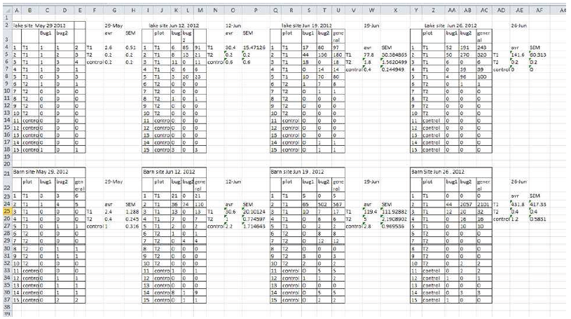
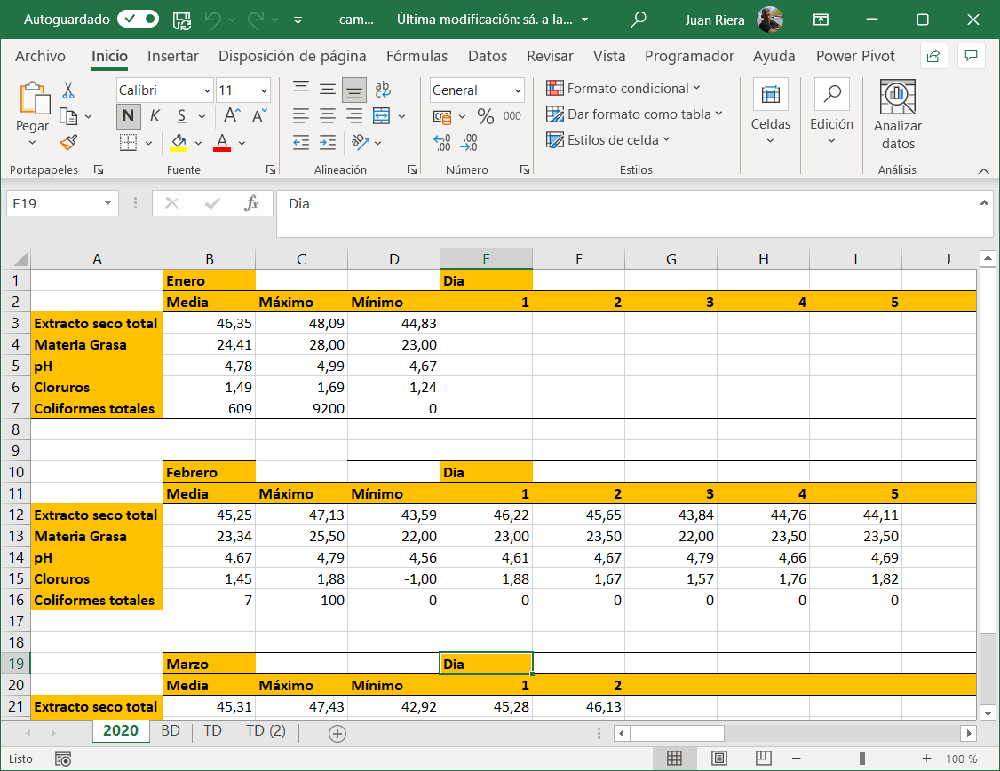
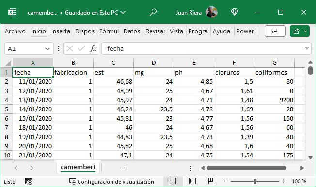
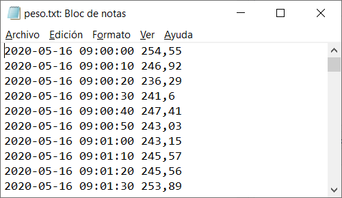
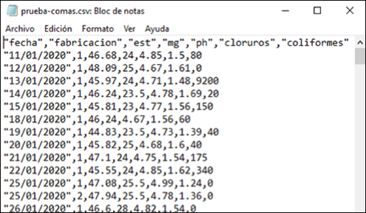
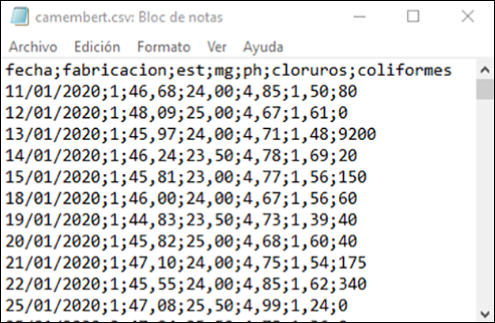

<<<<<<< HEAD
# Conceptos fundamentales, organización de datos y flujo de trabajo

::: callout-note
#### Objetivos de aprendizaje

Al terminar este capítulo, el alumno debe ser capaz de:

-   Definir y distinguir los conceptos de población, muestra, parámetro y estadístico, y aplicarlos a situaciones de análisis industrial concretas.
-   Identificar y clasificar los tipos de variables —cualitativas y cuantitativas— y asignar nombres válidos a variables según las convenciones establecidas.
-   Describir las etapas de un flujo de trabajo estructurado de análisis de datos y explicar por qué es importante seguirlo.
-   Reconocer y corregir estructuras incorrectas de almacenamiento de datos en hojas de cálculo, aplicando los principios de los datos ordenados (*tidy data*).
-   Crear, exportar e importar ficheros CSV desde Excel, y comprender su papel en el intercambio de datos entre herramientas.

Los conceptos clave introducidos en este capítulo son: **población**, **muestra**, **parámetro**, **estadístico**, **variable cualitativa**, **variable cuantitativa**, **caso**, **flujo de trabajo**, **datos ordenados** (*tidy data*), **fichero plano**, **fichero CSV**, **DataFrame**.
:::

## Introducción

En el capítulo anterior vimos que trabajar con scripts en lugar de hojas de cálculo es la base de un análisis reproducible. Pero la reproducibilidad no depende solo de la herramienta: depende también de cómo están organizados los datos. Un script impecable aplicado sobre datos mal estructurados produce resultados incorrectos o ininterpretables. Este capítulo aborda precisamente eso: cómo organizar los datos de forma que sean útiles para el análisis, y cómo estructurar el proceso de trabajo para que sea ordenado, eficiente y reproducible.

Antes de entrar en el flujo de trabajo y la organización de los datos, es necesario establecer un vocabulario común. Las definiciones que siguen son la base conceptual sobre la que se apoya todo el análisis de datos.

## Conceptos básicos: datos, variables y casos

### Variables y casos

A los objetos descritos en un conjunto de datos los llamamos **casos**. Cuando esos objetos son personas, podemos llamarlos **individuos**; en el entorno industrial, donde los casos suelen ser fabricaciones, lotes, muestras o mediciones, utilizamos la nomenclatura genérica de caso.

Una **variable** es una característica de un caso que puede ser medida u observada, y que puede tomar diferentes valores en diferentes casos. Por ejemplo, el pH de una muestra de leche, la temperatura de una cuba de cuajado o el peso de un envase son variables. El conjunto de variables medidas sobre cada caso constituye la información que vamos a analizar.

### Tipos de variables

No todas las variables son del mismo tipo, y esa diferencia es importante porque determina qué operaciones pueden realizarse con ellas y qué gráficos son apropiados para representarlas.

| Variables cualitativas o categóricas |   | Variables cuantitativas o métricas |   |
|-------------------|------------------|------------------|-------------------|
| **Nominales** | **Ordinales** | **Discretas** | **Continuas** |
| Valores en categorías arbitrarias | Valores en categorías ordenadas | Valores enteros en escala numérica | Valores continuos en escala numérica |
| Sin unidades | Sin unidades | Unidades contadas | Unidades medidas |

Una **variable cualitativa** o **categórica** clasifica los casos en categorías: el tipo de queso, la línea de producción, el turno de trabajo. Con estas variables no tiene sentido hacer operaciones aritméticas directamente, aunque sí podemos contarlas y calcular frecuencias.

Una **variable cuantitativa** o **métrica** toma valores numéricos con los que sí tiene sentido operar: sumar, calcular medias, calcular desviaciones. El peso, el pH, la temperatura o el rendimiento quesero son variables cuantitativas.

::: callout-warning
#### ¿Cualitativo significa "de calidad"?

El término *cualitativo* proviene de *cualidad*, no de *calidad*, y hace referencia a las características o propiedades de un objeto sin implicar juicio de valor. En estadística describe variables que representan categorías o atributos. La frase, usada a veces, "este envase es muy cualitativo" es por tanto incorrecta; lo correcto es "este envase es de gran calidad".
:::

### Población y muestra

Una **población** es el conjunto completo de casos que queremos estudiar. En muchas ocasiones la población es demasiado grande para analizarla completamente, por lo que extraemos una **muestra**: un subconjunto seleccionado para el estudio. El proceso de obtener una muestra se llama **muestreo**.

Para que los resultados obtenidos a partir de la muestra sean válidos para la población, la muestra debe ser **representativa**, es decir, debe reflejar adecuadamente las características de la población. Esto se consigue mediante el **muestreo aleatorio**: cada caso de la población debe tener la misma probabilidad de ser seleccionado.

::: callout-note
#### Ejemplo: muestreo en una cámara de maduración

Imagina que debes analizar el extracto seco de una producción de quesos en maduración. Dado que la cámara está llena y es difícil acceder a su interior, decides tomar tu muestra de los quesos más accesibles, situados cerca de la puerta y a la altura de la vista.

Esta forma de muestrear no es correcta: al seleccionar solo los quesos más accesibles introduces un *sesgo*. Las condiciones de humedad, temperatura y circulación de aire pueden variar dentro de la cámara, afectando el extracto seco según la ubicación. Para obtener resultados fiables, todos los quesos deben tener la misma probabilidad de ser seleccionados.

La **población** en este caso es el conjunto total de quesos en maduración dentro de la cámara.
:::

En muchas aplicaciones industriales, definimos la población como *todos los resultados que podríamos haber obtenido* en las mismas condiciones. A este conjunto lo llamamos **población conceptual**. Por ejemplo, al medir el pH de varias muestras de leche, la población es el conjunto de todos los valores posibles que podríamos haber obtenido. Muchos problemas de ingeniería y tecnología se refieren a poblaciones conceptuales.

### Parámetro y estadístico

Un **parámetro** es una característica de una población —su media, su variabilidad, su proporción de defectos—. Como la población completa raramente es accesible, estimamos el valor del parámetro a partir de la muestra, calculando un **estadístico muestral**. El estadístico es un número que resume una propiedad de la muestra y constituye nuestra mejor estimación del parámetro poblacional correspondiente.

::: callout-important
En la mayoría de las situaciones reales, nuestros datos provienen de una **muestra** obtenida de una **población**. Los estadísticos que calculamos estiman parámetros poblacionales, y esa estimación siempre lleva asociada una incertidumbre.
:::

### Reglas para nombrar variables

Nombrar bien las variables es más importante de lo que parece: un nombre claro y consistente evita errores, facilita la lectura del código y permite el intercambio de datos entre herramientas. Las reglas que seguiremos son:

1.  Los nombres deben empezar siempre por una letra, nunca por un número o un signo especial.
2.  Solo se usarán letras minúsculas, números y el signo de subrayado `_`.
3.  No se usarán espacios, acentos, `ñ` (salvo casos justificados), guiones ni paréntesis.
4.  Las palabras se separarán con el signo de subrayado: `temp_cuajo`, no `temperaturaDelCuajo`.
5.  Los nombres serán lo más cortos posible sin perder claridad: `ph_leche_rec` es preferible a `pH_de_la_leche_en_recepcion`.

| No válido | Válido | Motivo |
|------------------------|-----------|---------------------|
| `peso en gramos` | `peso_g` | Espacios no permitidos |
| `pH_Leche_Recepción` | `ph_leche_rec` | Mayúsculas y acento |
| `extracto_seco_total_salida_salmuera` | `est_sal` | Demasiado largo |
| `1er_control` | `control_1` | Empieza por número |

En Python y R usaremos el signo de subrayado como separador, que es la convención estándar en ambos lenguajes (*snake_case*).

## El flujo de trabajo

Un **flujo de trabajo** en análisis de datos es un proceso sistemático y estructurado que guía la manipulación, exploración y análisis de los datos desde su recolección hasta la comunicación de los resultados. Es la hoja de ruta que asegura que cada paso se realice de forma ordenada, eficiente y reproducible.

Hadley Wickham [@wickham2023] —uno de los autores más influyentes en la ciencia de datos moderna— ha propuesto un modelo de flujo de trabajo que se ha convertido en referencia en la disciplina (disponible en español en @wickham2023es):

Este modelo integra todas las actividades del análisis: importación y limpieza de datos, transformación, exploración, modelado y comunicación de resultados, dentro de un marco de programación reproducible.

## Etapas de un flujo de trabajo estructurado

### Recolección de datos

La primera etapa es obtener los datos desde sus fuentes: archivos CSV, bases de datos, sistemas de captura automática, hojas de cálculo. La calidad del análisis depende directamente de la calidad de los datos recogidos, como se señaló en el capítulo anterior.

### Inspección de los datos

Una vez disponibles los datos, se examinan para entender su estructura y contenido: tipos de variables, presencia de valores faltantes o duplicados, rango de los valores, posibles inconsistencias. Esta fase es imprescindible antes de cualquier análisis.

### Limpieza de los datos

La limpieza incluye el tratamiento de valores faltantes, la eliminación de duplicados, la corrección de inconsistencias y la conversión de los datos al formato adecuado para el análisis. Es, con diferencia, la fase más larga y laboriosa de cualquier proyecto de datos: se estima que un analista dedica entre el 60 % y el 80 % de su tiempo total a preparar y depurar los datos, y solo el resto al análisis propiamente dicho. Esta proporción sorprende a quienes se acercan por primera vez al análisis de datos, pero refleja una realidad bien documentada: los datos reales raramente llegan limpios, completos y listos para el análisis, independientemente de si provienen de registros históricos, de sistemas automáticos o de mediciones de laboratorio.

Por su extensión y su dependencia del contexto —las técnicas de limpieza varían según el tipo de dato y el problema concreto— esta etapa no se desarrolla de forma abstracta en un único capítulo, sino de forma práctica a lo largo del libro, aplicada a los conjuntos de datos de cada ejemplo. Lo que sí conviene interiorizar desde ahora es su importancia: ninguna herramienta de análisis, por potente que sea, puede compensar datos mal preparados. Como se señaló en el capítulo anterior, *garbage in, garbage out*.

### Transformación de los datos

Los datos se restructuran en formato **ordenado o arreglado** (*tidy*), que se desarrolla en la sección siguiente, y se calculan las variables derivadas necesarias para el análisis.

### Análisis exploratorio de datos (EDA)

El análisis exploratorio busca entender los patrones y relaciones en los datos mediante estadísticas descriptivas y visualizaciones: medias, medianas, dispersiones, gráficos de distribución y de relación entre variables. Es la fase central de este libro.

### Modelado

Dependiendo del objetivo, se pueden aplicar modelos estadísticos para extraer información más profunda: regresión, análisis de tendencias, control estadístico de procesos. El modelado va más allá del alcance introductorio de este libro, pero el flujo de trabajo que aquí se aprende es el mismo que se usaría en análisis más avanzados.

### Comunicación de resultados

La última etapa es presentar los resultados de forma clara y efectiva: tablas, gráficos, informes. Un análisis que no se comunica bien no tiene impacto, independientemente de su calidad técnica.

Seguir este flujo de trabajo de forma sistemática garantiza la reproducibilidad del análisis, reduce los errores, facilita la colaboración y permite adaptar el trabajo cuando cambian los datos o los objetivos. La ausencia de un flujo estructurado, en cambio, conduce con frecuencia a errores difíciles de detectar, a análisis que no pueden verificarse y a trabajo que no puede reutilizarse ni compartirse.

## Los datos ordenados o *tidy data*

### El problema: datos mal estructurados

El error más frecuente al almacenar datos en una hoja de cálculo es tratarla como un bloc de notas: anotar de forma libre, colocar varias tablas en la misma hoja, usar pestañas distintas para cada mes o cada año, o mezclar datos y resultados en el mismo espacio. Este tipo de estructura puede resultar cómoda para quien la crea, pero es prácticamente inanalizable por cualquier programa de análisis.

Una variante igualmente problemática es el uso de pestañas para separar períodos de tiempo —una pestaña por mes, una por año—. Si los datos corresponden a las mismas variables medidas en fechas distintas, la solución correcta no es usar pestañas sino añadir una variable de fecha que permita filtrar y seleccionar los datos según el período de interés, manteniendo toda la información en una única tabla coherente.

### La solución: tres reglas simples

De la misma manera que la gramática estructura un escrito según reglas comunes, los **datos ordenados** (*tidy data*) siguen tres reglas que garantizan una estructura homogénea y analizable [@wickham2023]:

-   **Cada variable ocupa una columna.**
-   **Cada observación ocupa una fila.**
-   **Cada valor ocupa una celda.**

Estas tres reglas son interdependientes: no es posible cumplir solo dos de las tres. Cuando se respetan, la tabla resultante tiene una estructura rectangular homogénea que puede importarse directamente en Python, R o Excel y analizarse sin necesidad de transformaciones previas.

## Ficheros planos y ficheros CSV

### Qué son

Un **fichero plano** es un archivo de texto sin formato donde los datos están separados por espacios o tabulaciones. Muchos equipos de laboratorio y básculas de proceso generan este tipo de archivos, que pueden importarse directamente en Excel, Python o R.

Un **fichero CSV** (*Comma-Separated Values*) es un tipo de fichero plano en el que los valores están separados por un carácter especial denominado **separador**. Existen dos variantes habituales:

-   Separador coma `,` con punto decimal `.` — estándar en EE.UU. y Reino Unido.
-   Separador punto y coma `;` con coma decimal `,` — estándar en España y Europa continental.

La primera fila del fichero suele contener los nombres de las columnas. Los programas de importación se ocupan de la conversión de formatos en la mayoría de los casos.

El fichero CSV es el formato de intercambio de datos más universal: todos los programas de análisis —Excel, Python, R— pueden leerlo y generarlo. Por esa razón es el formato recomendado para almacenar y compartir datos en este libro.

### Exportar un fichero CSV desde Excel

Una vez que los datos están correctamente organizados en Excel, podemos exportarlos a CSV para usarlos en Python o R:

1.  Abre el fichero en Excel.
=======
# La organización de los datos y el flujo de trabajo.Los datos ordenados o *arreglados* (*tidy data*)

## Definiciones y términos útiles

### Población y muestra

Una **población** es un conjunto de de personas, cosas o, en general, objetos en estudio. A veces, una población es demasiado grande para que podamos abarcarla completa; para poder estudiarla, obtenemos una **muestra**, que consiste en un subconjunto de la población que hemos seleccionado para su estudio. El proceso de obtener una muestra se llama **muestreo**, y se realiza de acuerdo con normas y procedimientos específicos.

En muchas ocasiones, cuando se recogen los datos como resultado de una experimentación, definimos la población como *todos los resultados que podríamos haber obtenido*. Llamamos a este conjunto de posibles resultados una **población conceptual**. Por ejemplo, cuando medimos el $pH$ de varias muestras de leche, la población es el conjunto de todos los resultados posibles que podríamos haber tenido. Muchos problemas de ingeniería y tecnología se refieren a poblaciones conceptuales.

::: {.callout-important .content-visible when-format="html"}
### Recuerda

En la mayoría de las ocasiones, nuestros datos provienen de una **muestra** obtenida de una **población**,
:::

Cuando tomamos una muestra, debemos estar seguros de que contiene las propiedades que queremos estudiar en la población. En ese caso, decimos que la muestra es **representativa**: los individuos de la muestra son representativos de la población. Para que la muestra sea representativa, debe ser obtenida mediante un **muestreo aleatorio**. Una **muestra aleatoria simple** de tamaño $n$ consiste en $n$ individuos de una población, elegidos de forma que cada conjunto posible de $n$ individuos tiene la misma **probabilidad** de ser elegido.

::: {.callout-note .content-visible when-format="html" icon="false"}
### Ejemplo 1: Muestreando una cámara de maduración de queso

Imagina que debes analizar el contenido de extracto seco de una producción de quesos en fase de maduración en una cámara frigorífica. Dado que la cámara está muy llena y es complicado acceder a su interior, decides tomar tu muestra de los quesos que están más a tu alcance, situados cerca de la puerta y a la altura de la vista.

¿Consideras que esta es una forma correcta de obtener una muestra representativa?

¿Cómo definirías la población en este caso?
:::

::: {.callout-tip .content-visible collapse="true" when-format="html" icon="false"}
### Respuesta al ejemplo 1: Muestreando una cámara de maduración de queso

La forma de tomar la muestra no es correcta, ya que al seleccionar únicamente los quesos más accesibles introduces un *sesgo* en la muestra. Las condiciones de humedad, temperatura y circulación de aire podrían variar dentro de la cámara, afectando el contenido de extracto seco según la ubicación de los quesos.

Para obtener resultados fiables, es fundamental que la muestra sea representativa de toda la producción. Para ello, se debe aplicar un método de **muestreo aleatorio**, donde todos los quesos tengan la misma *probabilidad* de ser seleccionados.

En este caso, la **población** está formada por el conjunto total de quesos en proceso de maduración dentro de la cámara.
:::

### Parámetro y estadístico

Un **parámetro** es una característica de una población. Podemos estimar su valor mediante la extracción de una **muestra**, que utilizaremos para calcular un **estadístico muestral**. Llamamos **estadístico** a un número que representa una propiedad o característica de la muestra, y constituye una estimación del valor de un parámetro de la población que estamos estudiando.

### Variables y casos

A los objetos descritos en un conjunto de datos los llamamos **casos**, de forma genérica. A veces, estos casos pueden corresponder a personas; en ese caso podemos llamarlos **individuos**. Cuando los objetos que estudiamos no son personas, como es lo habitual en el entorno industrial, utilizamos la nomenclatura genérica.

Un **atributo** es una característica que define una propiedad de un objeto, persona o cosa. Por ejemplo, edad, peso, altura, sexo, color de ojos, son atributos de una persona. Llamamos **variable** a una característica cualquiera de un individuo o caso que puede ser medida u observada. Una variable puede tomar diferentes valores en diferentes individuos o casos.

Según estas definiciones que acabamos de ver, una muestra está formada por un conjunto de casos, y cada caso contiene un determinado número de variables, que contienen los valores que hemos analizado o medido.

### Tipos de variables

Algunas variables, como el color, sirven para clasificar los individuos en categorías. Otras, como la altura o el peso de un individuo, pueden tomar valores numéricos con los que podemos hacer cálculos. Por ejemplo, podemos sumar la altura de varias personas, pero no tiene sentido *sumar* los colores del arco-iris (aunque sí podemos *contarlos*, y hacer cálculos con estos recuentos). También podemos *categorizar* variables continuas: podemos clasificar nuestro grupo de personas en *altas* o *bajas*, y podemos contar cuántas personas entran en cada categoría.

| Variables cualitativas   o categóricas |   | Variables cuantitativas   o métricas |   |
|------------------|------------------|------------------|------------------|
| **Nominales** | **Ordinales** | **Discretas** | **Continuas** |
| Valores en categorías arbitrarias | Valores en categorías ordenadas | Valores enteros en escala numérica | Valores continuos en escala numérica |
| (sin unidades) | (sin unidades) | Unidades contadas | Unidades medidas |

Una **variable categórica** coloca a un individuo en uno o más grupos o categorías

Una **variable métrica** toma valores numéricos con los que tiene sentido realizar cálculos aritméticos como sumar, restar, etc.

Las variables categóricas se conocen también como **variables cualitativas** porque indican *cualidades*.

Las variables métricas se conocen también como **variables cuantitativas** porque indican *cantidades*.

::: {.callout-warning .content-visible when-format="html"}
### Comentario: ¿Cualitativo quiere decir "que tiene calidad"?

Algunas veces se usa el término *cualitativo* de forma incorrecta para referirse a la *calidad* de algo, por ejemplo, cuando alguien dice: “Este envase es muy cualitativo”. La forma correcta sería: “Este envase es de gran calidad”.

En realidad, *cualitativo* no proviene *calidad* sino de *cualidad*, y hace referencia a las características o propiedades de un objeto o fenómeno, sin implicar juicio de valor. Como hemos visto, este término se usa en estadística para describir variables que representan categorías o atributos, como el color, el tipo de material o la marca, sin medir cantidades.
:::

::: {.callout-note .content-visible icon="false"}
### Para resolver

**Ejemplo 1**. Tiramos un dado al aire. Describe a qué corresponde la variable y el caso.

**Ejemplo 2**. Durante un proceso de envasado de un producto que dura una hora, controlamos el peso de cada envase cada minuto. Describe la variable y el caso. ¿Puede haber más de una variable?
:::

::: {.callout-tip .content-visible collapse="true" icon="false"}
### Respuestas: Para resolver

**Ejemplo 1**: La **variable** es el resultado que obtenemos cada vez; podríamos denominarla, por ejemplo, $resultado\_obtenido$. Colocaríamos este nombre en el encabezado de una columna en una hoja de cálculo.  Cada tirada que hacemos es un **caso**; iríamos colocando el resultado que obtenemos cada vez en una nueva fila de nuestra hoja de cálculo.

**Ejemplo 2**. En este caso, la **variable** es el $peso\_obtenido$, y cada pesada constituye un **caso**. Si registrásemos, además, la hora y el minuto en el que que hemos hecho cada control de peso, podríamos definir una nueva variable, que podríamos llamar $hora$, y que colocaríamos en una columna al lado del $peso\_obtenido$. Incluso podríamos definir otra variable adicional, el $numero\_de\_pesada$, que sería un número secuencial empezando en $1$ y que se incrementaría en cada pesada, de forma que al final esta variable nos daría el número de pesadas realizadas, y nos indicaría además el orden en el que las hemos realizado.  Puesto que hemos realizado una pesada cada minuto, tendríamos tres variables y 61 líneas (un encabezado y 60 líneas correspondientes una a cada minuto)
:::

### Reglas básicas para establecer los nombres de las variables.

Según hemos visto, existen diferentes tipos de variables, **cualitativas** (*categóricas*) y **cuantitativas** (*métricas*). Normalmente, los valores de las variables categóricas se describen mediante textos del tipo "color blanco", "hombre", "mujer", "alto", "bajo", etc. [A partir de aquí utilizaremos una nomenclatura compatible con las hojas de cálculo en formato europeo para escribir los números; usaremos la **coma** para la separación decimal y el **punto y coma** para la separación de los números cuando los escribamos de forma seriada.]{.aside} Suelen corresponder con características descriptivas, y por lo tanto, no puede hacerse cálculos directamente con ellos, a menos que se hayan resumido, por ejemplo, mediante un conteo. Las variables métricas consisten en valores numéricos, que pueden ser **enteros** o **continuos**, y pueden utilizarse directamente para hacer cálculos tales como sumas, etc.

Una **variable** está descrita siempre por **un nombre**, que designa la variable, y **un valor o conjunto de valores**, que corresponden a los casos. Este conjunto de valores, como acabamos de ver, pueden ser textos o números.

[Existen también otros tipos de variables que veremos más tarde, como variables lógicas o fechas, según el tipo de dato que almacenemos en esa variable.]{.aside}

Ejemplos de valores de texto: "Carlos", "fruta", "Lluvia fuerte", "muy ácido", "sabor a fresa"

Ejemplos de valores numéricos: $1$; $7$; $10,65$

Siempre que sea posible, utilizaremos el nombre del atributo o característica que estamos midiendo o analizando, o su abreviatura, para designar una variable; por ejemplo, si estamos recogiendo la altura de una serie de personas, llamaremos `altura` a la variable; si estamos recogiendo el peso, usaremos el nombre `peso`, etc.

A veces, asignar un nombre a una variable no es todo lo fácil que podría parecer a simple vista. Por ejemplo, ¿qué nombre daríamos a una variable que va a recoger los valores de $pH$ de la leche en una cuba de queso en el momento de añadir el cuajo? Está claro que $pH$ no es suficiente, porque en el proceso hay varias medidas de $pH$ y sería bueno que pudiésemos diferenciarlas con facilidad. En un caso como éste, es probable que necesitemos utilizar varias palabras o abreviaturas que describan mejor el nombre de la variable.

Para la construcción correcta de estos nombres, se han establecido un conjunto de reglas, con el objetivo de evitar errores y facilitar el intercambio de los datos entre diferentes programas de análisis. Son éstas:

1.  Un nombre válido consiste en una combinación de letras, números y signo de subrayado ($\_$)

2.  Un nombre de variable no puede empezar por un número, un punto o un signo de subrayado ($\_$); debe empezar siempre por una letra.

3.  Los nombres de variables irán siempre en minúsculas. Según esta regla, $Peso$ no es un nombre válido, pero $peso$ si lo es.

4.  No utilizaremos espacios en blanco, acentos ni caracteres especiales como $\tilde{n}$, $\%$, guiones o paréntesis.

5.  Hay veces en que nos interesa unir varias palabras para construir un nombre de variable. Se utilizan diferentes formas de unir palabras, por ejemplo:

    -   un punto, como en $peso.en.cm$,

    -   lo que se ha llamado *escritura de camello* (*camelCase*), que se llama así por el uso de mayúsculas y minúsculas mezcladas ($PesoEnCm$)

    -   el signo de subrayado $\_$, como en $peso\_en\_cm$

    Algunas de estas opciones son utilizadas en distintas comunidades de usuarios, por ejemplo la opción 1 es utilizada en la guía de estilo de Google, y la opción 2 es muy utilizada por los programadores del entorno de los lenguajes de Microsoft. Nosotros utilizaremos el signo de subrayado ($\_$), que es la forma más usada en el entorno de programación de `Python`.

6.  Siempre se separarán las palabras mediante el signo de subrayado (\_) para facilitar la lectura. Así, aunque $temperatura1$ es un nombre válido, preferiremos $temp\_1$; es más corto y de lectura más clara. Igualmente, preferiremos $peso\_empaquetado$ a $pesoempaquetado$

7.  Mantendremos los nombres razonablemente cortos para facilitar la lectura. Aunque podemos hacer los nombres todo lo largos que queramos, es más cómodo utilizar nombres cortos. Por ejemplo, podríamos utilizar $temperatura\_de\_la\_leche\_al\_cuajar$, pero preferiremos abreviarlo como $temp\_cuajo$.

Nombres no válidos:

-   $peso\ en\ gramos$ (contiene espacios)
-   $pH\_de\_la\_leche\_en\_Recepci\acute{o}n$ (demasiado largo, tiene un acento, tiene mayúsculas)
-   $extracto\_seco\_total\_a\_la\_salida\_de\_la\_salmuera$ (demasiado largo)

Alternativas válidas:

-   $peso\_g$
-   $pH\_leche\_rec$ (en este caso, de manera excepcional, podemos mantener el uso de la mayúscula por corrección formal)
-   $est\_salida\_sal$

Un caso particular es el uso de la $\tilde{n}$, ya que no hay una alternativa fácil para el uso en las fechas ($a\tilde{n}o$). `Python` admite el uso de la $\tilde{n}$ en los nombres de variables, por lo que podremos usarlo con cuidado, poniendo atención a los posibles errores que se pudiesen producir en algunas librerías.

## El flujo de trabajo

Un **flujo de trabajo en análisis de datos** es un proceso sistemático y estructurado que guía la manipulación, exploración y análisis de datos desde su recolección hasta la obtención de resultados finales y su comunicación. Es una hoja de ruta que asegura que cada paso se realice de manera ordenada, eficiente y reproducible, facilitando la comprensión y utilización de los datos.

Hadley Wickham [@wickham2023] ha propuesto un método de flujo de trabajo que se ha convertido en estándar en la ciencia de datos (hay versión en español: [@wickham2023es])

Este flujo de trabajo abarca diversas actividades como la importación de datos, su limpieza y transformación, el análisis exploratorio, y el modelado, culminando en la interpretación y presentación de los resultados. Todo esto se hace siguiendo metodologías específicas para asegurar la calidad y precisión del análisis.

La importancia de seguir un flujo de trabajo bien definido radica en la capacidad de replicar estudios, minimizar errores y fomentar la transparencia, permitiendo que cualquier persona pueda entender y validar las decisiones tomadas durante el análisis. Además, mejora la eficiencia al estandarizar procedimientos y facilita la colaboración entre diferentes analistas o equipos de trabajo.

## Etapas en un flujo de trabajo estructurado.

### Recolección de datos

La primera etapa es la **recolección de datos**. Esto implica obtener datos desde diversas fuentes como archivos CSV, bases de datos, APIs, etc. La recolección de datos es fundamental porque la calidad del análisis depende de la calidad de los datos recolectados.

### Inspección de los datos

Una vez recolectados, se procede a **inspeccionar los datos** para entender su estructura y contenido. Esto incluye examinar los tipos de datos, la presencia de valores faltantes, duplicados y la distribución de las variables.

### Limpieza de los datos

La **limpieza de datos** es crucial para asegurar que la información sea precisa y esté en el formato adecuado. Esta etapa incluye:

-   Manejo de valores faltantes.
-   Eliminación de duplicados.
-   Corrección de inconsistencias.
-   Transformación de datos a un formato adecuado para el análisis.

### Transformación de los datos

Transformar los datos a un formato **ordenado o arreglado** (*tidy*) es esencial. Según Wickham, los datos **arreglados** tienen una estructura clara: cada variable es una columna, cada observación es una fila, y cada valor tiene su propia celda. Este formato facilita el análisis y la visualización de datos.

### Análisis exploratorio de datos (EDA)

El **Análisis Exploratorio de Datos (EDA)** busca entender los patrones y relaciones en los datos mediante estadísticas descriptivas y visualizaciones. Durante esta etapa se realizan:

-   Estadísticas básicas (media, mediana, desviación estándar).
-   Gráficos y diagramas para visualizar la distribución de los datos y las relaciones entre variables.

### Modelado de datos

Dependiendo del objetivo del análisis, se pueden aplicar diversos modelos estadísticos para extraer información y hacer predicciones. Esto puede incluir:

-   Modelos de regresión.
-   Análisis de clasificación.
-   Modelos de series temporales, entre otros.

### Comunicación de resultados

Finalmente, es fundamental **comunicar los resultados** de manera clara y efectiva. Esto se hace a través de:

-   Tablas y resúmenes interpretativos.
-   Gráficos y visualizaciones.
-   Informes y presentaciones que expliquen los hallazgos y sus implicaciones.

Siguiendo estos pasos, puedes manejar y analizar datos de manera organizada y reproducible, facilitando la colaboración y la toma de decisiones informadas. Este flujo de trabajo asegura que los datos se traten de manera sistemática, desde su recolección hasta la comunicación de los resultados.

## Razones para seguir un flujo de trabajo

1.  **Reproducibilidad**: Un flujo de trabajo organizado permite que los análisis sean reproducibles. Otros pueden seguir los mismos pasos para obtener resultados similares, lo que es crucial en la investigación y en la toma de decisiones basadas en datos.

2.  **Consistencia**: Ayuda a asegurar que los pasos se realizan de manera consistente cada vez que se ejecuta el análisis, reduciendo la posibilidad de errores humanos.

3.  **Transparencia**: Proporciona un registro claro de los pasos tomados durante el análisis, facilitando la revisión y validación de los resultados.

4.  **Eficiencia**: Mejora la eficiencia al estandarizar el proceso, permitiendo a los analistas concentrarse en el análisis y la interpretación de los datos en lugar de tareas repetitivas.

5.  **Colaboración**: Facilita la colaboración entre equipos, ya que los flujos de trabajo bien documentados permiten que otros comprendan fácilmente los métodos y pasos utilizados.

6.  **Adaptabilidad**: Permite adaptar y ajustar el análisis de manera más fácil cuando se presentan nuevos datos o cuando cambian los objetivos del análisis.

## Problemas de no seguir un flujo de trabajo estructurado

1.  **Errores y Sesgos**: La falta de un enfoque estructurado puede resultar en errores y sesgos inadvertidos en el análisis, lo que puede llevar a conclusiones incorrectas.

2.  **Dificultad para Replicar Resultados**: Sin un flujo de trabajo claro, replicar resultados se vuelve complicado, lo que puede afectar la credibilidad del análisis y la capacidad de validación por otros.

3.  **Falta de Documentación**: La ausencia de una documentación adecuada dificulta entender los pasos y las decisiones tomadas durante el análisis, lo que puede ser un obstáculo en auditorías y revisiones.

4.  **Ineficiencia**: Sin una estructura clara, los analistas pueden gastar tiempo valioso realizando tareas repetitivas y resolviendo problemas que podrían haberse evitado con un enfoque más organizado.

5.  **Problemas de Colaboración**: La colaboración se vuelve más difícil si los miembros del equipo no pueden seguir o entender los pasos tomados por otros, lo que puede llevar a malentendidos y duplicación de esfuerzos.

6.  **Dificultad para Adaptarse a Cambios**: Sin un flujo de trabajo definido, adaptar el análisis a nuevos datos o cambios en los objetivos puede ser más complejo y propenso a errores.

En resumen, seguir un flujo de trabajo estructurado es esencial para garantizar la precisión, eficiencia, y reproducibilidad del análisis de datos, evitando problemas que puedan comprometer la integridad y utilidad de los resultados. .

## Un ejemplo: revisando los datos existentes.

Cuando nos incorporamos a un equipo de trabajo existente, lo más seguro es que ya se disponga de un sistema de archivo de los datos, de acuerdo con los métodos habituales del equipo. En muchos casos, el diseño de la captura de datos sigue aproximadamente el modelo manual en papel; se introducen los datos en la hoja de cálculo y una vez completados, se imprime el documento para su archivo.

El error más común que se suele cometer es, precisamente, tratar la hoja de cálculo como un bloc de notas, es decir, hacer anotaciones de forma libre, colocar los datos y el resultado de los análisis al lado y en cualquier parte de la hoja, y apoyarnos en el contexto para interpretar lo que hemos guardado. Pero para que el ordenador sea capaz de analizar nuestros datos de manera eficiente, debemos estructurarlos de tal forma que el programa use la información tal como nosotros queremos.

Es común utilizar una hoja para guardar múltiples tablas de datos, tal como vemos en la [@fig-excel_mess]. Esta estructura, sin embargo, resulta enormemente confusa para su análisis, o lo imposibilita completamente.

{#fig-excel_mess}

En otros casos, los datos se guardan en hojas de cálculo que se componen de diferentes pestañas para cada semana, cada mes o cada año, como vemos en la @fig-2021-09-1_excel_1. Sin embargo, esta forma de almacenar los datos tampoco es la óptima para su análisis.

{#fig-2021-09-1_excel_1}

Si las diferentes tablas presentan situaciones diferentes, o datos que no están relacionados, podemos utilizar diferentes pestañas. Pero si los datos están vinculados, por ejemplo, se corresponden con las mismas medidas, hechas en fechas diferentes (meses, años), la respuesta es que las pestañas no son la forma correcta de almacenarlos datos; lo mejor es añadir una variable que nos permita diferenciar los datos por fecha; nuestro programa de análisis nos permitirá *filtrar* los datos según la fecha que deseemos, y todos estarán en una única tabla, facilitando la coherencia y el análisis posterior.

Hay muchas formas de almacenar la información en una hoja de cálculo, pero sólo la estructura de **datos ordenados o arreglados** facilita la utilización de los datos tanto por la hoja de cálculo como por otros programas de análisis.

## Los datos ordenados o arreglados (*tidy data*)

De la misma manera que la gramática permite ordenar y estructurar un escrito de acuerdo a reglas comunes, hay reglas para que el almacenamiento de los datos sea lo más homogéneo posible y se reduzcan los errores al mínimo.

Las reglas principales al almacenar nuestros datos en una hoja de cálculo son tres:

-   columnas=variables,

-   filas=observaciones,

-   celdas=valores.

Cada variable debe tener su propia columna, cada observación debe tener su propia fila, y cada valor debe tener su propia celda o casilla .

Estas tres reglas básicas son las que hacen que nuestro conjunto de datos sea **ordenado (o arreglado)**[@wickham2023] (hay edición *online* en español: [@wickham2023es]:

La @fig-tidy muestra estas reglas de forma visual.

{#fig-tidy}

Estas tres reglas están interrelacionadas porque es imposible satisfacer sólo dos de tres.

En una hoja de cálculo, una tabla de datos arreglada tendría este aspecto:

{#fig-excel-camembert}

Datos rectangulares: formato tabla

## Qué es un fichero plano y un fichero CSV

Se suele llamar **fichero plano** a un fichero de datos de texto sin ningún tipo de formato, donde los datos están separados por espacios o tabulaciones. Muchos equipos automáticos, como balanzas de laboratorio o básculas de proceso, producen ficheros planos de texto, que se pueden importar a Excel o `Python`. Un [fichero CSV](https://es.wikipedia.org/wiki/Valores_separados_por_comas) es un fichero plano en el que los valores están separados por un carácter especial, llamado **separador**. Este separador puede ser una coma `,` (cuando los decimales se separan mediante un punto, como en EEUU) o un punto y coma `;` (cuando los decimales se separan mediante una coma, como en España)

::: {#fig-ficheros-texto layout="[[1,1], [1]]"}

Tres tipos de ficheros planos de texto.
:::

En un fichero plano o en un fichero CSV, la primera fila puede contener los nombres de las columnas. En algunos casos, los elementos de texto pueden estar entre comillas. En estos casos, los programas de importación se ocupan de la conversión de formatos.

La importación de un fichero CSV en Excel en español es directa si se ha generado con puntos y comas como separador y comas para los decimales; si no es así, nos aparecerá como un fichero plano de texto sin formato, y tendremos que realizar una conversión.

### Cómo exportar un fichero CSV desde Excel.

Una vez que tenemos nuestros datos en Excel, hay dos formas en las que podemos poner los datos a disposición de `Python` para su análisis: exportarlos a un archivo de texto con **formato CSV**, o leer directamente los datos de Excel desde `Python` utilizando las funciónes adecuadas. En ambos casos, el resultado es un **DataFrame** o **cuadro de datos**, que es una estructura equivalente a la de nuestra tabla de datos en Excel. En el capçitulo siguiente veremos cómo realizar esta importación de datos `Python` desde nuestro fichero `CSV`

En el ejemplo, crearemos un fichero CSV desde Excel y haremos un manejo básico de los datos.

#### Paso 1: Guardar el Fichero CSV desde Excel

1.  Abre tu fichero en Excel.
>>>>>>> 508126e9fb31336481e7210747cee01fbc3147da
2.  Selecciona **Archivo** \> **Guardar como**.
3.  Elige el formato **CSV (delimitado por comas) (\*.csv)**.
4.  Guarda el archivo.

<<<<<<< HEAD
Alternativamente, tanto Python como R pueden leer directamente ficheros Excel sin necesidad de exportar a CSV, utilizando las funciones adecuadas de sus respectivas bibliotecas (`pandas` en Python, `readxl` en R). En el capítulo siguiente veremos cómo realizar esta importación.

Cuando los datos se importan en Python o R, se almacenan en una estructura denominada **DataFrame** o **cuadro de datos**, equivalente a la tabla rectangular de Excel, y sobre la que se realizarán todas las operaciones de análisis.

## Práctica

-   En Excel, crea una tabla de datos con al menos tres variables y cinco observaciones, siguiendo las reglas de datos ordenados y la convención de nombres de variables. Guárdala en formato CSV y vuelve a abrirla para verificar que el formato se ha conservado correctamente.
-   Practica el uso de **Datos** \> **Filtro** en Excel para seleccionar observaciones según distintos criterios.

## Para resolver

Escribe cinco ejemplos de nombres de variables relacionados con medidas analíticas o de proceso en quesería —como la temperatura de la leche en recepción o el pH al finalizar la cuajada— y verifica si son válidos según las reglas establecidas. Para los que no sean válidos, propón una alternativa correcta.

## Resumen del capítulo

Este capítulo ha establecido los fundamentos conceptuales y prácticos para organizar los datos antes de analizarlos.

Los conceptos básicos del análisis de datos son: la **variable** —característica medible de un caso—, el **caso** —unidad de observación—, y la distinción entre variables **cualitativas** —que clasifican en categorías— y **cuantitativas** —que toman valores numéricos con los que se puede operar—. La **población** es el conjunto completo de casos de interés; la **muestra** es el subconjunto que analizamos. Un **parámetro** describe a la población; un **estadístico** lo estima a partir de la muestra.

El **flujo de trabajo** es la secuencia ordenada de pasos desde la recolección de los datos hasta la comunicación de los resultados: recolección, inspección, limpieza, transformación, análisis exploratorio, modelado y comunicación. Seguir este flujo de forma sistemática garantiza la reproducibilidad, reduce los errores y facilita la colaboración.

Los **datos ordenados** (*tidy data*) siguen tres reglas: cada variable en una columna, cada observación en una fila, cada valor en una celda. Esta estructura rectangular es la única que permite el análisis directo con cualquier herramienta, y evita los errores frecuentes de las hojas de cálculo mal estructuradas.

Los **ficheros CSV** son el formato de intercambio de datos más universal, legible por Excel, Python y R. Al importarlos en Python o R, los datos se almacenan en un **DataFrame**, estructura equivalente a la tabla de Excel sobre la que se realizarán los análisis.
=======
## Practica con el CSV

-   En Excel, prueba a guardar y recuperar tus datos en formato CSV.

Una vez cargados los datos en Excel,

-   selecciona el menú **Datos** \> **Filtro**

y prueba a filtrar y seleccionar los datos según diferentes criterios

## Para resolver

Escribe distintos ejemplos de nombres de variables y verifica si son válidos o no según los criterios que hemos definido. Describe medidas analíticas y explica cómo llamaríamos a esa variable (por ejemplo, la temperatura de la leche que acabamos de descargar de una cisterna) 
>>>>>>> 508126e9fb31336481e7210747cee01fbc3147da
