```{r}
#| include: false
library(reticulate)
use_python("C:/ProgramData/miniconda3/python.exe", required = TRUE)

```

Una imagen vale más que mil palabras, y en el análisis de datos, la visualización es fundamental para entender patrones, distribuciones y relaciones en nuestros datos. 

En este capítulo estudiaremos cómo describir conjuntos de datos de forma visual, utilizando varios tipos de gráficos distintos:

-   *Stemplot*
-   Histograma
-   Diagrama de caja o *boxplot*
-   Gráfico de dispersión
-   Gráfico de series temporales

Veremos la relación visual entre un histograma y un diagrama de caja, y aprenderemos también a construir tablas de frecuencias en Excel, en Python y en R. Finalmente, veremos algunos otros tipos de gráficos que son útiles para aplicaciones concretas, como los gráficos de densidad.

## El diagrama de tallo y hojas (*stem and leaf plot* o *stemplot*)

El diagrama de tallo y hojas, también conocido como *stemplot*, es una herramienta gráfica utilizada en estadística para representar la distribución de un conjunto de datos. Es especialmente útil para conjuntos de datos pequeños y proporciona una forma rápida y efectiva de visualizar la forma de los datos y su dispersión. El *stemplot* recibe este nombre porque el dibujo que resulta se asemeja a un tallo el que le salen las hojas que son los datos individuales.

Los componentes de un *stemplot* son:

-   **Tallo**: Representa el grupo principal de los valores de los datos. Generalmente, se usa la parte más significativa del número. Por ejemplo, en el número 43, el tallo podría ser 4.

-   **Hojas**: Representan los dígitos finales o menos significativos de los valores de los datos. Siguiendo el ejemplo anterior, la hoja sería 3.

#### Construcción del diagrama en la hoja de cálculo

Supongamos que queremos medir la altura de un grupo de alumnos de nuestra clase. Éste es nuestro grupo:


Realizamos la medida de altura de cada persona y registramos los valores en una hoja de cálculo, siguiendo las buenas prácticas que hemos visto al estudiar los *datos ordenados*.

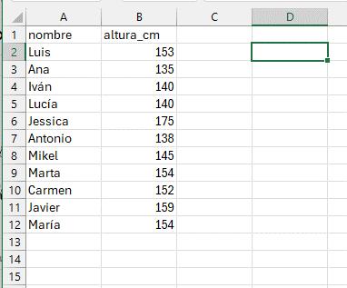

Vamos a utilizar los datos de medidas de altura de nuestro grupo de alumnos. Quitamos el último dígito a la derecha de nuestros valores y colocamos verticalmente los valores resultantes ordenándolos de menor a mayor, y evitando las repeticiones. Para evitar errores en la escala, debemos incluir los valores intermedios aunque no haya ninguno en nuestros datos (en el ejemplo, el valor 16 que correspondería a los 160). Esto forma el "tallo" de nuestro diagrama:

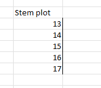

A continuación añadimos las "hojas" en la celda a la derecha, que consisten en los valores que hemos "cortado" de nuestro árbol, uno al lado de otro, incluyendo esta vez los valores repetidos, en orden de menor a mayor. Por ejemplo, para el valor 135, descartamos 13 y utlizamos 5; para el valor 138, descartamos 13 y utilizamos 8, y así sucesivamente para todos los valores.

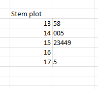

#### Construcción del diagrama en Python y R

R permite realizar el _stemplot_ mediante la función $stem()$ de forma automática. Python no incluye entre sus métodos básicos una función para hacer un *stemplot*, aunque sí la tiene en la librería `stemgraphic`; importamos de esta librería sólo la función `stem_text()`

::: {.panel-tabset group="idiomas"}

## Python

```{python}
from stemgraphic.text import stem_text

altura_cm = [153,135,140,140,175,138,145,154,152,159,154]
stem_text(altura_cm)
```

## R

```{r message=FALSE, warning=FALSE}
altura_cm <- c(153,135,140,140,175,138,145,154,152,159,154)
stem(altura_cm)
```

:::

### Interpretación del diagrama de tallo y hojas

-   **Tallo**: Los números a la izquierda del símbolo `|` representan los valores base (o tallos), en este caso, las decenas de las alturas.
-   **Hojas**: Los números a la derecha del símbolo `|` representan los dígitos adicionales (o hojas). Por ejemplo, en la línea `13 | 58`, el tallo es `13` (130), y las hojas son `5` y `8`, que corresponden a los datos `135` y `138`.

El diagrama nos dice que los valores en torno a 150 cm son los más frecuentes, y que hay un valor alto (175) que se separa un poco del resto.

### Resumen

El *stemplot* es muy sencillo de hacer y nos da una visión rápida y compacta de la *distribución* de nuestros valores, así como de la posible existencia de valores que se separan del conjunto. Estos valores alejados, que se conocen en inglés como *outliers*, tienen mucha importancia en el analisis e interpretación de los datos, como veremos más adelante.

La ventaja principal del *stemplot* es que mantiene los valores originales de las observaciones, y puede hacerse fácilmente con bolígrafo y papel, sin necesidad de más herramientas.

Su principal inconveniente es la elaboración manual (aunque lenguajes como R tienen funciones que lo contruyen de forma automática), y por lo tanto, la dificultad de aplicarlo a volumenes de datos medios o grandes. El uso generalizado de los ordenadores ha hecho que actualmente esta herramienta tenga muy poco uso, y se utilicen en su lugar otras más gráficas y de construcción automática, como el **histograma**.

## Distribuciones de frecuencias

Una **distribución de frecuencias** es una tabla que muestra la frecuencia con la que ocurren los valores diferentes en un conjunto de datos. Esta herramienta es fundamental en la estadística descriptiva y permite resumir y visualizar cómo se distribuyen los datos de manera clara y comprensible. A partir de una tabla de frecuencias se pueden construir diagramas de barra o histogramas para visualizar la tabla de forma gráfica.

Para construir una distribución de frecuencias, agrupamos nuestros valores por intervalos, y contamos el número de observaciones que aparecen en cada intervalo. Los componentes de una distribución de frecuencias son:

-   las **categorías o clases** son los intervalos o valores específicos de los datos que se están analizando. Cada categoría representa un rango de valores en caso de datos continuos, o valores específicos en caso de datos discretos.
-   la **frecuencia absoluta** es un *recuento simple* de cuántas veces aparece cada valor en un conjunto de datos.
-   la **frecuencia relativa** nos muestra la *proporción* de cada valor frente al total. Puede expresarse como fracción (entre 0 y 1) o como porcentaje (respecto a 100), y se calcula como: $$
     \text{Frecuencia Relativa} = \frac{\text{Frecuencia Absoluta}}{\text{Número Total de Observaciones}}
     $$
-   la **frecuencia acumulada** nos dice cuántas observaciones están por debajo de un cierto valor.
-   la **frecuencia relativa acumulada** es la proporción de valores que están por debajo de un cierto valor

### Construcción de una tabla de frecuencias paso a paso en Excel

Para crear una tabla de frecuencias de la variable `altura_cm` mediante una tabla dinámica en Excel, sigue estos pasos:

**1. Selecciona los Datos**

1.  Abre tu archivo de Excel y selecciona toda la tabla que incluye los encabezados (`nombre` y `altura_cm`).

**2. Inserta una tabla dinámica**

1.  Ve a la pestaña **Insertar** en la barra de herramientas de Excel.
2.  Haz clic en **Tabla Dinámica**.
3.  En el cuadro de diálogo que aparece, asegúrate de que el rango de datos seleccionado es correcto y elige dónde deseas colocar la tabla dinámica (en una nueva hoja de cálculo o en la hoja actual).

**3. Añade la frecuencia absoluta**

1.  En el panel de campos de la tabla dinámica, arrastra el campo `altura_cm` a la sección **Filas**.
2.  Arrastra nuevamente el campo `altura_cm` a la sección **Valores**.

**4. Ajusta la configuración de valores**

1.  Haz clic en el campo `altura_cm` en la sección **Valores**.
2.  Selecciona **Configuración de campo de valor**.
3.  En el cuadro de diálogo que aparece, asegúrate de que esté seleccionada la opción **Recuento**
4.  Acepta todo hasta volver a Excel.

**5. Añade la frecuencia relativa**

1.  En el panel de campos de la tabla dinámica, arrastra de nuevo el campo `altura_cm` a la sección **Valores**. Ahora la variable aparecerá como `altura_cm2`.

**6. Ajusta de nuevo la configuración de valores**

1.  Haz clic en el campo `altura_cm2` en la sección **Valores**.
2.  Selecciona **Configuración de campo de valor**.
3.  En el cuadro de diálogo que aparece, asegúrate de que esté seleccionada la opción **Recuento**.
4.  En ese mismo cuadro, haz click en el botón **Formato de número**, selecciona **Número** y **2 decimales**, y acepta.
5.  En ese mismo cuadro, selecciona la pestaña que dice **Mostrar valores como**
6.  En el menú desplegable, escoge la opción **% del total de columnas**.
7.  Acepta todo hasta volver a Excel.

**7. Ordena y formatea**

1.  Puedes ordenar las alturas en orden ascendente o descendente haciendo clic en la flecha junto a `altura_cm` en la tabla dinámica.
2.  También puedes cambiar el formato de la tabla dinámica para que sea más fácil de leer.
3.  Puedes renombrar los encabezados de la tabla para que sea más fácil de leer, rotulando las columnas, por ejemplo, como `frec_abs`y `frec_rel`, o cualquier otro encabezado que te resulte claro y útil.

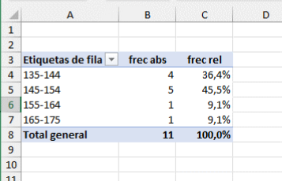

### Construcción de una tabla de frecuencias mediante Python o R

::: {#clr-instrucciones .callout-tip .content-visible when-format="html"}
## Importante: Explicación del código

A continuación, veremos varios ejemplos de código R y Python.

Para un explicación detallada del código, copia el código R o Python y pégalo en Gemini o en ChatGPT (o Copilot). A continuación. da esta instrucción a la IA (puedes copiar y pegar):

>Actúa como un tutor de programación. Explica este código instrucción a instrucción de forma detallada y sencilla, indicando qué hace cada línea y por qué es necesaria. Usa analogías con Excel o tareas manuales para que sea más fácil de entender.

:::

::: {.panel-tabset group="idiomas"}

## Python
```{python}
import pandas as pd

altura_cm = [153,135,140,140,175,138,145,154,152,159,154]
frecuencias = pd.Series(altura_cm).value_counts()
print(frecuencias)
```

## R base
```{r}
altura_cm <- c(153, 135, 140, 140, 175, 138, 145, 154, 152, 159, 154)
frecuencias <- table(altura_cm)
print(frecuencias)
```

## R con dplyr
```{r}
#| message: false
#| warning: false

library(dplyr)
df_alturas <- tibble(
  altura = c(153, 135, 140, 140, 175, 138, 145, 154, 152, 159, 154)
)
frecuencias <- df_alturas |>
  count(altura, sort = TRUE, name = "frecuencia")
print(frecuencias)
```

:::

Con un poco más de código podemos hacer la tabla agrupando los valores en clases de amplitud 10, con las frecuencias absolutas y relativas. Es un poco más complicado, tómate tu tiempo para entender cada paso de las instrucciones.


::: {.panel-tabset group="idiomas"}

## Python
```{python}
import pandas as pd
import numpy as np

altura_cm = [153,135,140,140,175,138,145,154,152,159,154]
serie = pd.Series(altura_cm)

# Crear intervalos automáticamente con amplitud 10
bins = np.arange(min(altura_cm)//10*10, 
                 max(altura_cm)//10*10 + 20, 10)

# Agrupar y contar
tabla = pd.cut(serie, bins=bins).value_counts(sort=False)

# Convertir a DataFrame con acumulados y relativos
df = tabla.to_frame(name='Frecuencia')
df['Frec_acum_%'] = df['Frecuencia'].cumsum()

# escribimos la instrucción en dos lineas usando los paréntesis
df['Frec_rel_%'] = (
  (df['Frecuencia'] / df['Frecuencia'].sum() * 100).round(2)
)
df['Frec_rel_acum_%'] = df['Frec_rel_%'].cumsum()

print(df)
```

## R base
```{r}
# 1. Definir los datos
altura_cm <- c(153, 135, 140, 140, 175, 138, 145, 154, 152, 159, 154)

# 2. Crear los cortes (bins) como en NumPy
limite_inf <- floor(min(altura_cm) / 10) * 10
limite_sup <- floor(max(altura_cm) / 10) * 10 + 10 # +10 para asegurar el último rango

bins <- seq(limite_inf, limite_sup + 10, by = 10)

# 3. Agrupar los datos en los intervalos
intervalos <- cut(altura_cm, breaks = bins, right = FALSE)

# 4. Crear la tabla de frecuencias
frecuencia <- as.vector(table(intervalos))
nombres_intervalos <- levels(intervalos)

# 5. Construir el data.frame con los cálculos
df <- data.frame(
  Intervalo = nombres_intervalos,
  Frecuencia = frecuencia
)

# Cálculos de acumulados y relativos
df$Frec_acum <- cumsum(df$Frecuencia)
df$Frec_rel_pct <- round((df$Frecuencia / sum(df$Frecuencia)) * 100, 2)
df$Frec_rel_acum_pct <- cumsum(df$Frec_rel_pct)

# Imprimir resultado
print(df)
```

## R con dplyr
```{r}
#| message: false
#| warning: false
#| 
library(dplyr)

# 1. Definir los datos
altura_cm <- c(153, 135, 140, 140, 175, 138, 145, 154, 152, 159, 154)

# 2. Definir los cortes (bins)
bins <- seq(
  from = floor(min(altura_cm) / 10) * 10,
  to   = floor(max(altura_cm) / 10) * 10 + 20,
  by   = 10
)

tabla_frecuencias <- tibble(altura = altura_cm) |>
  mutate(
    intervalo = cut(altura, breaks = bins, right = FALSE)
  ) |>
  count(intervalo, name = "Frecuencia", .drop=FALSE) |>
  mutate(
    Frec_acum_pct= cumsum(Frecuencia),
    Frec_rel_pct = round((Frecuencia / sum(Frecuencia)) * 100, 2),
    Frec_rel_acum_pct = cumsum(Frec_rel_pct)
  )

print(tabla_frecuencias)
```

:::

Como ves en el resultado, a veces se utilizan los símbolos `(` y `[` para definir los intervalos, tal como se hace en matemáticas.

-   Intervalo **abierto**: El símbolo `(` se utiliza para denotar un intervalo abierto. El límite correspondiente **no** está incluuido en el intervalo.
-   Intervalo **cerrado o semiabierto**:El símbolo `[` se utiliza para denotar un intervalo cerrado o semiabierto. EL límite correspondiente **sí** está incluido en el intervalo.

Ejemplos:

-   $(a, b)$ representa todos los números reales **mayores** que $a$ y **menores** que $b$ (excluye los valores $a$ y $b$).
-   $[a, b]$ representa todos los números reales **mayores o iguales** que $a$ y **menores o iguales** que $b$ (incluye $a$ y $b$).
-   $[a, b)$ representa todos los números reales **mayores o iguales** que $a$ y **menores** que $b$ (incluye $a$, pero excluye $b$)
-   $(a, b]$ representa todos los números reales **mayores** que $a$ y **menores o iguales** que $b$ (excluye $a$, pero incluye $b$). :::

Si comparamos los dos métodos que hemos utilizado para construir la tabla de frecuencias, vemos que:

-   en Excel los pasos que hemos dado no están registrados y a la vista, y, por lo tanto, no son fácilmente revisables
-   en Python y R, todos los pasos y opciones que hemos utilizado están a la vista en el código del script

Si otra persona quisiera modificar la tabla, le sería fácil editar el código y relanzar el script, mientras que en Excel no sería fácil asegurarse de todos y cada uno de los pasos y clicks de ratón que hemos dado para construir y formatear la tabla.

Es el caso, por ejemplo, de que enviásemos la tabla a otra persona y ésta tuviese que editarla en nuestra ausencia. En Excel, tendríamos que enviar a esa persona una explicación con las instrucciones oportunas; en cambio, en Python y en R, una vez que se comprende el código, no hacen falta más explicaciones adicionales. Incluso sin una comprensión total del código, se podría duplicar exactamente la tabla copiando y ejecutando el código.

Esta es una de las principales razones de la conveniencia del aprendizaje de `Python` incluso para las actividades más sencillas.

### Ejercicio propuesto

En la tabla de frecuencias anterior, calcular **frecuencia absoluta acumulada** y **frecuencia relativa acumulada** en Excel, e incluirlas en la tabla como dos columnas adicionales. La **frecuencia relativa acumulada** nos permitirá crear **diagramas de Pareto**, muy útiles en los procesos de mejora de calidad.

## Diagrama de barras

Cuando nuestra variable es *discreta*, podemos representar las frecuencias de cada valor de forma gráfica utilizando un diagrama de barras. Este diagrama utiliza barras rectangulares para representar la frecuencia de cada categoría.

Este gráfico es muy utilizado para representar, por ejemplo, resultados de encuestas, como el número de votos que han obtenido los diferentes partidos políticos en unas elecciones, o tablas discretas, como los kilos fabricados por meses en una fábrica.

::: {layout-ncol=2}
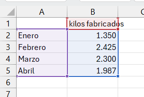{width=300}

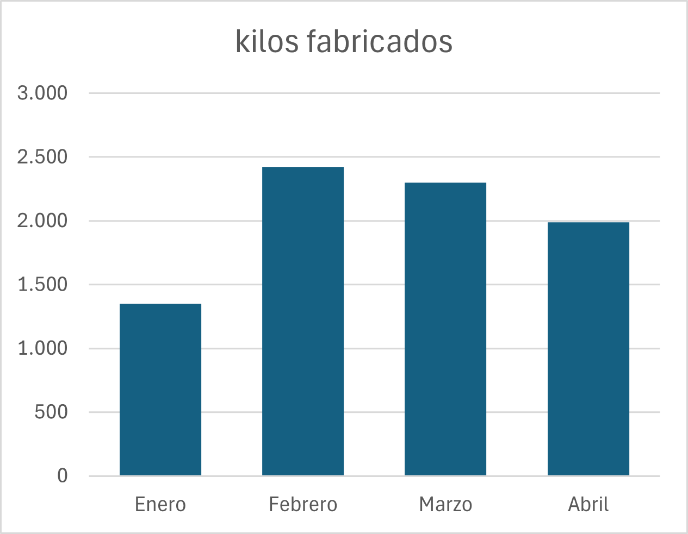{width=300}

{width=300}

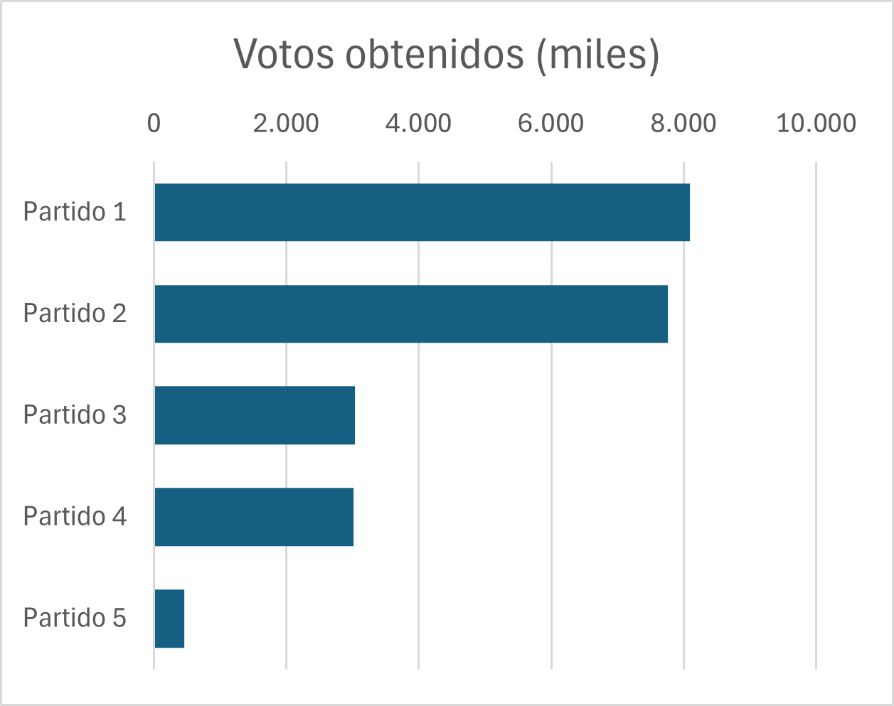{width=300}

:::

## Histograma

Para visualizar las variables continuas se utiliza el **histograma**, que es un diagrama que utiliza las barras rectangulares para hacer un gráfico de la distribución de valores continuos, previamente agrupados en intervalos (*bins* en inglés), tal como se ha hecho en la tabla de frecuencias.

#### Componentes de un histograma

1.  **Eje horizontal (X)**: Representa los intervalos de valores de la variable. Cada intervalo abarca un rango específico de valores.
2.  **Eje vertical (Y)**: Muestra la frecuencia o el número de veces que los valores caen dentro de cada intervalo.
3.  **Barras**: Cada barra en el histograma representa un intervalo. La altura de la barra indica la frecuencia de los valores dentro de ese intervalo.

#### Cómo interpretar un histograma

-   Si las barras son altas en un intervalo específico, significa que muchos valores del conjunto de datos caen dentro de ese rango.
-   Un histograma puede ayudar a identificar patrones, como si los datos están distribuidos de manera simétrica, sesgada, o si hay picos y valles significativos.

### Construcción de un histograma en Excel

Usaremos el ejemplo de la altura en cm. de un grupo de alumnos, cuyos datos hemos guardado en el fichero csv `aula1.csv`.

Podemos utilizar dos métodos para hacer un histograma en Excel

#### Método 1: histograma directo

-   Seleccionamos el rango de datos. Podemos hacerlo mediante un click en el encabezado de la columna de la variable `altura_cm`, en este caso, la columna `B`.
-   En la opción de menú `Insertar`, seleccionamos el icono `Seleccionar gráficos de estadística`
-   Seleccionamos `Histograma`

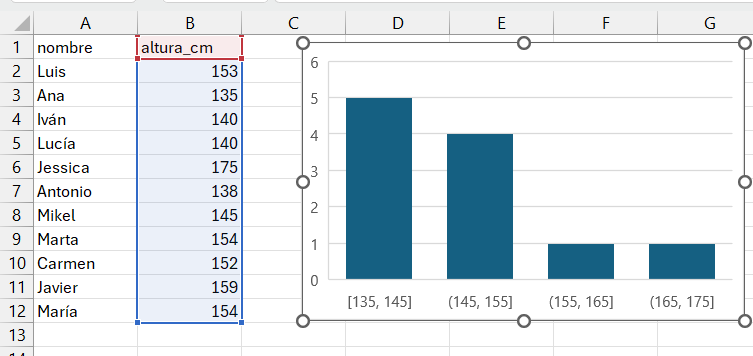{fig-align="center" width="75%"}

Excel calcula automáticamente la amplitud de los intervalos y el número de columnas; estas opciones pueden modificarse seleccionando con el botón derecho del ratón el elemento a modificar. En este caso, utilizamos estas opciones:

-   Eliminamos título del gráfico
-   Modificamos anchura de las barras seleccionando `Dar formato a serie de datos`, `Opciones de serie`, `Ancho del rango`= 50%
-   Modificamos los intervalos seleccionando el eje X: `Dar formato al eje`, `Opciones de eje`, `Ancho del rango` = 10

La descripción de los intervalos utiliza los mismos símbolos que hemos visto en las tablas de frecuencias de `Python`.

En el momento de escribir este manual, Excel no permite hacer histogramas múltiples ni agrupados por otra variable, por lo que para diseños más complejos, no hay más remedio que recurrir a otras opciones como las tablas dinámicas de Excel o, mejor aún, `Python` o `R`.

#### Método 2: utilizar una tabla dinámica

La tabla dinámica que hemos construido en Excel ha convertido nuestra variable continua, `altura_cm`, en una tabla de valores discretos, al agrupar los valores en intervalos. En Excel podemos representar las frecuencias absolutas de nuestra tabla gráficamente, insertando un gráfico de barras a partir de la tabla:

-   Con el cursor dentro de la tabla, seleccionamos la opción de menú `Insertar`
-   Insertamos un gráfico de barras

Opcionalmente, aplicamos las siguientes opciones de formato:

-   Hacemos click sobre uno de los botones del gráfico dinámico con el boton derecho del ratón, y seleccionamos la opción ocultar todos los botones del gráfico.
-   Eliminamos el título del gráfico
-   Abrimos el formato de la serie de datos, e introducimos en la opción `Ancho del rango` el valor $50\%$ para ensanchar las barras.

{fig-align="center" width="75%"}

Al utiizar la tabla dinámica para construir el gráfico, Excel utiliza las categorías de la tabla dinámica. Dado que estas categorías (los intervalos que ha formado la tabla dinámica) son discretas, Excel utiliza el resultado de la tabla dinámica para hacer el gráfico con un diagrama de barras. No es posible insertar un histograma a partir de una tabla dinámica.

### Análisis de un caso real

El histograma muestra su utilidad cuando representamos la distribución de un conjunto de valores más grande que nuestros once alumnos. Veamos su aplicación a los datos diarios de una fabricación de queso camembert a lo largo de un año.Los datos de esta fabricación están en el fichero [`camembert.csv`](https://raw.githubusercontent.com/juanriera/master-queseria/master/datos/camembert.csv').

La tabla de datos tiene esta estructura:

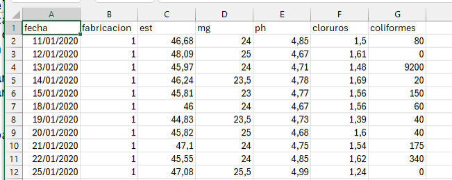{fig-align="center" width="75%"}

La tabla está formada por 211 casos.


#### Construcción del histograma con Excel

##### Método directo

Seleccionamos el rango del extracto seco (columna `est`) e insertamos el histograma, ajustando el ancho de intervalo a $1$ en las opciones de gráfico:

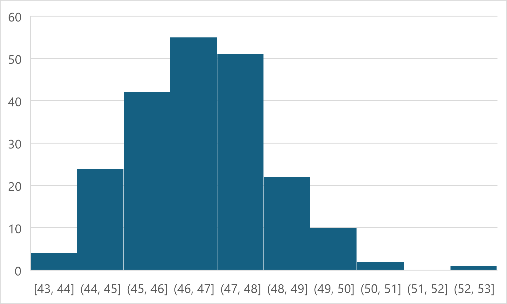{fig-align="center" width="50%"}

##### Método 2: mediante una tabla dinámica

Los pasos a seguir son:

1.  Construir la tabla dinámica
2.  Agrupar los datos
3.  Insertar el gráfico a partir de la tabla

Con una agrupación de datos en intervalos de 1, esta es nuestra tabla dinámica:

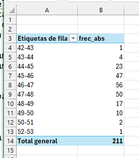{fig-align="center" width="50%"}

En la figura siguiente vemos el histograma correspondiente a la tabla anterior, con un intervalo de clase de 1 punto de extracto seco total, y otras dos alternativas si el intervalo de clase fuese de 2 puntos o de de 0,5 puntos.

::: {layout-ncol=2}
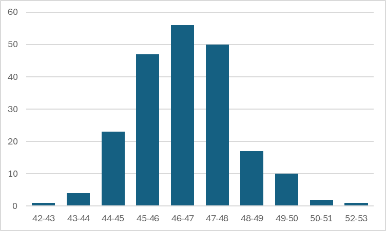

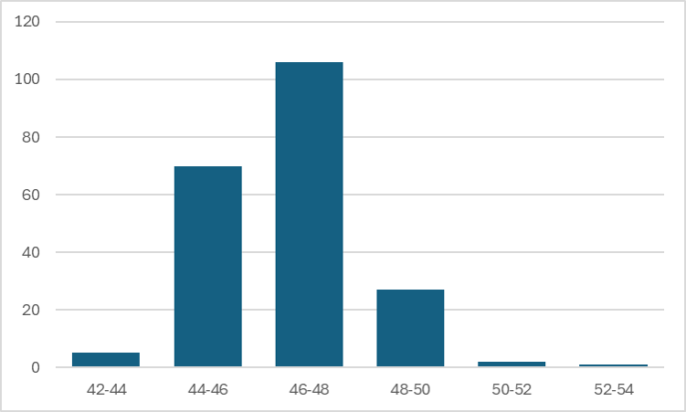

:::

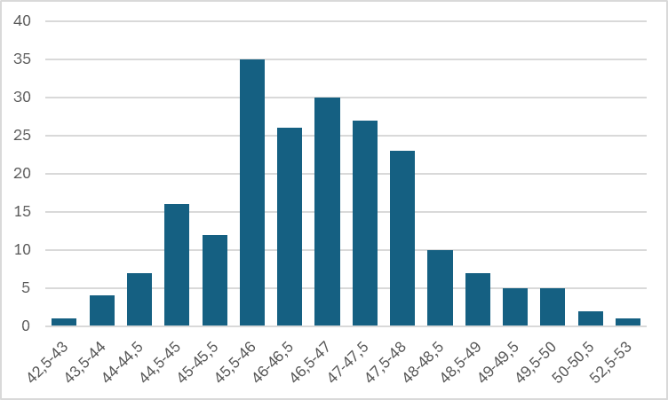{fig-align="center" width="75%"}

La decisión de cambiar la amplitud del intervalo en un histograma influye en el aspecto del gráfico y es una opción personal; lo mejor es utilizar la que en nuestra opinión refleje mejor el aspecto de la distribución de datos, ni demasiado grande ni demasiado pequeña. En todo caso, debemos ser capaces de interpretar que la distribución de los valores es la misma en los tres casos: hay una mayoría de casos con valores entre 46 y 48, y muy pocos casos con valores muy bajos o muy altos. En este caso, la distribución de los valores es aproximadamente simétrica, y se reparten alrededor de una mayoría de valores centrales.

### Histograma en Python y R

En Python, las librerías `matplotlib` y `seaborn` son las herramientas estándar para crear gráficos.

- **matplotlib.pyplot (alias `plt`):** Es la base, una librería de bajo nivel que da un control muy granular sobre cada aspecto del gráfico.
- **seaborn (alias `sns`):** Construye sobre `matplotlib`, ofreciendo una interfaz de alto nivel para crear gráficos estadísticos complejos y estéticamente agradables con menos código. Es ideal para explorar distribuciones, relaciones entre variables y comparaciones entre grupos. 

Siempre importamos ambas, ya que `seaborn` a menudo usa funciones de `matplotlib` para mostrar y personalizar los gráficos (como `plt.title()` para el título o `plt.show()` para mostrar el gráfico).

En **R**, usaremos las funciones de base y la librería `ggplot()`.

El texto siguiente incluye el código para crear el gráfico. En caso de dificultad con el código, puedes copiarlo en Gemini o Copilot para que te lo explique línea a línea, como hemos hecho antes.

Las funciones de histograma de Python y R permiten construir el histograma directamente sin necesidad de hacer previamente una tabla de frecuencias (en realidad, la tabla de frecuencias se calcula internamente). Es mucho más sencillo utilizar estas funciones, ya que el código se simplifica mucho.

Vemos que los gráficos no son idénticos a pesar de provenir de los mismos datos, porque la construcción de los intervalos subyacente y el aspecto de las barras pueden ser ligeramente diferentes. Esto no debe preocuparnos, porque el aspecto general de la distribución de los datos es el mismo, y pueden modificarse mediante la parametrización adecuada de sus opciones.

En la fase de exploración nos importa más entender estas propiedades de los datos (aspecto, forma de la distribución) que la precisión en la construcción del gráfico. Las funciones de base son más fáciles y directas de usar, aunque tienen menos opciones.

En primer lugar, cargamos los datos del CSV de la fabricación de camembert, que está en la subcarpeta `datos`, en un dataframe:

::: {.panel-tabset}
## Python
```{python}
import pandas as pd

df = pd.read_csv("datos/camembert.csv", decimal = ",", sep=';', encoding='ISO-8859-1')
```

## R

```{r}

df <- read.csv2("datos/camembert.csv")
```


:::

y a continuación, construimos el gráfico:

::: {.panel-tabset}
## Python (con `matplotlib`)
```{python}
import matplotlib.pyplot as plt

df["est"].hist() # histograma básico de matplotlib

# Añadir título y etiquetas
plt.title("Distribución del extracto seco total"
          " en una fabricación anual de camembert")
plt.xlabel("Extracto seco total (est)")
plt.ylabel("Frecuencia")

# Mostrar el gráfico
plt.show()
```

## Python (con `seaborn`)

```{python}
import seaborn as sns
import matplotlib.pyplot as plt

sns.histplot(df["est"])

# 2. Etiquetas de ejes
plt.title("Distribución del extracto seco total\nen una fabricación anual de camembert")
plt.xlabel("Extracto seco total (est)")
plt.ylabel("Frecuencia")

# Mostrar gráfico
plt.show()
```

## R base
```{r}

hist(df$est, 
     main = "Distribución del extracto seco total\nen una fabricación anual de camembert",
     xlab = "Extracto seco total (est)",
     ylab = "Frecuencia")

```

## R (con `ggplot`)

```{r}
#| message: false
library(ggplot2)

ggplot(df, aes(x = est)) +
  geom_histogram(bins = 10) +
  labs(
    title = "Distribución del extracto seco total",
    subtitle = "Fabricación anual de queso camembert",
    x = "Extracto seco total (est)",
    y = "Frecuencia"
  ) +
  theme_minimal()
```
:::

### Otros ejemplos

En ocasiones, nos encontramos con datos que son asimétricos: hay una mayoría de valores bajos o bien de valores altos. Veamos un caso: los recuentos bacterianos de bacterias coliformes, que tenemos en la última columna a la derecha de nuestra tabla, en la variable ´coliformes´.

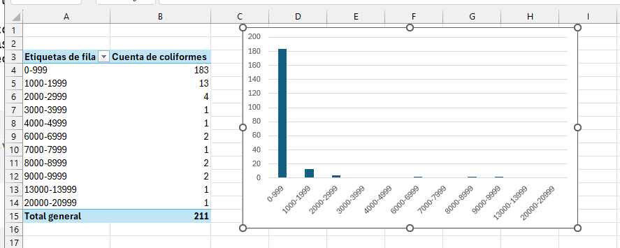

En este caso, vemos que la mayoría de los casos tienen valor cero. Es el caso de los recuentos de bacterias contaminantes, en el que la mayoría de los análisis tienen recuentos cero o muy bajos, y sólo en pocos casos tienen valores altos. Veremos con más detalle cómo tratar estas distribuciones má adelante.

## Diagrama de caja o *boxplot*

Este gráfico fue creado por el estadístico John Tukey en 1977, y es una herramienta fundamental en la exploración de datos. Se basa en un grupo de medidas que se utiliza ampliamente en la descripción de conjuntos de datos, el conjunto de **cuartiles**. Si dividimos un grupo de datos **ordenados** en cuatro partes iguales, mediante **tres** puntos de corte, llamamos **primer cuartil** o $Q1$ al valor que se situa en el 25%; **segundo cuartil**, o $Q2$, al valor que se sitúa en el centro (50%), y **tercer cuartil**, o $Q3$, al punto que se situa en el 75% de los datos. A estos tres valores añadimos el **mínimo** y el **máximo**, y tenemos un conjunto de **cinco números** que nos permiten describir la forma de la distribución de datos con cierta precisión. El segundo cuartil ($Q2$), que corresponde al 50% de los datos, se conoce habitualmente como **mediana**. El valor resultante de restar $Q3-Q1$ es lo que se conoce como **rango intercuartil** o $IQR$, y es una medida de la dispersión de la distribución de datos (mide la amplitud de la distribución).

El **diagrama de caja**, también conocido como *boxplot*, es un gráfico que permite resumir las características principales de un conjunto de datos utilizando estos cinco números, tal como se explica a continuación. Sus ventajas son:

-   Muestra la mediana y los cuartiles (Q1 y Q3) de los datos.
-   Permite identificar la simetría de la distribución: si la mediana no está en el centro, la distribución no es simétrica.
-   Permite detectar posibles valores atípicos, representando los valores atípicos (*outliers*) que están lejos del resto de los datos (un valor es atípico si está más allá de (Q3 + 1.5 \cdot IQR) o (Q1 - 1.5 \cdot IQR).

La construcción de un diagrama de caja es como sigue:


Microsoft Excel no dispone de un diseño de gráficos de caja que sea práctico, por lo que recurriremos siempre a `Python` para realizarlos.

### Relación entre el *boxplot* y el histograma

Resulta muy útil comprender visualmente la relación entre el *boxplot* y el histograma para entender la distribución de los datos. En la gráfica siguiente analizamos el extracto seco total de nuesta fabricacion usando ambos gráficos simultáneamente. La caja del `boxplot`se corresponde con el 50% central de los datos, y la línea media representa la mediana, como hemos visto. Vemos también que hemos utilizado una opción de formato para destacar las observaciones que se separan de forma anormal del conjunto de datos (valores atípicos o *outliers*)


```{python}
#| code-fold: true
#| code-summary: "Mostrar código"

import pandas as pd
import matplotlib.pyplot as plt
import seaborn as sns

df = pd.read_csv("datos/camembert.csv", decimal = ",", sep=';', encoding='ISO-8859-1')

# 1. Crear la figura y los subplots (2 filas, 1 columna)
fig, (ax_hist, ax_box) = plt.subplots(
    2, 1, 
    sharex=True, 
    gridspec_kw={"height_ratios": (.85, .15)},
    figsize=(8, 6) # Tamaño de la figura
)

# 2. Dibujar el Histograma (en el subplot superior)
# fill="lightblue", color="black", bins=20, alpha=0.7
sns.histplot(
    data=df, 
    x='est', 
    bins=20, 
    edgecolor='black', 
    alpha=0.7, 
    kde=True, # Añadir curva de densidad (similar a geom_density)
    ax=ax_hist
)
ax_hist.set_title(f"Histograma y Boxplot para `est`", fontsize=14)
ax_hist.set_ylabel("Frecuencias", fontsize=12)
ax_hist.set_xlabel('') # Eliminar etiqueta X redundante

# 3. Dibujar el Boxplot (en el subplot inferior)
# width = 2, fill = "darkgrey", alpha = 0.7
# Nota: La posición 'nudge' se maneja al usar un subplot separado.
sns.boxplot(
    data=df, 
    x='est', 
    color='darkgrey', 
    linewidth=1.5,
    flierprops={'markerfacecolor': 'red', 'marker': 'o'}, # Estilo para outliers
    ax=ax_box
)
ax_box.set_xlabel('est', fontsize=12) # Colocar la etiqueta X aquí
ax_box.set_ylabel('') # Quitar etiqueta Y del boxplot
ax_box.tick_params(left=False, labelleft=False) # Quitar ticks y etiquetas Y

# Ajustar diseño
plt.tight_layout()
plt.show()
```

## Alternativas al boxplot

#### Beeswarm

El *boxplot* es muy útil para resumir grandes cantidades de información, pero cuando el número de puntos es muy bajo, puede resultarnos más útil la visualización mediante otro tipo de gráficos que nos muestren los puntos individuales agrupados. Entre estas visualizaciones, el gráfico tipo *beeswarm* que podemos utiizar en Python mediante la función `swarmplot()` de `seaborn`, o en R mediante la librería `ggbeeswarm`. 

::: {.panel-tabset}
## Python (con `seaborn`)

```{python}
sns.swarmplot(data=df, y='est', size=5)
plt.title('Beeswarm: extracto seco total')
plt.ylabel('Extracto seco total')
plt.tight_layout()
plt.show()
```

## R (con `ggbeeswarm`)
```{r}
#| message: false
 
library(ggplot2)
library(ggbeeswarm)

# 2. Crear el gráfico de enjambre profesional
ggplot(df, aes(x = "", y = est)) +
  geom_beeswarm(size = 2, color = "darkblue", cex = 1.5) +
  labs(
    title = "Beeswarm: extracto seco total",
    subtitle = "Gráfico de puntos sin solapamiento (estilo Seaborn)",
    x = "", 
    y = "Extracto seco total"
  ) +
  theme_minimal()

```

:::

El *beeswarm* nos da una distribución aproximada de los valores individuales, y los coloca al lado evitando solapamientos.

#### Stripplot o dotplot
El *stripplot* muestra los puntos en distribución vertical sobre las categorías; para evitar que los puntos con las mismas coordenada se solapen, utilizamos la opción *jitter*, que introduce un pequeño *ruido* aleatorio horizontal para desplazar las coordenadas de los puntos evitando su solapamiento.

::: {.panel-tabset}

## Python
```{python}
sns.stripplot(data=df, y='est', jitter=True, size=5)
plt.title('Dotplot con jitter: extracto seco total')
plt.ylabel("Extracto seco total")
plt.tight_layout()
plt.show()
```

## R

```{r}
library(ggplot2)

ggplot(df, aes(x = "", y = est)) +
  geom_jitter(width = 0.1, size = 2, color = "darkblue", alpha = 0.6) +
  labs(
    title = "Extracto seco total",
    subtitle = "Dotplot con jitter",
    x = "", 
    y = "Extracto seco total"
  ) +
  theme_minimal()
```

:::

Estos diagramas pueden superponerse al *boxplot*, lo que nos permite completar la visualización de los puntos y la interpretación que hace el *boxplot* de su distribución.

::: {.panel-tabset}

## Python (beeswarm)

```{python}
sns.boxplot(data=df, y='est', width = 0.2, color='lightgray')
sns.swarmplot(data=df, y='est', size=4)
plt.title('Boxplot + Beeswarm: extracto seco total')
plt.ylabel("Extracto seco total")
plt.tight_layout()
plt.show()
```

## Python (stripplot)
```{python}
import seaborn as sns
import matplotlib.pyplot as plt

sns.boxplot(data=df, y='est', color='lightgray', width=0.3, fliersize=0)
sns.stripplot(data=df, y='est', jitter=True, size=5, color='darkblue', alpha=0.7)
plt.title('Boxplot + Stripplot: extracto seco total')
plt.ylabel("Extracto seco total")
plt.tight_layout()
plt.show()
```

## R (beeswarm)

```{r}
#| message: false
library(ggplot2)
library(ggbeeswarm)

ggplot(df, aes(x = "", y = est)) +
  geom_boxplot(width = 0.3, fill = "lightgray", outlier.shape = NA) +
  geom_beeswarm(color = "darkblue", size = 2, cex = 1.5, alpha = 0.4) +
  labs(
    title = "Boxplot + Beeswarm: extracto seco total",
    x = "",
    y = "Extracto seco total"
  ) +
  theme_minimal()
```

## R(stripplot)
```{r}
library(ggplot2)

ggplot(df, aes(x = "", y = est)) +
  geom_boxplot(width = 0.3, fill = "lightgray", outlier.shape = NA) +
  geom_jitter(width = 0.1, size = 2, color = "darkblue", alpha = 0.4) +
  labs(
    title = "Extracto seco total",
    subtitle = "Dotplot con jitter",
    x = "", 
    y = "Extracto seco total"
  ) +
  theme_minimal()
```

:::

## Gráficos de densidad

Un gráfico de densidad es una representación visual suavizada de la distribución de un conjunto de datos. A diferencia de los histogramas, que dividen los datos en intervalos y cuentan las frecuencias, los gráficos de densidad utilizan técnicas estadísticas no paramétricas para estimar la función de densidad de probabilidad.

Excel no permite la representación de los gráficos de densidad; en `Python` utilizamos `seaborn`, añadiendo la funcion de densidad a un histograma añadiendo la opción `kde = True`. 

Los gráficos de densidad son especialmente útiles cuando estamos comparando diferentes grupos de datos entre sí, por ejemplo en este caso comparamos el extracto seco total de nuestra fabricación de camembert trimestre a trimestre:

```{python}
#| code-fold: true
#| code-summary: "Mostrar código"

# 1. Reemplazar la columna 'fecha' in-place con formato fecha
df['fecha'] = pd.to_datetime(
    df['fecha'], 
    format='%d/%m/%Y',
    errors='coerce' # Mantiene la robustez ante datos incorrectos
)

# 2. Asignar Trimestre
# Extraer el trimestre de la columna 'fecha'
df['trimestre'] = df['fecha'].dt.quarter.astype(str)
df['trimestre_etiqueta'] = 'T' + df['trimestre']

# 3. Visualización con Seaborn (Curva de Densidad por Trimestre)

plt.figure(figsize=(10, 6))

# Usamos sns.kdeplot, que es la función ideal para comparar densidades.
sns.kdeplot(
    data=df, 
    x='est', 
    hue='trimestre_etiqueta', # Columna para diferenciar las curvas
    fill=True,               # Rellenar el área bajo la curva
    alpha=0.2,               # Transparencia del relleno
    linewidth=2              # Grosor de la línea
)

# Configuración del Título y Etiquetas
plt.title('Comparación de la Curva de Densidad del Extracto Seco Total (EST) por Trimestre', fontsize=16)
plt.xlabel('Extracto Seco Total (EST)', fontsize=12)
plt.ylabel('Densidad', fontsize=12)

# Mostrar leyenda y gráfico
plt.gca().get_legend().set_title("Trimestre")
plt.grid(axis='y', linestyle='--', alpha=0.6)
plt.show()
```

R calcula la función de densidad de forma ligeramente distinta, por lo que las curvas obtenidas no son idénticas; puede parametrizarse para obtener un resultado muy aproximado mediante el parámetro `adjust` de `geom_density()`.

```{r}
#| message: false
#| warning: false
#| code-fold: true
#| code-summary: "Mostrar código"
#| 
library(ggplot2)
library(lubridate) # Librería estándar para fechas en R

# 1. Convertir la columna 'fecha' a formato Fecha
df$fecha <- dmy(df$fecha) 

# 2. Crear la etiqueta del Trimestre
# quarter() extrae el número y paste0() le añade la "T" delante
df$trimestre_etiqueta <- paste0("T", quarter(df$fecha))

# 3. Visualización con ggplot2 (Curva de Densidad)
ggplot(df, aes(x = est, fill = trimestre_etiqueta, color = trimestre_etiqueta)) +
  geom_density(alpha = 0.2, linewidth = 1, adjust = 1) +
  labs(
    title = "Comparación de la Curva de Densidad del EST por Trimestre",
    x = "Extracto Seco Total (EST)",
    y = "Densidad",
    fill = "Trimestre",
    color = "Trimestre"
  ) +
  theme_minimal() +
  theme(panel.grid.minor = element_blank())
```

La curva de densidad nos permite visualizar la desviación que se produce por el verano (T3); son los valores que el *boxplot* nos ha mostrado como *outliers*.

### Otra alternativa al *boxplot*: el *violin plot*

El *violin plot* es una alternativa reciente al *boxplot*, tiene la ventaja de que muestra la *densidad* de la distribución superpuesta al *boxplot*, lo que permite visualizar con más claridad la distribución de los datos:

::: {.panel-tabset}

## Python

```{python}
sns.violinplot(y='est', data=df)
plt.title('Violin plot+boxplot: Extracto seco total')
plt.ylabel("Extracto seco total")
plt.tight_layout()
plt.show()
```

## R
```{r}
library(ggplot2)

ggplot(df, aes(x = "", y = est)) +
  geom_violin(fill = "lightgray", color = "grey") +
  geom_boxplot(width = 0.1, fill = "white", color = "black", outlier.shape = NA) +
  labs(
    title = "Gráfico de Violín: Extracto Seco Total",
    x = "",
    y = "Extracto seco total (est)"
  ) +
  theme_minimal()
```

:::

Tanto el *violin plot* como el *boxplot* se usan muy a menudo para comparar distribuciones de datos. Puedes comparar el gráfico de densidades por trimestres que hemos hecho antes con este *violin plot* múltiple por trimestres.

::: {.panel-tabset}

## Python

```{python}
sns.violinplot(x= 'trimestre', y='est', data=df, alpha=0.4)
plt.title('Violin plot+boxplot: Extracto seco total')
plt.ylabel("Extracto seco total")
plt.tight_layout()
plt.show()
```

## R

```{r}
library(ggplot2)

ggplot(df, aes(x = trimestre_etiqueta, y = est, fill = trimestre_etiqueta)) +
  # 1. Capa de violín con transparencia
  geom_violin(alpha = 0.4, color = "black") +
  # 2. Añadimos el boxplot interno (típico de Seaborn)
  geom_boxplot(width = 0.1, fill = "white", outlier.shape = NA) +
  labs(
    title = "Violin plot + boxplot: Extracto seco total",
    x = "Trimestre",
    y = "Extracto seco total"
  ) +
  theme_minimal() +
  theme(legend.position = "none") # Quitamos la leyenda porque el eje X ya informa
```

:::

## Gráficos de dispersión

Un gráfico de dispersión, también conocido como diagrama de dispersión o *scatter plot*, es una representación gráfica que utiliza puntos para mostrar la relación entre dos variables numéricas. Cada punto en el gráfico representa una observación del conjunto de datos y se coloca en el plano cartesiano de acuerdo con sus valores en las dos variables que se están comparando.

Un gráfico de dispersión se compone mediante puntos:

-   Cada punto en el gráfico representa una observación.
-   La posición del punto en el gráfico está determinada por los valores de las dos variables para esa observación.

Los gráficos de dispersión son útiles para identificar varios aspectos de la relación entre las dos variables:

-   Si los puntos tienden a agruparse a lo largo de una línea recta ascendente, esto indica una correlación positiva (a medida que una variable aumenta, la otra también lo hace).
-   Si los puntos se agrupan a lo largo de una línea descendente, esto indica una correlación negativa (a medida que una variable aumenta, la otra disminuye).
-   Si los puntos forman una curva en lugar de una línea recta, esto sugiere una relación no lineal entre las variables.
-   La dispersión de los puntos puede indicar la variabilidad de los datos. Puntos que están muy lejos del patrón general pueden ser valores atípicos.

Representamos las variables `est`y `mg` de nuestros datos de la fabricación de camembert.

::: {#fig-grafdisp layout-ncol="2"}
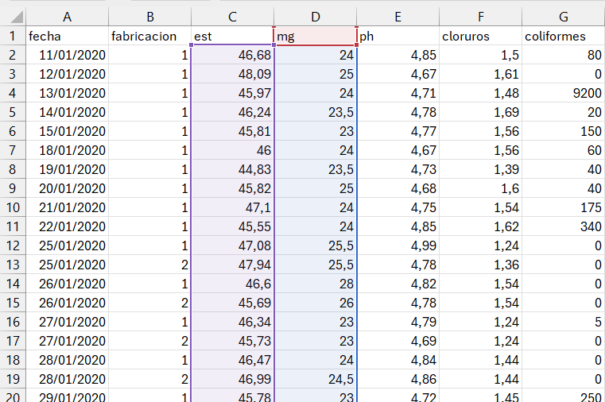{#fig-tabladisp}

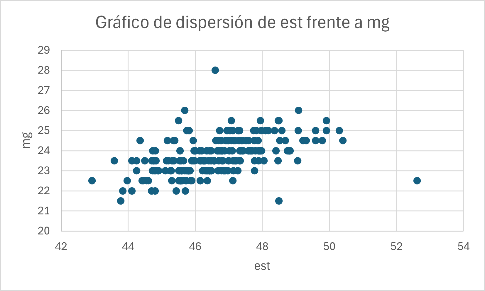

Gráfico de dispersión en Excel
:::

Lo esperable en nuestros datos es que el valor de `est` y el de `mg` estén asociados, y a valores altos de la primera variable correspondan valores altos de la segunda (para el mismo producto y sin cambios de tecnología). Sin embargo, algunos valores parecen no encajar en este modelo; es el caso de un valor de `est`por encima de 52% con un valor de `mg`inferior a 23%, o el caso de un valor de `mg` en torno al 28% con un valor de `est` por debajo de 47%. Debemos revisar estos valores aparentemente anormales para verificar si ha habido un error en la toma de muestras o un error analítico. En fábricas con productos diferentes cuyos resultados analíticos se recogen en una tabla de datos común, a veces puede haber errores en la introducción de los códigos de producto, de forma que la toma de muestras y los análisis pueden ser correctos, pero estar mal asignados al guardar los datos.

Tanto Python como R nos permiten separar el diagrama de dispersión en función de una tercera variable; en este caso, usaremos el trimestre para ver lo que ha sucedido por el verano.

::: {.panel-tabset}

## Python

```{python}
plt.figure(figsize=(9, 6))
sns.scatterplot(data=df, x='est', y='mg', hue='trimestre', s=80, alpha=0.7)
plt.title('Relación entre el EST y la MG en una fabricación anual de camembert')
plt.xlabel('EST (%)')
plt.ylabel('MG (%)')
plt.legend(title='Trimestre') # Mostrar leyenda para el trimestre
plt.grid(True, linestyle='--', alpha=0.7)
plt.show()
```

## R
```{r}

library(ggplot2)

ggplot(df, aes(x = est, y = mg, color = trimestre_etiqueta)) +
  geom_point(size = 3, alpha = 0.9) +
  labs(
    title = "Relación entre el EST y la MG en una fabricación anual de camembert",
    x = "EST (%)",
    y = "MG (%)",
    color = "Trimestre"
  ) +
  theme_minimal()
```

:::

Los gráficos de dispersión multiserie no son nativos en Microsoft Excel, pero pueden hacerse con algo de trabajo manual, un poco más complejo que el procedimiento en **Python** o **R** (ver el procedimiento [aqui](https://juanriera.github.io/blog/posts/excel-xy/) y [aquí](https://juanriera.github.io/blog/posts/excel-xy-pinguinos/), y un video con el procedimiento detallado [aquí](https://www.youtube.com/watch?v=tD2P5wabb1k))

El gráfico de dispersión en Excel podría quedar así:

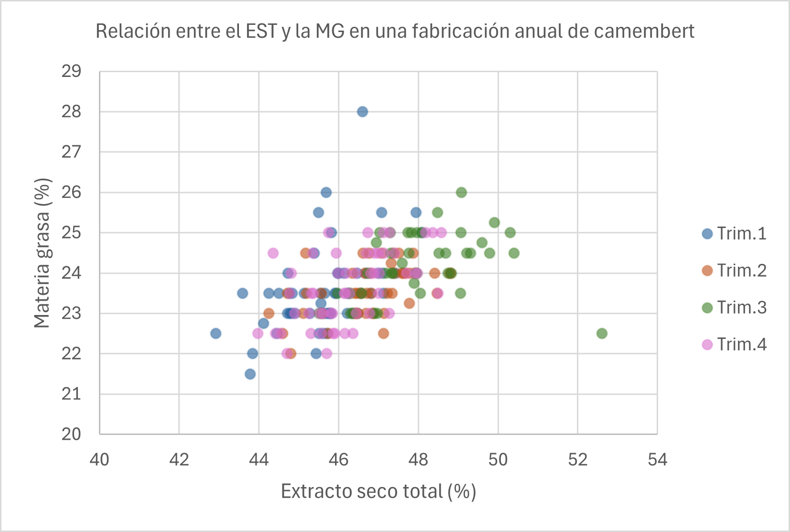
[Descargar hoja Excel con gráfico de dispersión (archivo `camembert.xlsx`)](https://raw.githubusercontent.com/juanriera/master-queseria/master/datos/camembert.xlsx){target="_blank" rel="noopener noreferrer"}

Como vemos, los gráficos de dispersión son una herramienta esencial en el análisis exploratorio de datos, ya que permiten visualizar relaciones y patrones en los datos, identificar correlaciones y detectar posibles anomalías. Esta información es crucial para realizar análisis estadísticos más profundos y tomar decisiones basadas en datos.

## Gráficos de series temporales

Hasta ahora hemos utilizado gráficos y tablas que describen la estructura y forma de una variable, o las relaciones entre dos variables. Hay otros gráficos que tienen en cuenta la forma en la que esos datos cambian con el tiempo. En este caso, será necesario que hayamos recogido en una variable de nuestra tabla los intervalos de tiempo en los que se han producido nuestros valores.

Algunos ejemplos:

-   proceso de llenado de envases de queso crema: se llena una tarrina cada 15 segundos. Nuestros datos deben recoger el tiempo y el peso.

-   nuestro fichero de fabricación de queso camembert recoge los valores analíticos medios diarios del producto fabricado.

-   Una fábrica recoge leche diariamente y analiza cada día la composición de la leche que entra en la fábrica.

En un gráfico de series temporales,

-   el eje horizontal (X) representa el tiempo. Los puntos de tiempo pueden ser minutos, horas, días, meses, años, etc.
-   el eje vertical (Y) representa los valores de la variable que se está estudiando. Estos valores pueden ser medidas como temperatura, ventas, precios, etc.
-   cada valor individual corresponde a un punto
-   los valores se conectan mediante una línea que conecta los puntos de datos, mostrando cómo cambian los valores de la variable a lo largo del tiempo.
-   normalmente, en un gráfico de series temporales no suelen representarse los puntos individuales para facilitar la legibilidad del gráfico.

En nuestro conjunto de datos de fabricación de queso camembert, la primera columna de la tabla recoge la variable `fecha`, lo que nos permite ordenar nuestros valores en el tiempo.

Cuando representamos valores en el tiempo, nunca usaremos el diagrama de barras, sino el gráfico de líneas.

### Cómo hacer los gráficos de series temporales en Excel

Para hacer el gráfico en Excel, seleccionamos la columna `est`e insertamos un gráfico de líneas. A continuación, con el cursor sobre el gráfico, pulsamos el boton derecho y seleccionamos la opción `Seleccionar datos`. Una vez abierto el cuadro de opciones, editamos las etiquetas del eje X y seleccionamos el rango de la variable `fecha` desde la fila 2 hasta la última.Aceptamos, y a continuación editamos el formato del eje Y para sustituir el valor mínimo de $0$ por $42$, que es el valor que queremos como mínimo para nuestro gráfico.

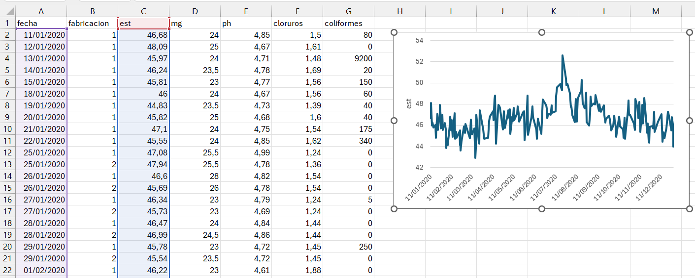

### Gráficos de series temporales en `Python` utilizando `pandas`

En los procesos industriales, el manejo de datos que cambian con el tiempo (**series temporales**) es fundamental. Hablamos de registrar **temperaturas** en un proceso de cocción, el **pH** de una fermentación a lo largo de las horas o días, o la **evolución de inventarios** de productos perecederos.

Para abordar este análisis de manera **eficiente y sencilla**, la biblioteca `pandas` de Python es la herramienta de referencia. Su principal estructura, el **`DataFrame`**, está especialmente diseñada para entender y manipular datos etiquetados con el tiempo. Esto nos ofrece una serie de ventajas clave:

1.  **Fácil Indexación Temporal:** Pandas permite que la fecha y hora sean el "índice" principal de los datos. Esto simplifica enormemente el **filtrado** (ej. "dame todos los datos del último turno") y la **selección por rangos** (ej. "analiza solo el periodo de 9:00 a 11:00").
2.  **Remuestreo (Resampling) Sencillo:** Es habitual tener datos muy detallados (ej. una medición por minuto) y querer analizarlos a una escala mayor (ej. la media por hora). Pandas permite este cambio de frecuencia con una única función, lo que es vital para suavizar el "ruido" y ver la **tendencia real** del proceso.
3.  **Ventanas Móviles (`rolling`):** Es la función estrella para la industria. Permite calcular **promedios móviles** o desviaciones estándar sobre un periodo de tiempo definido (ej. el promedio de temperatura de los últimos 15 minutos, o cada 15 minutos). Esto es crucial para el **control de calidad** y la identificación de anomalías o desviaciones en tiempo real.

En resumen, Pandas elimina las tareas de manipulación de datos tediosas, permitiendo a los profesionales de la alimentación centrarse en lo realmente importante: la **interpretación de los datos** para optimizar procesos, garantizar la **seguridad alimentaria** y mejorar la eficiencia.

### Construyendo la serie temporal con `pandas`

Vamos a incluir de nuevo el código de lectura de los datos completo, para mayor claridad. Además, vamos a incluir una opción en la función de lectura del `csv` que formatea el campo `fecha` al formato que `pandas` puede reconocer.

```{python}
import pandas as pd
import seaborn as sns
import matplotlib.pyplot as plt

url_datos = (
    "https://raw.githubusercontent.com/"
    "juanriera/master-queseria/master/"
    "datos/camembert.csv"
)

try:
    df = pd.read_csv(url_datos, 
      decimal = ",", 
      sep=';', 
      encoding='ISO-8859-1')
except Exception as e:
    print(f"Error al cargar el archivo: {e}")

df.info()
```

Como `fecha`se ha leído como object, la convertimos en fecha

```{python}
df['fecha'] = pd.to_datetime(
    df['fecha'], 
    format='%d/%m/%Y',  
    errors='coerce' # Si hay una fecha inválida convierte a 'NaT' 
                    # (Not a Time) en lugar de fallar.
)
```

Verificamos que el contenido del dataframe es correcto

```{python}
df.info()
```

Ahora `fecha`ya es `datetime64` y `pandas`lo reconoce como campo de fecha. Verificamos el dataframe:

```{python}
df.head()
```

Para utilizar las funciones de series de `pandas` es necesario crear una columna `index`o **índice**  y asignarla como `index` del dataframe; `pandas` utilizará el index para toda la gestión de las fechas de manera rápida y flexible.

```{python}
df['fecha_index']= pd.DatetimeIndex(df.fecha).normalize()
df.set_index('fecha_index',inplace=True)
df.sort_index(inplace=True)
```

La función `.plot()` nos representa los valores de la columna en orden secuencial, y toma las fechas del `index` de forma utomática, sin necesidad de explicitarlo:

```{python}
df["est"].plot()
plt.show()
```

Mediante las funciones de `pandas`, podemos reformatear las fechas remuestreando para hacer las medias semanales del extracto seco total. La función `resample('W-MON')` formatea las fechas para que las semanas empiecen en lunes, como es el caso en Europa (en USA la semana empieza el domingo). Aprovechamos para mostrar una de las potencias de `Python`: podemos hacer que varios cálculos se hagan a continuacion de los otros, simplemente enlazando las funciones, hasta el `.plot()`

```{python}
plt.figure(figsize=(10.0, 2.0))
df["est"].resample('W-MON').mean().plot(
    title="Media del extracto seco total semanal")
plt.show()
```

Veamos a continuación otras formas de formatear la serie sobre la marcha, pero esta vez representando la `desviación típica`en vez de la `media`.

```{python}
plt.figure(figsize=(10.0, 2.0))
df["est"].resample('W-MON', label='left', closed='left').std().plot(
    title="Desviación típica del extracto seco total semanal")
plt.show()
```

O podemos representar un período específico de la serie indicando a `pandas` los límites inferior y superior de las fechas que queremos.

```{python}
plt.figure(figsize=(10.0, 2.0))
df["est"]["2020-05":"2020-08"].resample('W-MON', label='left', closed='left').mean().plot(
    title="Media del extracto seco total semanal")
plt.show()
```

Por último, combinamos el gráfico de media y el de la desviación típica semanal en un único gráfico. Queda para el trabajo en clase ir buscando la explicación y comprensión de cada linea.

::: {.callout-tip title="Sugerencia"}
Se recomienda copiar el código y pegarlo en ChatGP3 o Gemini para explicarlo en detalle. 
Utiliza el [texto de la nota de aviso](#clr-instrucciones) que dimos al principio del capítulo para pedir que explique el código.
:::

```{python}
#| message: false
#| warning: false
#| code-fold: true
#| code-summary: Mostrar código

import pandas as pd
import matplotlib.pyplot as plt

# --- 1. Preparación de los datos 
#        (Calculando la Media y la Desviación Típica Semanal) 
media_semanal = df["est"].resample('W-MON', label='left', closed='left').mean()
dt_semanal = df["est"].resample('W-MON', label='left', closed='left').std()

# --- 2. Creación de los Subgráficos (El paso clave)
# Creamos una figura (conjunto de gráficos) con 2 filas y 1 columna.
# El parámetro 'figsize=(10, 4)' controla el tamaño: 
# 10 de ancho y 4 de alto total (como un gráfico normal).
# 'sharex=True' asegura que ambos gráficos compartan 
# el mismo eje temporal.
fig, (ax1, ax2) = plt.subplots(
    nrows=2, 
    ncols=1, 
    figsize=(10, 4), 
    sharex=True
)

# --- 3. Graficar la Media (Gráfico Superior) ---
ax1.plot(media_semanal, label="Media Semanal", color='tab:blue')
ax1.set_title("Media y Desviación Típica Semanal"
              " del Extracto Seco Total")
ax1.set_ylabel("Media (est)")
ax1.grid(True, linestyle='--', alpha=0.6)

# Quita las etiquetas de fecha/hora del gráfico superior
ax1.tick_params(labelbottom=False) 

# --- 4. Graficar la Desviación Típica (Gráfico Inferior) ---
ax2.plot(dt_semanal, 
         label="Desviación Típica Semanal", 
         color='tab:orange')
ax2.set_ylabel("D. Típica (est)")
ax2.grid(True, linestyle='--', alpha=0.6)

# Ajusta el espacio entre los gráficos para que no se superpongan
fig.tight_layout() 
plt.show()
```

A continuación, el gráfico realizado con R. Se recomienda copiar el código y pegarlo en un programa de IA (ChatGP3, Gemini) para explicarlo en detalle.Utiliza el [texto de la nota de aviso](#clr-instrucciones) que dimos al principio del capítulo para explicar el código.

::: {.callout-tip title="Sugerencia"}
Se recomienda copiar el código y pegarlo en ChatGP3 o Gemini para explicarlo en detalle. 
Utiliza el [texto de la nota de aviso](#clr-instrucciones) que dimos al principio del capítulo para pedir que explique el código.
:::


```{r}
#| message: false
#| warning: false
#| code-fold: true
#| code-summary: Mostrar código
#| fig-width: 10
#| fig-height: 5

library(ggplot2)
library(dplyr)
library(lubridate)
library(patchwork) # Librería clave para unir gráficos

# --- 1. Preparación de los datos (Resumen Semanal) ---
# En R, agrupamos por semana usando floor_date
df_semanal <- df %>%
  group_by(semana = floor_date(fecha, "week", week_start = 1)) %>%
  summarise(
    media = mean(est, na.rm = TRUE),
    desv_tipica = sd(est, na.rm = TRUE)
  )

# --- 2. Crear el Gráfico de la Media (Superior) ---
p1 <- ggplot(df_semanal, aes(x = semana, y = media)) +
  geom_line(color = "steelblue", linewidth = 1) +
  labs(title = "Media y Desviación Típica Semanal del Extracto Seco Total",
       y = "Media (est)") +
  theme_bw() +
  theme(axis.title.x = element_blank(), 
        axis.text.x = element_blank()) # Quitamos etiquetas X para unirlo bien

# --- 3. Crear el Gráfico de la Desviación (Inferior) ---
p2 <- ggplot(df_semanal, aes(x = semana, y = desv_tipica)) +
  geom_line(color = "orange", linewidth = 1) +
  labs(x = "Fecha", y = "D. Típica (est)") +
  theme_bw()

# --- 4. Unir los gráficos con patchwork ---
# El operador "/" coloca uno sobre otro
p1 / p2

```

### Resumen

Los gráficos de series temporales son útiles para:

1.  **Identificar Tendencias**:
    -   Una tendencia es una dirección general en la que los datos se mueven a lo largo del tiempo. Puede ser creciente, decreciente o constante.
2.  **Detección de Estacionalidad**:
    -   La estacionalidad se refiere a patrones que se repiten en intervalos regulares de tiempo, como las ventas de productos estacionales.
3.  **Identificar Ciclos**:
    -   Los ciclos son fluctuaciones que ocurren en intervalos no regulares y pueden deberse a factores económicos o de otra índole.
4.  **Detección de Anomalías**:
    -   Los picos y caídas repentinas pueden indicar eventos inusuales o errores en los datos.

Los gráficos de series temporales son cruciales en diversas áreas:

1.  **Economía y Finanzas**:
    -   Seguimiento de precios de acciones, tasas de interés y otros indicadores económicos.
2.  **Ciencia y Tecnología**:
    -   Monitoreo de variables ambientales, datos meteorológicos y medidas científicas.
3.  **Negocios**:
    -   Análisis de ventas, demanda de productos y desempeño empresarial a lo largo del tiempo.

Los gráficos de series temporales proporcionan una visión clara y concisa de cómo cambian los datos a lo largo del tiempo. Esta visualización es fundamental para el análisis predictivo, la toma de decisiones y la identificación de patrones y anomalías en los datos.

## Algunas sugerencias para la creación de gráficos

Algunos sitios tienen ejemplos de gráficos que puede resultar útil revisar:

- [Galería de `matplotlib`](https://matplotlib.org/stable/gallery/index.html), gran cantidad de ejemplos en Python
- [Galería de `seaborn`](https://seaborn.pydata.org/examples/index.html), una extensa galería de gráficos hechos con esta librería Python
- [Python Graph Gallery](https://python-graph-gallery.com/), otra extensa galería de gráficos en Python
- [The R Graph Gallery](https://r-graph-gallery.com/), una galería de gráficos hechos con R
- [R-charts](https://r-charts.com/) es una galería de gráficos R creada por un español, José Carlos Soage.
- [Tidyplots](https://tidyplots.org/) utiliza la libreria `tidyplots` en R para realizar de forma sencilla gran cantidad de gráficos.

Una de las guías más conocidas y seguidas para la creación de gráficos es el [vocabulario visual del Financial Times](https://raw.githubusercontent.com/ft-interactive/chart-doctor/master/visual-vocabulary/poster.png)

También esta guía proporciona información sobre el uso adecuado de cada tipo de gráfico, facilitando la elección según el objetivo perseguido

 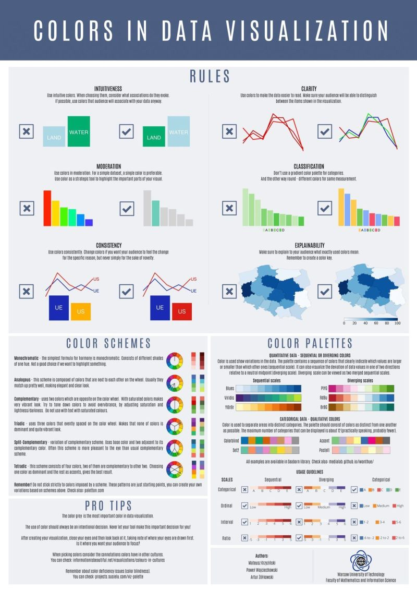

