```{r}
#| include: false
library(reticulate)
use_python("C:/ProgramData/miniconda3/python.exe", required = TRUE)
```

::: callout-note
## Objetivos de aprendizaje

Al finalizar este capítulo, el alumno será capaz de:

- Construir e interpretar un diagrama de tallo y hojas (stemplot) a partir de un conjunto de datos pequeño, tanto manualmente como con Python y R.
- Elaborar tablas de distribución de frecuencias con frecuencias absolutas, relativas y acumuladas en Excel, Python y R.
- Crear e interpretar diagramas de barras para variables discretas en Excel.
- Construir histogramas para variables continuas en Excel, Python y R, y seleccionar la amplitud de intervalo adecuada según el conjunto de datos.
- Identificar e interpretar la forma de una distribución de datos (simétrica, asimétrica, bimodal) a partir de un histograma.
- Describir la distribución de un conjunto de datos mediante el diagrama de caja (boxplot), identificando la mediana, los cuartiles, el rango intercuartil y los valores atípicos (outliers), y relacionar la forma del boxplot con la forma de la distribución.
- Utilizar alternativas al boxplot (beeswarm, stripplot, violin plot) para visualizar distribuciones con mayor detalle.
- Construir gráficos de densidad con Python y R y utilizarlos para comparar distribuciones entre grupos.
- Crear e interpretar gráficos de dispersión para analizar relaciones entre dos variables numéricas, tanto en Excel como en Python y R.
- Construir gráficos de series temporales e identificar tendencias, estacionalidad y anomalías, utilizando las funciones de remuestreo y ventanas móviles de pandas en Python y los equivalentes en R.
- Elegir el tipo de gráfico más adecuado según el objetivo del análisis y el tipo de variable.

Los conceptos clave introducidos en este capítulo son: **stemplot, distribución de frecuencias, frecuencia absoluta, frecuencia relativa, frecuencia acumulada, diagrama de barras, histograma, intervalo (bin), forma de los datos, distribución simétrica, distribución asimétrica, distribución bimodal, diagrama de caja (boxplot), cuartil, mediana, rango intercuartil (IQR), valor atípico (outlier), beeswarm, violin plot, gráfico de densidad, gráfico de dispersión, correlación, serie temporal, estacionalidad, tendencia, remuestreo, media móvil, matplotlib, seaborn, ggplot2, pandas**.
:::

Una imagen vale más que mil palabras, y en el análisis de datos, la visualización es fundamental para entender patrones, distribuciones y relaciones en nuestros datos.

En este capítulo estudiaremos cómo describir conjuntos de datos de forma visual, utilizando varios tipos de gráficos distintos:

-   *Stemplot*
-   Histograma
-   Diagrama de caja o *boxplot*
-   Gráfico de dispersión
-   Gráfico de series temporales

Veremos la relación visual entre un histograma y un diagrama de caja, y aprenderemos también a construir tablas de frecuencias en Excel, en Python y en R. Finalmente, veremos algunos otros tipos de gráficos que son útiles para aplicaciones concretas, como los gráficos de densidad.

::: {.callout-note}
## Librerías necesarias en este capítulo

A lo largo de este capítulo se utilizan las siguientes librerías: 

- Python: `pip install palmerpenguins`
- R: `install.packages(c("palmerpenguins", "ggbeeswarm", "patchwork"))`

La mayoría forman parte de una instalación estándar de Python o R; `palmerpenguins`, `ggbeeswarm` y `patchwork` deben instalarse la primera vez.
:::

## El diagrama de tallo y hojas (*stem and leaf plot* o *stemplot*)

El diagrama de tallo y hojas, también conocido como *stemplot*, es una herramienta gráfica utilizada en estadística para representar la distribución de un conjunto de datos. Es especialmente útil para conjuntos de datos pequeños y proporciona una forma rápida y efectiva de visualizar la forma de los datos y su dispersión. El *stemplot* recibe este nombre porque el dibujo que resulta se asemeja a un tallo el que le salen las hojas que son los datos individuales.

Los componentes de un *stemplot* son:

-   **Tallo**: Representa el grupo principal de los valores de los datos. Generalmente, se usa la parte más significativa del número. Por ejemplo, en el número 43, el tallo podría ser 4.

-   **Hojas**: Representan los dígitos finales o menos significativos de los valores de los datos. Siguiendo el ejemplo anterior, la hoja sería 3.

#### Construcción del diagrama en la hoja de cálculo

Supongamos que queremos medir la altura de un grupo de alumnos de nuestra clase. Éste es nuestro grupo:


Realizamos la medida de altura de cada persona y registramos los valores en una hoja de cálculo, siguiendo las buenas prácticas que hemos visto al estudiar los *datos ordenados*.

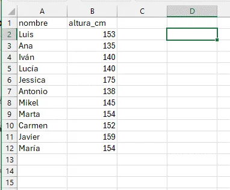

Vamos a utilizar los datos de medidas de altura de nuestro grupo de alumnos. Quitamos el último dígito a la derecha de nuestros valores y colocamos verticalmente los valores resultantes ordenándolos de menor a mayor, y evitando las repeticiones. Para evitar errores en la escala, debemos incluir los valores intermedios aunque no haya ninguno en nuestros datos (en el ejemplo, el valor 16 que correspondería a los 160). Esto forma el "tallo" de nuestro diagrama:

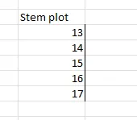

A continuación añadimos las "hojas" en la celda a la derecha, que consisten en los valores que hemos "cortado" de nuestro árbol, uno al lado de otro, incluyendo esta vez los valores repetidos, en orden de menor a mayor. Por ejemplo, para el valor 135, descartamos 13 y utlizamos 5; para el valor 138, descartamos 13 y utilizamos 8, y así sucesivamente para todos los valores.

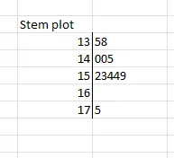

#### Construcción del diagrama en Python y R

R permite realizar el *stemplot* mediante la función $stem()$ de forma automática. Python no incluye entre sus métodos básicos una función para hacer un *stemplot*, aunque sí la tiene en la librería `stemgraphic`; importamos de esta librería sólo la función `stem_text()`

::: {#clr-instrucciones .callout-tip .content-visible when-format="html"}
## Importante: Explicación del código

En este capítulo veremos varios ejemplos de código R y Python.

Para un explicación detallada del código, copia el código R o Python y pégalo en Gemini o en ChatGPT (o Copilot). A continuación. da esta instrucción a la IA (puedes copiar y pegar el párrafo):

> Actúa como un tutor de programación. Explica este código instrucción a instrucción de forma detallada y sencilla, indicando qué hace cada línea y por qué es necesaria. Usa analogías con Excel o tareas manuales para que sea más fácil de entender.
:::

::: {.panel-tabset group="idiomas"}
## Python

```{python}
from stemgraphic.text import stem_text

altura_cm = [153,135,140,140,175,138,145,154,152,159,154]
stem_text(altura_cm)
```

## R

```{r message=FALSE, warning=FALSE}
altura_cm <- c(153,135,140,140,175,138,145,154,152,159,154)
stem(altura_cm)
```
:::

### Interpretación del diagrama de tallo y hojas

-   **Tallo**: Los números a la izquierda del símbolo `|` representan los valores base (o tallos), en este caso, las decenas de las alturas.
-   **Hojas**: Los números a la derecha del símbolo `|` representan los dígitos adicionales (o hojas). Por ejemplo, en la línea `13 | 58`, el tallo es `13` (130), y las hojas son `5` y `8`, que corresponden a los datos `135` y `138`.

El diagrama nos dice que los valores en torno a 150 cm son los más frecuentes, y que hay un valor alto (175) que se separa un poco del resto.

### Resumen

El *stemplot* es muy sencillo de hacer y nos da una visión rápida y compacta de la *distribución* de nuestros valores, así como de la posible existencia de valores que se separan del conjunto. Estos valores alejados, que se conocen en inglés como *outliers*, tienen mucha importancia en el analisis e interpretación de los datos, como veremos más adelante.

La ventaja principal del *stemplot* es que mantiene los valores originales de las observaciones, y puede hacerse fácilmente con bolígrafo y papel, sin necesidad de más herramientas.

Su principal inconveniente es la elaboración manual (aunque lenguajes como R tienen funciones que lo contruyen de forma automática), y por lo tanto, la dificultad de aplicarlo a volumenes de datos medios o grandes. El uso generalizado de los ordenadores ha hecho que actualmente esta herramienta tenga muy poco uso, y se utilicen en su lugar otras más gráficas y de construcción automática, como el **histograma**.

## Distribuciones de frecuencias

Una **distribución de frecuencias** es una tabla que muestra la frecuencia con la que ocurren los valores diferentes en un conjunto de datos. Esta herramienta es fundamental en la estadística descriptiva y permite resumir y visualizar cómo se distribuyen los datos de manera clara y comprensible. A partir de una tabla de frecuencias se pueden construir diagramas de barra o histogramas para visualizar la tabla de forma gráfica.

Para construir una distribución de frecuencias, agrupamos nuestros valores por intervalos, y contamos el número de observaciones que aparecen en cada intervalo. Los componentes de una distribución de frecuencias son:

-   las **categorías o clases** son los intervalos o valores específicos de los datos que se están analizando. Cada categoría representa un rango de valores en caso de datos continuos, o valores específicos en caso de datos discretos.
-   la **frecuencia absoluta** es un *recuento simple* de cuántas veces aparece cada valor en un conjunto de datos.
-   la **frecuencia relativa** nos muestra la *proporción* de cada valor frente al total. Puede expresarse como fracción (entre 0 y 1) o como porcentaje (respecto a 100), y se calcula como: $$
     \text{Frecuencia Relativa} = \frac{\text{Frecuencia Absoluta}}{\text{Número Total de Observaciones}}
     $$
-   la **frecuencia acumulada** nos dice cuántas observaciones están por debajo de un cierto valor.
-   la **frecuencia relativa acumulada** es la proporción de valores que están por debajo de un cierto valor

### Construcción de una tabla de frecuencias paso a paso en Excel

Para crear una tabla de frecuencias de la variable `altura_cm` mediante una tabla dinámica en Excel, sigue estos pasos:

**1. Selecciona los Datos**

1.  Abre tu archivo de Excel y selecciona toda la tabla que incluye los encabezados (`nombre` y `altura_cm`).

**2. Inserta una tabla dinámica**

1.  Ve a la pestaña **Insertar** en la barra de herramientas de Excel.
2.  Haz clic en **Tabla Dinámica**.
3.  En el cuadro de diálogo que aparece, asegúrate de que el rango de datos seleccionado es correcto y elige dónde deseas colocar la tabla dinámica (en una nueva hoja de cálculo o en la hoja actual).

**3. Añade la frecuencia absoluta**

1.  En el panel de campos de la tabla dinámica, arrastra el campo `altura_cm` a la sección **Filas**.
2.  Arrastra nuevamente el campo `altura_cm` a la sección **Valores**.

**4. Ajusta la configuración de valores**

1.  Haz clic en el campo `altura_cm` en la sección **Valores**.
2.  Selecciona **Configuración de campo de valor**.
3.  En el cuadro de diálogo que aparece, asegúrate de que esté seleccionada la opción **Recuento**
4.  Acepta todo hasta volver a Excel.

**5. Añade la frecuencia relativa**

1.  En el panel de campos de la tabla dinámica, arrastra de nuevo el campo `altura_cm` a la sección **Valores**. Ahora la variable aparecerá como `altura_cm2`.

**6. Ajusta de nuevo la configuración de valores**

1.  Haz clic en el campo `altura_cm2` en la sección **Valores**.
2.  Selecciona **Configuración de campo de valor**.
3.  En el cuadro de diálogo que aparece, asegúrate de que esté seleccionada la opción **Recuento**.
4.  En ese mismo cuadro, haz click en el botón **Formato de número**, selecciona **Número** y **2 decimales**, y acepta.
5.  En ese mismo cuadro, selecciona la pestaña que dice **Mostrar valores como**
6.  En el menú desplegable, escoge la opción **% del total de columnas**.
7.  Acepta todo hasta volver a Excel.

**7. Ordena y formatea**

1.  Puedes ordenar las alturas en orden ascendente o descendente haciendo clic en la flecha junto a `altura_cm` en la tabla dinámica.
2.  También puedes cambiar el formato de la tabla dinámica para que sea más fácil de leer.
3.  Puedes renombrar los encabezados de la tabla para que sea más fácil de leer, rotulando las columnas, por ejemplo, como `frec_abs`y `frec_rel`, o cualquier otro encabezado que te resulte claro y útil.

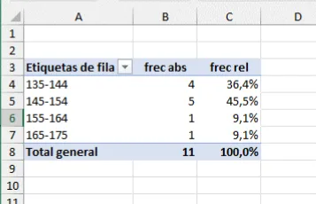

### Construcción de una tabla de frecuencias mediante Python o R

::: {.panel-tabset group="idiomas"}
## Python

```{python}
import pandas as pd

altura_cm = [153,135,140,140,175,138,145,154,152,159,154]
frecuencias = pd.Series(altura_cm).value_counts()
print(frecuencias)
```

## R base
```{r}
altura_cm <- c(153, 135, 140, 140, 175, 138, 145, 154, 152, 159, 154)
frecuencias <- table(altura_cm)
print(frecuencias)
```

## R con dplyr
```{r}
#| message: false
#| warning: false

library(dplyr)
df_alturas <- tibble(
  altura = c(153, 135, 140, 140, 175, 138, 145, 154, 152, 159, 154)
)
frecuencias <- df_alturas |>
  count(altura, sort = TRUE, name = "frecuencia")
print(frecuencias)
```
:::

Con un poco más de código podemos hacer la tabla agrupando los valores en clases de amplitud 10, con las frecuencias absolutas y relativas. Es un poco más complicado, tómate tu tiempo para entender cada paso de las instrucciones.

::: {.panel-tabset group="idiomas"}
## Python

```{python}
import pandas as pd
import numpy as np

altura_cm = [153,135,140,140,175,138,145,154,152,159,154]
serie = pd.Series(altura_cm)

# Crear intervalos automáticamente con amplitud 10
bins = np.arange(min(altura_cm)//10*10, 
                 max(altura_cm)//10*10 + 20, 10)

# Agrupar y contar
tabla = pd.cut(serie, bins=bins).value_counts(sort=False)

# Convertir a DataFrame con acumulados y relativos
df = tabla.to_frame(name='Frecuencia')
df['Frec_acum_%'] = df['Frecuencia'].cumsum()

# escribimos la instrucción en dos lineas usando los paréntesis
df['Frec_rel_%'] = (
  (df['Frecuencia'] / df['Frecuencia'].sum() * 100).round(2)
)
df['Frec_rel_acum_%'] = df['Frec_rel_%'].cumsum()

print(df)
```

## R base
```{r}
# 1. Definir los datos
altura_cm <- c(153, 135, 140, 140, 175, 138, 145, 154, 152, 159, 154)

# 2. Crear los cortes (bins) como en NumPy
limite_inf <- floor(min(altura_cm) / 10) * 10
limite_sup <- floor(max(altura_cm) / 10) * 10 + 10

bins <- seq(limite_inf, limite_sup + 10, by = 10)

# 3. Agrupar los datos en los intervalos
intervalos <- cut(altura_cm, breaks = bins, right = FALSE)

# 4. Crear la tabla de frecuencias
frecuencia <- as.vector(table(intervalos))
nombres_intervalos <- levels(intervalos)

# 5. Construir el data.frame con los cálculos
df <- data.frame(
  Intervalo = nombres_intervalos,
  Frecuencia = frecuencia
)

# Cálculos de acumulados y relativos
df$Frec_acum <- cumsum(df$Frecuencia)
df$Frec_rel_pct <- round((df$Frecuencia / sum(df$Frecuencia)) * 100, 2)
df$Frec_rel_acum_pct <- cumsum(df$Frec_rel_pct)

print(df)
```

## R con dplyr

```{r}
#| message: false
#| warning: false

library(dplyr)

altura_cm <- c(153, 135, 140, 140, 175, 138, 145, 154, 152, 159, 154)

bins <- seq(
  from = floor(min(altura_cm) / 10) * 10,
  to   = floor(max(altura_cm) / 10) * 10 + 20,
  by   = 10
)

tabla_frecuencias <- tibble(altura = altura_cm) |>
  mutate(
    intervalo = cut(altura, breaks = bins, right = FALSE)
  ) |>
  count(intervalo, name = "Frecuencia", .drop=FALSE) |>
  mutate(
    Frec_acum_pct= cumsum(Frecuencia),
    Frec_rel_pct = round((Frecuencia / sum(Frecuencia)) * 100, 2),
    Frec_rel_acum_pct = cumsum(Frec_rel_pct)
  )

print(tabla_frecuencias)
```
:::

Como ves en el resultado, a veces se utilizan los símbolos `(` y `[` para definir los intervalos, tal como se hace en matemáticas.

-   Intervalo **abierto**: El símbolo `(` se utiliza para denotar un intervalo abierto. El límite correspondiente **no** está incluido en el intervalo.
-   Intervalo **cerrado o semiabierto**: El símbolo `[` se utiliza para denotar un intervalo cerrado o semiabierto. El límite correspondiente **sí** está incluido en el intervalo.

Ejemplos:

-   $(a, b)$ representa todos los números reales **mayores** que $a$ y **menores** que $b$ (excluye los valores $a$ y $b$).
-   $[a, b]$ representa todos los números reales **mayores o iguales** que $a$ y **menores o iguales** que $b$ (incluye $a$ y $b$).
-   $[a, b)$ representa todos los números reales **mayores o iguales** que $a$ y **menores** que $b$ (incluye $a$, pero excluye $b$)
-   $(a, b]$ representa todos los números reales **mayores** que $a$ y **menores o iguales** que $b$ (excluye $a$, pero incluye $b$).

Si comparamos los dos métodos que hemos utilizado para construir la tabla de frecuencias, vemos que:

-   en Excel los pasos que hemos dado no están registrados y a la vista, y, por lo tanto, no son fácilmente revisables
-   en Python y R, todos los pasos y opciones que hemos utilizado están a la vista en el código del script

Si otra persona quisiera modificar la tabla, le sería fácil editar el código y relanzar el script, mientras que en Excel no sería fácil asegurarse de todos y cada uno de los pasos y clicks de ratón que hemos dado para construir y formatear la tabla.

Esta es una de las principales razones de la conveniencia del aprendizaje de `Python` incluso para las actividades más sencillas.

### Ejercicio propuesto

En la tabla de frecuencias anterior, calcular **frecuencia absoluta acumulada** y **frecuencia relativa acumulada** en Excel, e incluirlas en la tabla como dos columnas adicionales. La **frecuencia relativa acumulada** nos permitirá crear **diagramas de Pareto**, muy útiles en los procesos de mejora de calidad.

## Diagrama de barras

Cuando nuestra variable es *discreta*, podemos representar las frecuencias de cada valor de forma gráfica utilizando un diagrama de barras. Este diagrama utiliza barras rectangulares para representar la frecuencia de cada categoría.

Este gráfico es muy utilizado para representar, por ejemplo, resultados de encuestas, como el número de votos que han obtenido los diferentes partidos políticos en unas elecciones, o tablas discretas, como los kilos fabricados por meses en una fábrica.

::: {layout-ncol="2"}
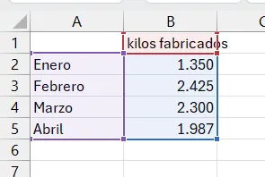{width="300"}

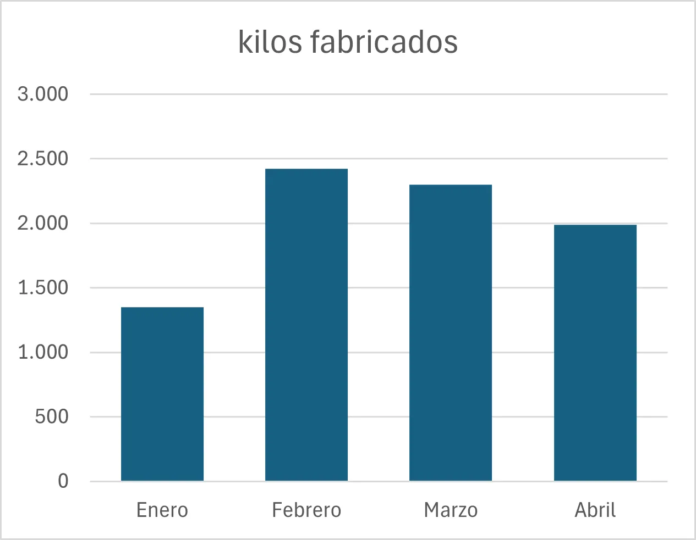{width="300"}

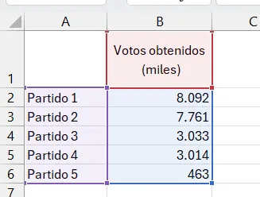{width="300"}

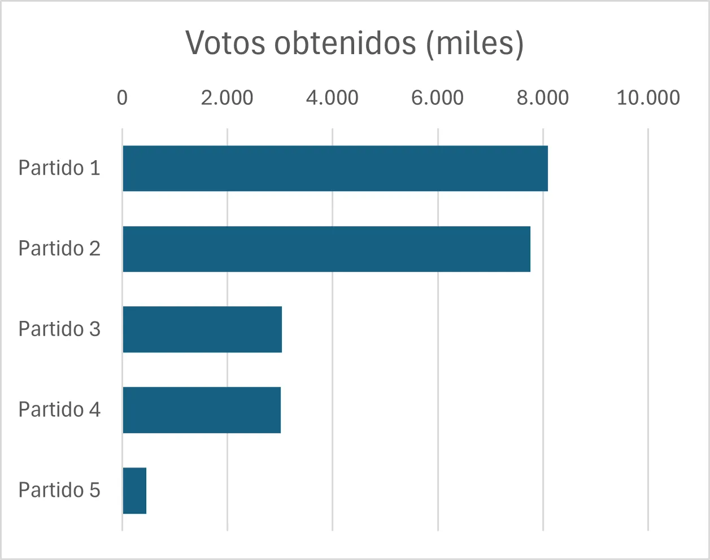{width="300"}
:::

## Histograma

Para visualizar las variables continuas se utiliza el **histograma**, que es un diagrama que utiliza las barras rectangulares para hacer un gráfico de la distribución de valores continuos, previamente agrupados en intervalos (*bins* en inglés), tal como se ha hecho en la tabla de frecuencias.

#### Componentes de un histograma

1.  **Eje horizontal (X)**: Representa los intervalos de valores de la variable. Cada intervalo abarca un rango específico de valores.
2.  **Eje vertical (Y)**: Muestra la frecuencia o el número de veces que los valores caen dentro de cada intervalo.
3.  **Barras**: Cada barra en el histograma representa un intervalo. La altura de la barra indica la frecuencia de los valores dentro de ese intervalo.

#### Cómo interpretar un histograma

-   Si las barras son altas en un intervalo específico, significa que muchos valores del conjunto de datos caen dentro de ese rango.
-   Un histograma puede ayudar a identificar patrones, como si los datos están distribuidos de manera simétrica, sesgada, o si hay picos y valles significativos.

### Construcción de un histograma en Excel

Usaremos el ejemplo de la altura en cm. de un grupo de alumnos.

Podemos utilizar dos métodos para hacer un histograma en Excel

#### Método 1: histograma directo

-   Seleccionamos el rango de datos. Podemos hacerlo mediante un click en el encabezado de la columna de la variable `altura_cm`, en este caso, la columna `B`.
-   En la opción de menú `Insertar`, seleccionamos el icono `Seleccionar gráficos de estadística`
-   Seleccionamos `Histograma`

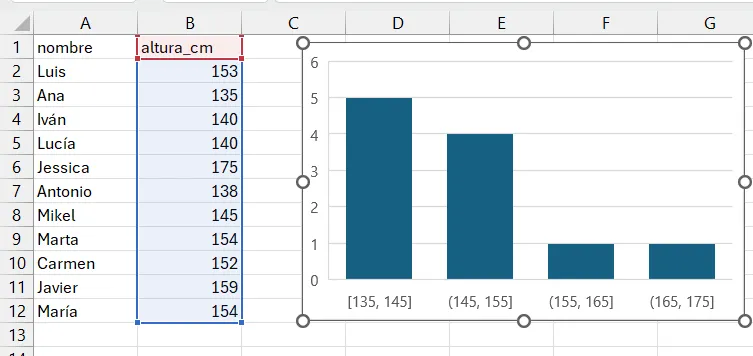{fig-align="center" width="75%"}

Excel calcula automáticamente la amplitud de los intervalos y el número de columnas; estas opciones pueden modificarse seleccionando con el botón derecho del ratón el elemento a modificar. En este caso, utilizamos estas opciones:

-   Eliminamos título del gráfico
-   Modificamos anchura de las barras seleccionando `Dar formato a serie de datos`, `Opciones de serie`, `Ancho del rango`= 50%
-   Modificamos los intervalos seleccionando el eje X: `Dar formato al eje`, `Opciones de eje`, `Ancho del rango` = 10

La descripción de los intervalos utiliza los mismos símbolos que hemos visto en las tablas de frecuencias de `Python`.

En el momento de escribir este manual, Excel no permite hacer histogramas múltiples ni agrupados por otra variable, por lo que para diseños más complejos, no hay más remedio que recurrir a otras opciones como las tablas dinámicas de Excel o, mejor aún, `Python` o `R`.

#### Método 2: utilizar una tabla dinámica

La tabla dinámica que hemos construido en Excel ha convertido nuestra variable continua, `altura_cm`, en una tabla de valores discretos, al agrupar los valores en intervalos. En Excel podemos representar las frecuencias absolutas de nuestra tabla gráficamente, insertando un gráfico de barras a partir de la tabla:

-   Con el cursor dentro de la tabla, seleccionamos la opción de menú `Insertar`
-   Insertamos un gráfico de barras

Opcionalmente, aplicamos las siguientes opciones de formato:

-   Hacemos click sobre uno de los botones del gráfico dinámico con el boton derecho del ratón, y seleccionamos la opción ocultar todos los botones del gráfico.
-   Eliminamos el título del gráfico
-   Abrimos el formato de la serie de datos, e introducimos en la opción `Ancho del rango` el valor $50\%$ para ensanchar las barras.

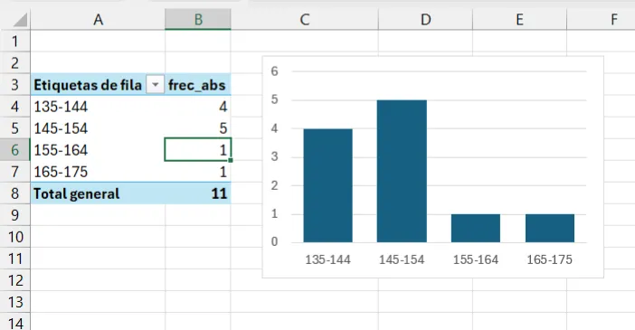{fig-align="center" width="75%"}

Al utiizar la tabla dinámica para construir el gráfico, Excel utiliza las categorías de la tabla dinámica. Dado que estas categorías (los intervalos que ha formado la tabla dinámica) son discretas, Excel utiliza el resultado de la tabla dinámica para hacer el gráfico con un diagrama de barras. No es posible insertar un histograma a partir de una tabla dinámica.

### Histograma en Python y R

En Python, las librerías `matplotlib` y `seaborn` son las herramientas estándar para crear gráficos.

-   **matplotlib.pyplot (alias `plt`):** Es la base, una librería de bajo nivel que da un control muy granular sobre cada aspecto del gráfico.
-   **seaborn (alias `sns`):** Construye sobre `matplotlib`, ofreciendo una interfaz de alto nivel para crear gráficos estadísticos complejos y estéticamente agradables con menos código. Es ideal para explorar distribuciones, relaciones entre variables y comparaciones entre grupos.

Siempre importamos ambas, ya que `seaborn` a menudo usa funciones de `matplotlib` para mostrar y personalizar los gráficos (como `plt.title()` para el título o `plt.show()` para mostrar el gráfico).

En **R**, usaremos las funciones de base y la librería `ggplot2`.

Las funciones de histograma de Python y R permiten construir el histograma directamente sin necesidad de hacer previamente una tabla de frecuencias (en realidad, la tabla de frecuencias se calcula internamente). Es mucho más sencillo utilizar estas funciones, ya que el código se simplifica mucho.

Vemos que los gráficos no son idénticos a pesar de provenir de los mismos datos, porque la construcción de los intervalos subyacente y el aspecto de las barras pueden ser ligeramente diferentes. Esto no debe preocuparnos, porque el aspecto general de la distribución de los datos es el mismo.

En la fase de exploración nos importa más entender estas propiedades de los datos (aspecto, forma de la distribución) que la precisión en la construcción del gráfico.

Comenzamos con el histograma de nuestros datos de altura:

::: panel-tabset
## Python (con `matplotlib`)

```{python}
import matplotlib.pyplot as plt

altura_cm = [153,135,140,140,175,138,145,154,152,159,154]

plt.hist(altura_cm)
plt.title("Distribución de la altura de los alumnos")
plt.xlabel("Altura (cm)")
plt.ylabel("Frecuencia")
plt.show()
```

## Python (con `seaborn`)

```{python}
import pandas as pd
import seaborn as sns
import matplotlib.pyplot as plt

altura_cm = [153,135,140,140,175,138,145,154,152,159,154]
df_altura = pd.DataFrame({'altura_cm': altura_cm})

sns.histplot(df_altura['altura_cm'])
plt.title("Distribución de la altura de los alumnos")
plt.xlabel("Altura (cm)")
plt.ylabel("Frecuencia")
plt.show()
```

## R base

```{r}
altura_cm <- c(153,135,140,140,175,138,145,154,152,159,154)

hist(altura_cm,
     main = "Distribución de la altura de los alumnos",
     xlab = "Altura (cm)",
     ylab = "Frecuencia")
```

## R (con `ggplot`)

```{r}
#| message: false
library(ggplot2)

altura_cm <- c(153,135,140,140,175,138,145,154,152,159,154)
df_altura <- data.frame(altura_cm = altura_cm)

ggplot(df_altura, aes(x = altura_cm)) +
  geom_histogram(bins = 6) +
  labs(
    title = "Distribución de la altura de los alumnos",
    x = "Altura (cm)",
    y = "Frecuencia"
  ) +
  theme_minimal()
```
:::

Con solo 11 observaciones el histograma es poco informativo. Cuando tenemos más datos, el histograma muestra con mucha más claridad la forma de la distribución. Usaremos a partir de ahora el dataset `penguins`, que contiene medidas de 344 pingüinos de tres especies del archipiélago Palmer (Antártida).

::: {.callout-note}
Para usar el dataset `penguins` es necesario instalar la librería correspondiente la primera vez:

- En Python: `pip install palmerpenguins`
- En R: `install.packages("palmerpenguins")`
:::

::: panel-tabset
## Python (con `matplotlib`)

```{python}
from palmerpenguins import load_penguins
import matplotlib.pyplot as plt

penguins = load_penguins()

penguins['flipper_length_mm'].dropna().hist()
plt.title("Distribución de la longitud de aleta")
plt.xlabel("Longitud de aleta (mm)")
plt.ylabel("Frecuencia")
plt.show()
```

## Python (con `seaborn`)

```{python}
from palmerpenguins import load_penguins
import seaborn as sns
import matplotlib.pyplot as plt

penguins = load_penguins()

sns.histplot(penguins['flipper_length_mm'].dropna())
plt.title("Distribución de la longitud de aleta")
plt.xlabel("Longitud de aleta (mm)")
plt.ylabel("Frecuencia")
plt.show()
```

## R base

```{r}
#| message: false
#| warning: false
library(palmerpenguins)

hist(penguins$flipper_length_mm,
     main = "Distribución de la longitud de aleta",
     xlab = "Longitud de aleta (mm)",
     ylab = "Frecuencia")
```

## R (con `ggplot`)

```{r}
#| message: false
#| warning: false
library(palmerpenguins)
library(ggplot2)

ggplot(penguins, aes(x = flipper_length_mm)) +
  geom_histogram(bins = 20) +
  labs(
    title = "Distribución de la longitud de aleta",
    x = "Longitud de aleta (mm)",
    y = "Frecuencia"
  ) +
  theme_minimal()
```
:::

Con 344 observaciones el histograma muestra una forma mucho más clara. En la sección siguiente aprenderemos a interpretar esta forma.

## La forma de los datos

¿Por qué es importante conocer la forma de los datos? Porque la forma nos dice si los datos son homogéneos o si hay grupos distintos mezclados, y eso cambia completamente la interpretación. Imaginemos que medimos la altura de los alumnos de un aula y obtenemos el histograma que ya conocemos: una distribución centrada en torno a 150 cm, aproximadamente simétrica. Ahora imaginemos que en esa misma aula hay tres alumnos de 16 años mezclados con alumnos de 12 años: el histograma mostraría dos grupos claramente separados, y la forma nos estaría diciendo que no estamos ante una población homogénea sino ante dos grupos distintos. Si no miramos la forma y nos quedamos solo con un número resumen, perderíamos esa información fundamental.

Lo mismo ocurre en la industria: si mezclamos en una tabla de datos la producción de dos líneas con ajustes diferentes, o de dos turnos con operarios distintos, o de dos épocas del año con materias primas diferentes, el histograma nos lo mostrará. La forma de los datos es la primera señal de que algo merece una investigación más profunda, antes de hacer ningún cálculo. En el capítulo 8 veremos un caso real de fabricación de queso camembert en el que la forma de los datos nos dará la primera pista sobre una desviación estacional que solo se explica cuando analizamos los datos en el tiempo.

### Distribución simétrica

Cuando la mayoría de los valores se concentran en el centro y las frecuencias disminuyen de forma equilibrada hacia ambos lados, decimos que la distribución es **simétrica**. Es el caso más frecuente en medidas de procesos industriales controlados: pesos, temperaturas, extractos secos. El histograma de la longitud de aleta de los pingüinos que acabamos de ver es un buen ejemplo de distribución aproximadamente simétrica.

Esta forma recuerda a una campana, y es la que en estadística se conoce como **distribución normal** o **campana de Gauss**. Volveremos sobre este concepto en el capítulo 7, cuando estudiemos la media y la desviación típica.

### Distribución asimétrica

No todas las distribuciones son simétricas. Cuando la mayoría de los valores se concentran en un extremo y la frecuencia disminuye lentamente hacia el otro, decimos que la distribución es **asimétrica**. Un ejemplo muy claro es la distribución de goles por partido en La Liga. El dataset `laliga_resultados2425.csv` contiene los resultados de los 380 partidos de la temporada 2024-25 de la Primera División de fútbol española, con el marcador de cada equipo al final del partido. Se ha elegido este conjunto de datos por su familiaridad para cualquier alumno español y porque la distribución de goles por partido es un ejemplo clásico de asimetría positiva: la mayoría de los partidos terminan con pocos goles, pero ocasionalmente aparecen resultados muy abultados que forman una cola hacia la derecha.

Los resultados proceden de los registros oficiales de [LaLiga](https://www.laliga.com).

::: panel-tabset
## Python

```{python}
import pandas as pd
import seaborn as sns
import matplotlib.pyplot as plt

laliga = pd.read_csv("datos/laliga_resultados2425.csv", sep=';')
laliga['goles_totales'] = laliga['goles_local'] + laliga['goles_visitante']

sns.histplot(laliga['goles_totales'], bins=10, discrete=True)
plt.xlabel("Goles por partido")
plt.ylabel("Número de partidos")
plt.title("Distribución de goles por partido. La Liga 2024-25")
plt.show()
```

## R

```{r}
#| message: false
#| warning: false
laliga <- read.csv2("datos/laliga_resultados2425.csv")
laliga$goles_totales <- laliga$goles_local + laliga$goles_visitante

hist(laliga$goles_totales,
     breaks = 10,
     main = "Distribución de goles por partido. La Liga 2024-25",
     xlab = "Goles por partido",
     ylab = "Número de partidos")
```
:::

La mayoría de los partidos terminan con pocos goles, y los partidos con muchos goles son cada vez más raros. La distribución tiene una cola larga hacia la derecha: esto es lo que se conoce como **asimetría positiva** o **sesgo positivo**. El valor más frecuente (la **moda**) es más bajo que el valor central, y hay algunos partidos con resultados muy abultados que forman esa cola. En la industria alimentaria encontraremos distribuciones asimétricas positivas con frecuencia en variables como los recuentos de bacterias o los tiempos de avería de una máquina, donde la mayoría de los valores son bajos pero ocasionalmente aparecen valores muy altos.

::: {.callout-note}
Cuando la cola es hacia la derecha (valores altos poco frecuentes) hablamos de **asimetría positiva**. Cuando la cola es hacia la izquierda (valores bajos poco frecuentes) hablamos de **asimetría negativa**. En la práctica industrial, la asimetría positiva es mucho más frecuente que la negativa.
:::

### Distribución bimodal

En ocasiones el histograma muestra **dos picos** claramente diferenciados en lugar de uno. Esto se conoce como **distribución bimodal** y suele indicar que los datos provienen de dos grupos distintos que se han mezclado. Si volvemos al histograma de la longitud de aleta de los pingüinos y coloreamos por especie, vemos que lo que parecía una distribución aproximadamente simétrica es en realidad la mezcla de dos grupos:

::: panel-tabset
## Python

```{python}
from palmerpenguins import load_penguins
import seaborn as sns
import matplotlib.pyplot as plt

penguins = load_penguins()

sns.histplot(
    data=penguins,
    x='flipper_length_mm',
    hue='species',
    bins=20
)
plt.xlabel("Longitud de aleta (mm)")
plt.ylabel("Frecuencia")
plt.title("Distribución de la longitud de aleta por especie")
plt.show()
```

## R

```{r}
#| message: false
#| warning: false
library(palmerpenguins)
library(ggplot2)

ggplot(penguins, aes(x = flipper_length_mm, fill = species)) +
  geom_histogram(bins = 20, alpha = 0.6, position = "identity") +
  labs(
    title = "Distribución de la longitud de aleta por especie",
    x = "Longitud de aleta (mm)",
    y = "Frecuencia",
    fill = "Especie"
  ) +
  theme_minimal()
```
:::

Cuando en un proceso industrial aparece una distribución bimodal, es casi siempre una señal de que hay dos condiciones de proceso distintas mezcladas en los datos: dos máquinas, dos turnos, dos proveedores de materia prima o dos épocas del año con comportamientos diferentes. Identificar y separar esos grupos es uno de los primeros pasos del análisis.

### Valores extremos y su efecto en la forma

Ya hemos visto en la sección del stemplot que algunos valores se separan claramente del resto. Estos valores, que llamamos **valores atípicos** o ***outliers***, afectan a la forma del histograma añadiendo barras aisladas en los extremos. Son importantes porque pueden indicar errores en la toma de datos, condiciones excepcionales del proceso, o simplemente la variabilidad natural de algunos fenómenos.

::: {.callout-note}
La presencia de valores extremos es uno de los motivos por los que la exploración gráfica siempre debe preceder al cálculo de estadísticos. Como veremos en el capítulo 7, los valores extremos tienen una influencia desproporcionada sobre la media y la desviación típica, y pueden llevar a conclusiones erróneas si no se han detectado previamente.
:::

En el capítulo siguiente veremos cómo la forma de los datos se refleja también en el diagrama de caja, y cómo la elección del estadístico más adecuado depende precisamente de esta forma.

## Diagrama de caja o *boxplot*

Este gráfico fue creado por el estadístico John Tukey en 1977, y es una herramienta fundamental en la exploración de datos. Se basa en el conjunto de **cuartiles**: si dividimos un grupo de datos **ordenados** en cuatro partes iguales mediante **tres** puntos de corte, llamamos **primer cuartil** o $Q1$ al valor que se sitúa en el 25%, **segundo cuartil** o $Q2$ al valor que se sitúa en el centro (50%), y **tercer cuartil** o $Q3$ al punto que se sitúa en el 75% de los datos. A estos tres valores añadimos el **mínimo** y el **máximo**, y tenemos un conjunto de **cinco números** que nos permiten describir la forma de la distribución con cierta precisión. El segundo cuartil ($Q2$), que corresponde al 50% de los datos, se conoce habitualmente como **mediana**. El valor resultante de restar $Q3-Q1$ es lo que se conoce como **rango intercuartil** o $IQR$, y es una medida de la dispersión de la distribución.

El **diagrama de caja**, también conocido como *boxplot*, es un gráfico que permite resumir las características principales de un conjunto de datos utilizando estos cinco números. Sus ventajas son:

-   Muestra la mediana y los cuartiles (Q1 y Q3) de los datos.
-   Permite identificar la simetría de la distribución: si la mediana no está en el centro, la distribución no es simétrica.
-   Permite detectar posibles valores atípicos, representando los *outliers* que están lejos del resto de los datos (un valor es atípico si está más allá de $(Q3 + 1{,}5 \cdot IQR)$ o $(Q1 - 1{,}5 \cdot IQR)$).

La construcción de un diagrama de caja es como sigue:


Microsoft Excel no dispone de un diseño de gráficos de caja que sea práctico, por lo que recurriremos siempre a `Python` o `R` para realizarlos.

### El boxplot con pocos datos

Empecemos con nuestros datos de altura. Con solo 11 observaciones, el boxplot nos da un resumen numérico correcto, pero oculta la estructura real de los datos:

::: panel-tabset
## Python

```{python}
import pandas as pd
import seaborn as sns
import matplotlib.pyplot as plt

altura_cm = [153,135,140,140,175,138,145,154,152,159,154]
df_altura = pd.DataFrame({'altura_cm': altura_cm})

sns.boxplot(data=df_altura, y='altura_cm')
plt.ylabel("Altura (cm)")
plt.title("Boxplot de la altura de los alumnos")
plt.show()
```

## R

```{r}
altura_cm <- c(153,135,140,140,175,138,145,154,152,159,154)

boxplot(altura_cm,
        ylab = "Altura (cm)",
        main = "Boxplot de la altura de los alumnos")
```
:::

El boxplot nos indica que hay un valor alto que se separa del resto (175 cm), y que la distribución es ligeramente asimétrica. Pero con solo 11 valores, ¿podemos fiarnos de este resumen? La caja representa el 50% central de los datos, pero ese 50% son apenas 5 o 6 alumnos. En estos casos es mucho más informativo mostrar los puntos individuales directamente, usando un dotplot:

::: panel-tabset
## Python

```{python}
import pandas as pd
import seaborn as sns
import matplotlib.pyplot as plt

altura_cm = [153,135,140,140,175,138,145,154,152,159,154]
df_altura = pd.DataFrame({'altura_cm': altura_cm})

sns.stripplot(data=df_altura, y='altura_cm', jitter=False, size=8)
plt.ylabel("Altura (cm)")
plt.title("Dotplot de la altura de los alumnos")
plt.show()
```

## R

```{r}
altura_cm <- c(153,135,140,140,175,138,145,154,152,159,154)

stripchart(altura_cm,
           method = "stack",
           vertical = TRUE,
           pch = 19,
           ylab = "Altura (cm)",
           main = "Dotplot de la altura de los alumnos")
```
:::

Con el dotplot vemos exactamente cuántos alumnos hay en cada valor y dónde se concentran, información que el boxplot comprimía en una caja. La regla práctica es sencilla: **con pocos datos, el dotplot es más informativo que el boxplot**; el boxplot cobra todo su sentido cuando tenemos muchas observaciones.

### El boxplot con más datos: penguins

Con un dataset más grande el boxplot muestra toda su utilidad. Usaremos la longitud de aleta del dataset `penguins`. Este *dataset*  fue recopilado por la bióloga Kristen Gorman junto al equipo de la estación de investigación Palmer, en la Antártida, entre 2007 y 2009, y publicado en un estudio sobre dimorfismo sexual en pingüinos del género Pygoscelis [@gorman2014]. Posteriormente, Allison Horst, Alison Hill y Kristen Gorman lo empaquetaron como dataset de referencia para la enseñanza de estadística y visualización de datos, como alternativa al histórico dataset iris de Ronald Fisher. Contiene medidas morfológicas (longitud y profundidad del pico, longitud de aleta y peso corporal) de 344 pingüinos de tres especies (Adelie, Chinstrap y Gentoo) recogidas en tres islas del archipiélago Palmer. Su tamaño moderado, la presencia de valores ausentes reales, la existencia de grupos naturales con solapamiento parcial y la riqueza de relaciones entre variables lo han convertido en uno de los datasets estándar tanto en Python como en R.

::: panel-tabset
## Python

```{python}
from palmerpenguins import load_penguins
import seaborn as sns
import matplotlib.pyplot as plt

penguins = load_penguins()

sns.boxplot(data=penguins, y='flipper_length_mm')
plt.ylabel("Longitud de aleta (mm)")
plt.title("Boxplot de la longitud de aleta")
plt.show()
```

## R

```{r}
#| message: false
#| warning: false
library(palmerpenguins)

boxplot(penguins$flipper_length_mm,
        ylab = "Longitud de aleta (mm)",
        main = "Boxplot de la longitud de aleta")
```
:::

### La forma de los datos en el boxplot

La forma que vimos en el histograma se refleja directamente en el boxplot. En una distribución simétrica, la mediana está centrada dentro de la caja y los dos bigotes tienen una longitud similar. En una distribución asimétrica, la mediana se desplaza hacia uno de los extremos de la caja y los bigotes tienen longitudes desiguales.

Comparemos el boxplot de la longitud de aleta de penguins (distribución aproximadamente simétrica) con el boxplot de los goles por partido en La Liga (distribución asimétrica positiva):

::: panel-tabset
## Python

```{python}
from palmerpenguins import load_penguins
import pandas as pd
import seaborn as sns
import matplotlib.pyplot as plt

penguins = load_penguins()
laliga = pd.read_csv("datos/laliga_resultados2425.csv", sep=';')
laliga['goles_totales'] = laliga['goles_local'] + laliga['goles_visitante']

fig, (ax1, ax2) = plt.subplots(1, 2, figsize=(10, 5))

sns.boxplot(data=penguins, y='flipper_length_mm', ax=ax1)
ax1.set_title("Longitud de aleta (simétrica)")
ax1.set_ylabel("mm")

sns.boxplot(data=laliga, y='goles_totales', ax=ax2)
ax2.set_title("Goles por partido (asimétrica positiva)")
ax2.set_ylabel("Goles")

plt.tight_layout()
plt.show()
```

## R

```{r}
#| message: false
#| warning: false
library(palmerpenguins)

laliga <- read.csv2("datos/laliga_resultados2425.csv")
laliga$goles_totales <- laliga$goles_local + laliga$goles_visitante

par(mfrow = c(1, 2))

boxplot(penguins$flipper_length_mm,
        main = "Longitud de aleta (simétrica)",
        ylab = "mm")

boxplot(laliga$goles_totales,
        main = "Goles por partido (asimétrica positiva)",
        ylab = "Goles")

par(mfrow = c(1, 1))
```
:::

En el boxplot de los goles vemos claramente la asimetría positiva: la mediana está desplazada hacia la parte inferior de la caja, el bigote superior es mucho más largo que el inferior, y hay varios valores atípicos en la parte alta. En el capítulo 8 veremos cómo esta misma lectura del boxplot nos ayudará a interpretar la variabilidad estacional del extracto seco en la fabricación de queso camembert.

### El boxplot por grupos

Una de las aplicaciones más útiles del boxplot es la comparación de distribuciones entre grupos. Para ello simplemente indicamos a Python o R qué variable queremos usar como agrupación. Usamos penguins para comparar la longitud de aleta por especie:

::: panel-tabset
## Python

```{python}
from palmerpenguins import load_penguins
import seaborn as sns
import matplotlib.pyplot as plt

penguins = load_penguins()

sns.boxplot(data=penguins, x='species', y='flipper_length_mm')
plt.xlabel("Especie")
plt.ylabel("Longitud de aleta (mm)")
plt.title("Longitud de aleta por especie")
plt.show()
```

## R

```{r}
#| message: false
#| warning: false
library(palmerpenguins)

boxplot(flipper_length_mm ~ species,
        data = penguins,
        xlab = "Especie",
        ylab = "Longitud de aleta (mm)",
        main = "Longitud de aleta por especie")
```
:::

Cuando la caja de un grupo se sitúa claramente por encima o por debajo de la caja de otro grupo, las diferencias entre ellos son visualmente significativas. En este caso, los pingüinos *Gentoo* tienen aletas notablemente más largas que los *Adelie* y los *Chinstrap*. En el capítulo 8 usaremos este mismo tipo de gráfico para comparar la composición del queso camembert mes a mes a lo largo del año.

### Relación entre el *boxplot* y el histograma

Resulta muy útil comprender visualmente la relación entre el *boxplot* y el histograma para entender la distribución de los datos. La caja del boxplot se corresponde con el 50% central de los datos, y la línea media representa la mediana. En el gráfico siguiente mostramos ambas representaciones de forma simultánea para la longitud de aleta de penguins:

```{python}
#| code-fold: true
#| code-summary: "Mostrar código"

from palmerpenguins import load_penguins
import matplotlib.pyplot as plt
import seaborn as sns

penguins = load_penguins()

fig, (ax_hist, ax_box) = plt.subplots(
    2, 1,
    sharex=True,
    gridspec_kw={"height_ratios": (.85, .15)},
    figsize=(8, 6)
)

sns.histplot(
    data=penguins,
    x='flipper_length_mm',
    bins=20,
    edgecolor='black',
    alpha=0.7,
    kde=True,
    ax=ax_hist
)
ax_hist.set_title("Histograma y Boxplot: longitud de aleta (penguins)", fontsize=14)
ax_hist.set_ylabel("Frecuencias", fontsize=12)
ax_hist.set_xlabel('')

sns.boxplot(
    data=penguins,
    x='flipper_length_mm',
    color='darkgrey',
    linewidth=1.5,
    flierprops={'markerfacecolor': 'red', 'marker': 'o'},
    ax=ax_box
)
ax_box.set_xlabel('Longitud de aleta (mm)', fontsize=12)
ax_box.set_ylabel('')
ax_box.tick_params(left=False, labelleft=False)

plt.tight_layout()
plt.show()
```

```{r}
#| message: false
#| warning: false
#| code-fold: true
#| code-summary: "Mostrar código"
#| fig-width: 8
#| fig-height: 6

library(palmerpenguins)
library(ggplot2)
library(patchwork)

p_hist <- ggplot(penguins, aes(x = flipper_length_mm)) +
  geom_histogram(bins = 20, fill = "steelblue", alpha = 0.7, color = "black") +
  geom_density(aes(y = after_stat(count)), color = "darkblue", linewidth = 1) +
  labs(title = "Histograma y Boxplot: longitud de aleta (penguins)",
       y = "Frecuencias") +
  theme_bw() +
  theme(axis.title.x = element_blank(), axis.text.x = element_blank())

p_box <- ggplot(penguins, aes(x = flipper_length_mm)) +
  geom_boxplot(fill = "darkgrey", outlier.color = "red") +
  labs(x = "Longitud de aleta (mm)") +
  theme_bw() +
  theme(axis.text.y = element_blank(), axis.ticks.y = element_blank(),
        axis.title.y = element_blank())

p_hist / p_box + plot_layout(heights = c(5, 1))
```

## Alternativas al boxplot

#### Beeswarm

El *boxplot* es muy útil para resumir grandes cantidades de información, pero cuando el número de puntos es bajo puede resultarnos más útil la visualización mediante gráficos que muestren los puntos individuales. Entre estas visualizaciones, el gráfico tipo *beeswarm* puede utilizarse en Python mediante la función `swarmplot()` de `seaborn`, o en R mediante la librería `ggbeeswarm`.

::: panel-tabset
## Python (con `seaborn`)

```{python}
from palmerpenguins import load_penguins
import seaborn as sns
import matplotlib.pyplot as plt

penguins = load_penguins()

sns.swarmplot(data=penguins, y='flipper_length_mm', size=3)
plt.title('Beeswarm: longitud de aleta')
plt.ylabel('Longitud de aleta (mm)')
plt.tight_layout()
plt.show()
```

## R (con `ggbeeswarm`)

```{r}
#| message: false
#| warning: false
library(palmerpenguins)
library(ggplot2)
library(ggbeeswarm)

ggplot(penguins, aes(x = "", y = flipper_length_mm)) +
  geom_beeswarm(size = 1.5, color = "darkblue", cex = 1.5) +
  labs(
    title = "Beeswarm: longitud de aleta",
    x = "",
    y = "Longitud de aleta (mm)"
  ) +
  theme_minimal()
```
:::

El *beeswarm* nos da una distribución aproximada de los valores individuales, colocándolos de forma que se eviten solapamientos.

#### Stripplot o dotplot

El *stripplot* muestra los puntos en distribución vertical sobre las categorías; para evitar que los puntos con la misma coordenada se solapen, utilizamos la opción *jitter*, que introduce un pequeño ruido aleatorio horizontal.

::: panel-tabset
## Python

```{python}
from palmerpenguins import load_penguins
import seaborn as sns
import matplotlib.pyplot as plt

penguins = load_penguins()

sns.stripplot(data=penguins, y='flipper_length_mm', jitter=True, size=3)
plt.title('Dotplot con jitter: longitud de aleta')
plt.ylabel("Longitud de aleta (mm)")
plt.tight_layout()
plt.show()
```

## R

```{r}
#| message: false
#| warning: false
library(palmerpenguins)
library(ggplot2)

ggplot(penguins, aes(x = "", y = flipper_length_mm)) +
  geom_jitter(width = 0.1, size = 1.5, color = "darkblue", alpha = 0.6) +
  labs(
    title = "Longitud de aleta",
    subtitle = "Dotplot con jitter",
    x = "",
    y = "Longitud de aleta (mm)"
  ) +
  theme_minimal()
```
:::

Estos diagramas pueden superponerse al *boxplot*, lo que nos permite completar la visualización de los puntos y la interpretación que hace el *boxplot* de su distribución.

::: panel-tabset
## Python (beeswarm)

```{python}
from palmerpenguins import load_penguins
import seaborn as sns
import matplotlib.pyplot as plt

penguins = load_penguins()

sns.boxplot(data=penguins, y='flipper_length_mm', width=0.2, color='lightgray')
sns.swarmplot(data=penguins, y='flipper_length_mm', size=2)
plt.title('Boxplot + Beeswarm: longitud de aleta')
plt.ylabel("Longitud de aleta (mm)")
plt.tight_layout()
plt.show()
```

## Python (stripplot)

```{python}
from palmerpenguins import load_penguins
import seaborn as sns
import matplotlib.pyplot as plt

penguins = load_penguins()

sns.boxplot(data=penguins, y='flipper_length_mm', color='lightgray', width=0.3, fliersize=0)
sns.stripplot(data=penguins, y='flipper_length_mm', jitter=True, size=3, color='darkblue', alpha=0.5)
plt.title('Boxplot + Stripplot: longitud de aleta')
plt.ylabel("Longitud de aleta (mm)")
plt.tight_layout()
plt.show()
```

## R (beeswarm)

```{r}
#| message: false
#| warning: false
library(palmerpenguins)
library(ggplot2)
library(ggbeeswarm)

ggplot(penguins, aes(x = "", y = flipper_length_mm)) +
  geom_boxplot(width = 0.3, fill = "lightgray", outlier.shape = NA) +
  geom_beeswarm(color = "darkblue", size = 1.5, cex = 1.5, alpha = 0.4) +
  labs(
    title = "Boxplot + Beeswarm: longitud de aleta",
    x = "",
    y = "Longitud de aleta (mm)"
  ) +
  theme_minimal()
```

## R (stripplot)

```{r}
#| message: false
#| warning: false
library(palmerpenguins)
library(ggplot2)

ggplot(penguins, aes(x = "", y = flipper_length_mm)) +
  geom_boxplot(width = 0.3, fill = "lightgray", outlier.shape = NA) +
  geom_jitter(width = 0.1, size = 1.5, color = "darkblue", alpha = 0.4) +
  labs(
    title = "Longitud de aleta",
    subtitle = "Boxplot + Dotplot con jitter",
    x = "",
    y = "Longitud de aleta (mm)"
  ) +
  theme_minimal()
```
:::

## Gráficos de densidad

Un gráfico de densidad es una representación visual suavizada de la distribución de un conjunto de datos. A diferencia de los histogramas, que dividen los datos en intervalos y cuentan las frecuencias, los gráficos de densidad utilizan técnicas estadísticas no paramétricas para estimar la función de densidad de probabilidad.

Excel no permite la representación de los gráficos de densidad; en `Python` utilizamos `seaborn` y en `R` utilizamos `ggplot2`.

Los gráficos de densidad son especialmente útiles cuando estamos comparando diferentes grupos de datos entre sí. En este caso comparamos la longitud de aleta de los pingüinos por especie:

```{python}
#| code-fold: true
#| code-summary: "Mostrar código"

from palmerpenguins import load_penguins
import seaborn as sns
import matplotlib.pyplot as plt

penguins = load_penguins()

plt.figure(figsize=(10, 6))

sns.kdeplot(
    data=penguins,
    x='flipper_length_mm',
    hue='species',
    fill=True,
    alpha=0.2,
    linewidth=2
)

plt.title('Curva de densidad de la longitud de aleta por especie', fontsize=16)
plt.xlabel('Longitud de aleta (mm)', fontsize=12)
plt.ylabel('Densidad', fontsize=12)
plt.grid(axis='y', linestyle='--', alpha=0.6)
plt.show()
```

```{r}
#| message: false
#| warning: false
#| code-fold: true
#| code-summary: "Mostrar código"

library(palmerpenguins)
library(ggplot2)

ggplot(penguins, aes(x = flipper_length_mm, fill = species, color = species)) +
  geom_density(alpha = 0.2, linewidth = 1, adjust = 1) +
  labs(
    title = "Curva de densidad de la longitud de aleta por especie",
    x = "Longitud de aleta (mm)",
    y = "Densidad",
    fill = "Especie",
    color = "Especie"
  ) +
  theme_minimal() +
  theme(panel.grid.minor = element_blank())
```

Los gráficos de densidad confirman la bimodalidad que observamos en el histograma: las especies *Adelie* y *Chinstrap* tienen distribuciones solapadas con aletas más cortas, mientras que *Gentoo* tiene aletas claramente más largas.

### Otra alternativa al *boxplot*: el *violin plot*

El *violin plot* es una alternativa al *boxplot* que tiene la ventaja de mostrar la *densidad* de la distribución superpuesta al *boxplot*, lo que permite visualizar con más claridad la distribución de los datos:

::: panel-tabset
## Python

```{python}
from palmerpenguins import load_penguins
import seaborn as sns
import matplotlib.pyplot as plt

penguins = load_penguins()

sns.violinplot(y='flipper_length_mm', data=penguins)
plt.title('Violin plot: longitud de aleta')
plt.ylabel("Longitud de aleta (mm)")
plt.tight_layout()
plt.show()
```

## R

```{r}
#| message: false
#| warning: false
library(palmerpenguins)
library(ggplot2)

ggplot(penguins, aes(x = "", y = flipper_length_mm)) +
  geom_violin(fill = "lightgray", color = "grey") +
  geom_boxplot(width = 0.1, fill = "white", color = "black", outlier.shape = NA) +
  labs(
    title = "Violin plot: longitud de aleta",
    x = "",
    y = "Longitud de aleta (mm)"
  ) +
  theme_minimal()
```
:::

Tanto el *violin plot* como el *boxplot* se usan muy a menudo para comparar distribuciones de datos. El violin plot múltiple por especie muestra con claridad las diferencias que ya observamos en los gráficos de densidad:

::: panel-tabset
## Python

```{python}
from palmerpenguins import load_penguins
import seaborn as sns
import matplotlib.pyplot as plt

penguins = load_penguins()

sns.violinplot(x='species', y='flipper_length_mm', data=penguins, alpha=0.4)
plt.title('Violin plot por especie: longitud de aleta')
plt.xlabel("Especie")
plt.ylabel("Longitud de aleta (mm)")
plt.tight_layout()
plt.show()
```

## R

```{r}
#| message: false
#| warning: false
library(palmerpenguins)
library(ggplot2)

ggplot(penguins, aes(x = species, y = flipper_length_mm, fill = species)) +
  geom_violin(alpha = 0.4, color = "black") +
  geom_boxplot(width = 0.1, fill = "white", outlier.shape = NA) +
  labs(
    title = "Violin plot por especie: longitud de aleta",
    x = "Especie",
    y = "Longitud de aleta (mm)"
  ) +
  theme_minimal() +
  theme(legend.position = "none")
```
:::

## Gráficos de dispersión

Un gráfico de dispersión, también conocido como diagrama de dispersión o *scatter plot*, es una representación gráfica que utiliza puntos para mostrar la relación entre dos variables numéricas. Cada punto en el gráfico representa una observación del conjunto de datos y se coloca en el plano cartesiano de acuerdo con sus valores en las dos variables que se están comparando.

Los gráficos de dispersión son útiles para identificar varios aspectos de la relación entre las dos variables:

-   Si los puntos tienden a agruparse a lo largo de una línea recta ascendente, esto indica una **correlación positiva** (a medida que una variable aumenta, la otra también lo hace).
-   Si los puntos se agrupan a lo largo de una línea descendente, esto indica una **correlación negativa** (a medida que una variable aumenta, la otra disminuye).
-   Si los puntos forman una curva en lugar de una línea recta, esto sugiere una **relación no lineal** entre las variables.
-   La dispersión de los puntos puede indicar la variabilidad de los datos. Puntos que están muy lejos del patrón general pueden ser valores atípicos.

Representamos la longitud de aleta y el peso corporal de los pingüinos del dataset `penguins`:

::: panel-tabset
## Python

```{python}
from palmerpenguins import load_penguins
import seaborn as sns
import matplotlib.pyplot as plt

penguins = load_penguins()

sns.scatterplot(data=penguins, x='flipper_length_mm', y='body_mass_g')
plt.title('Relación entre longitud de aleta y peso corporal')
plt.xlabel('Longitud de aleta (mm)')
plt.ylabel('Peso corporal (g)')
plt.show()
```

## R

```{r}
#| message: false
#| warning: false
library(palmerpenguins)
library(ggplot2)

ggplot(penguins, aes(x = flipper_length_mm, y = body_mass_g)) +
  geom_point(alpha = 0.7) +
  labs(
    title = "Relación entre longitud de aleta y peso corporal",
    x = "Longitud de aleta (mm)",
    y = "Peso corporal (g)"
  ) +
  theme_minimal()
```
:::

Tanto Python como R nos permiten separar el diagrama de dispersión en función de una tercera variable, en este caso la especie:

::: panel-tabset
## Python

```{python}
from palmerpenguins import load_penguins
import seaborn as sns
import matplotlib.pyplot as plt

penguins = load_penguins()

plt.figure(figsize=(9, 6))
sns.scatterplot(data=penguins, x='flipper_length_mm', y='body_mass_g',
                hue='species', s=60, alpha=0.7)
plt.title('Relación entre longitud de aleta y peso corporal por especie')
plt.xlabel('Longitud de aleta (mm)')
plt.ylabel('Peso corporal (g)')
plt.legend(title='Especie')
plt.grid(True, linestyle='--', alpha=0.7)
plt.show()
```

## R

```{r}
#| message: false
#| warning: false
library(palmerpenguins)
library(ggplot2)

ggplot(penguins, aes(x = flipper_length_mm, y = body_mass_g, color = species)) +
  geom_point(size = 2, alpha = 0.8) +
  labs(
    title = "Relación entre longitud de aleta y peso corporal por especie",
    x = "Longitud de aleta (mm)",
    y = "Peso corporal (g)",
    color = "Especie"
  ) +
  theme_minimal()
```
:::

Los gráficos de dispersión multiserie no son nativos en Microsoft Excel, pero pueden hacerse con algo de trabajo manual, un poco más complejo que el procedimiento en **Python** o **R** (ver el procedimiento [aquí](https://juanriera.github.io/blog/posts/excel-xy/) y [aquí](https://juanriera.github.io/blog/posts/excel-xy-pinguinos/), y un vídeo con el procedimiento detallado [aquí](https://www.youtube.com/watch?v=tD2P5wabb1k)).

Como vemos, los gráficos de dispersión son una herramienta esencial en el análisis exploratorio de datos, ya que permiten visualizar relaciones y patrones, identificar correlaciones y detectar posibles anomalías.

## Gráficos de series temporales

Hasta ahora hemos utilizado gráficos y tablas que describen la estructura y forma de una variable, o las relaciones entre dos variables. Hay otros gráficos que tienen en cuenta la forma en la que esos datos cambian con el tiempo. En este caso, será necesario que hayamos recogido en una variable de nuestra tabla los intervalos de tiempo en los que se han producido nuestros valores.

Algunos ejemplos:

-   proceso de llenado de envases de queso crema: se llena una tarrina cada 15 segundos. Nuestros datos deben recoger el tiempo y el peso.
-   el registro diario de temperatura en una cámara de maduración.
-   el seguimiento mensual de la temperatura media exterior en una zona geográfica.

En un gráfico de series temporales:

-   el eje horizontal (X) representa el tiempo. Los puntos de tiempo pueden ser minutos, horas, días, meses, años, etc.
-   el eje vertical (Y) representa los valores de la variable que se está estudiando.
-   los valores se conectan mediante una línea que muestra cómo cambia la variable a lo largo del tiempo.
-   normalmente no suelen representarse los puntos individuales para facilitar la legibilidad del gráfico.

Cuando representamos valores en el tiempo, nunca usaremos el diagrama de barras, sino el gráfico de líneas.

Usaremos el dataset de **temperatura media mensual de Oviedo entre 2020 y 2024**, que está en el fichero `oviedo_temperatura.csv`. Este *dataset* contiene la temperatura media mensual registrada en Oviedo entre 2020 y 2024, con un total de 60 observaciones. Los datos proceden de los registros de [AEMET (Agencia Estatal de Meteorología)](https://www.aemet.es) y se han utilizado por su proximidad geográfica y por ilustrar con claridad dos patrones habituales en las series temporales industriales: la estacionalidad regular (el ciclo anual de temperaturas) y la tendencia a largo plazo, en este caso un ligero incremento de las temperaturas medias a lo largo del período.

### Cómo hacer los gráficos de series temporales en Excel

Para hacer el gráfico en Excel, seleccionamos la columna `temperatura` e insertamos un gráfico de líneas. A continuación, con el cursor sobre el gráfico, pulsamos el botón derecho y seleccionamos la opción `Seleccionar datos`. Una vez abierto el cuadro de opciones, editamos las etiquetas del eje X y seleccionamos el rango de la variable `fecha` desde la fila 2 hasta la última. Aceptamos, y a continuación editamos el formato del eje Y para ajustar la escala a los valores de temperatura.

### Gráficos de series temporales en `Python` utilizando `pandas`

En los procesos industriales, el manejo de datos que cambian con el tiempo (**series temporales**) es fundamental. Hablamos de registrar **temperaturas** en un proceso de cocción, el **pH** de una fermentación a lo largo de las horas o días, o la **evolución de inventarios** de productos perecederos.

Para abordar este análisis de manera **eficiente y sencilla**, la biblioteca `pandas` de Python es la herramienta de referencia. Esto nos ofrece una serie de ventajas clave:

1.  **Fácil Indexación Temporal:** Pandas permite que la fecha y hora sean el "índice" principal de los datos, simplificando el filtrado y la selección por rangos.
2.  **Remuestreo (Resampling) Sencillo:** Pandas permite cambiar la frecuencia de los datos con una única función, lo que es vital para suavizar el "ruido" y ver la tendencia real del proceso.
3.  **Ventanas Móviles (`rolling`):** Permite calcular promedios móviles o desviaciones estándar sobre un periodo de tiempo definido, crucial para el control de calidad.

### Construyendo la serie temporal con `pandas`

```{python}
import pandas as pd
import seaborn as sns
import matplotlib.pyplot as plt

df_temp = pd.read_csv("datos/oviedo_temperatura.csv",
                      sep=';',
                      decimal=',')

df_temp['fecha'] = pd.to_datetime(
    df_temp['fecha'],
    format='%d/%m/%Y',
    errors='coerce'
)

df_temp.info()
```

```{python}
df_temp.head()
```

Creamos el índice temporal y representamos la serie:

```{python}
df_temp['fecha_index'] = pd.DatetimeIndex(df_temp.fecha).normalize()
df_temp.set_index('fecha_index', inplace=True)
df_temp.sort_index(inplace=True)

df_temp["temperatura"].plot()
plt.ylabel("Temperatura media (°C)")
plt.title("Temperatura media mensual en Oviedo 2020-2024")
plt.show()
```

El gráfico muestra con claridad la **estacionalidad** anual: temperaturas bajas en invierno y altas en verano, con un patrón que se repite cada año. Además, si observamos con atención, podemos apreciar una ligera **tendencia creciente** a lo largo del período, que refleja el calentamiento registrado en los últimos años. Los gráficos de series temporales son capaces de mostrar simultáneamente estos dos patrones: la variación estacional a corto plazo y la tendencia a largo plazo.

Podemos calcular y representar la media anual para visualizar mejor la tendencia:

```{python}
plt.figure(figsize=(10.0, 3.0))
df_temp["temperatura"].resample('YE').mean().plot(
    title="Temperatura media anual en Oviedo 2020-2024",
    marker='o')
plt.ylabel("Temperatura media (°C)")
plt.show()
```

Y podemos hacer zoom en un período concreto para analizar con más detalle:

```{python}
plt.figure(figsize=(10.0, 3.0))
df_temp["temperatura"]["2022":"2023"].plot(
    title="Temperatura media mensual en Oviedo 2022-2023")
plt.ylabel("Temperatura media (°C)")
plt.show()
```

::: {.callout-tip title="Sugerencia"}
Se recomienda copiar el código y pegarlo en ChatGPT o Gemini para explicarlo en detalle. Utiliza el [texto de la nota de aviso](#clr-instrucciones) que dimos al principio del capítulo para pedir que explique el código.
:::

A continuación, el gráfico realizado con R.

```{r}
#| message: false
#| warning: false
#| code-fold: true
#| code-summary: Mostrar código
#| fig-width: 10
#| fig-height: 5

library(ggplot2)
library(dplyr)
library(lubridate)

df_temp <- read.csv2("datos/oviedo_temperatura.csv",
                     dec = ",")
df_temp$fecha <- dmy(df_temp$fecha)

ggplot(df_temp, aes(x = fecha, y = temperatura)) +
  geom_line(color = "steelblue", linewidth = 1) +
  geom_smooth(method = "lm", se = FALSE, color = "red",
              linetype = "dashed", linewidth = 0.8) +
  labs(
    title = "Temperatura media mensual en Oviedo 2020-2024",
    subtitle = "La línea roja muestra la tendencia general",
    x = "Fecha",
    y = "Temperatura media (°C)"
  ) +
  theme_bw()
```

### Resumen

Los gráficos de series temporales son la herramienta fundamental para el seguimiento y control de los procesos industriales. Permiten identificar tendencias a largo plazo, detectar estacionalidad (variaciones ligadas al ciclo productivo o a la época del año) y localizar anomalías puntuales que pueden indicar incidencias en el proceso o errores en la toma de datos. En la industria alimentaria, donde variables como temperatura, pH, extracto seco o rendimiento se registran de forma continua o periódica, la representación temporal es con frecuencia el primer paso del análisis antes de aplicar cualquier otra herramienta estadística.

## Algunas sugerencias para la creación de gráficos

Algunos sitios tienen ejemplos de gráficos que puede resultar útil revisar:

-   [Galería de `matplotlib`](https://matplotlib.org/stable/gallery/index.html), gran cantidad de ejemplos en Python
-   [Galería de `seaborn`](https://seaborn.pydata.org/examples/index.html), una extensa galería de gráficos hechos con esta librería Python
-   [Python Graph Gallery](https://python-graph-gallery.com/), otra extensa galería de gráficos en Python
-   [The R Graph Gallery](https://r-graph-gallery.com/), una galería de gráficos hechos con R
-   [R-charts](https://r-charts.com/) es una galería de gráficos R creada por un español, José Carlos Soage.
-   [ggplot2: Elegant Graphics for Data Analysis](https://ggplot2-book.org/) para profundizar en ggplot2, el libro de referencia de Hadley Wickham, de acceso libre en web
-   [R for Data Science, cap. Visualización](https://r4ds.hadley.nz/data-visualize), introducción práctica a ggplot2 en contexto de análisis de datos
-   [Tidyplots](https://tidyplots.org/) utiliza la librería `tidyplots` en R para realizar de forma sencilla gran cantidad de gráficos, simplificando la sintaxis de ggplot2.

Una de las guías más conocidas y seguidas para la creación de gráficos es el [vocabulario visual del Financial Times](https://raw.githubusercontent.com/ft-interactive/chart-doctor/master/visual-vocabulary/poster.webp)

También esta guía proporciona información sobre el uso adecuado de cada tipo de gráfico, facilitando la elección según el objetivo perseguido

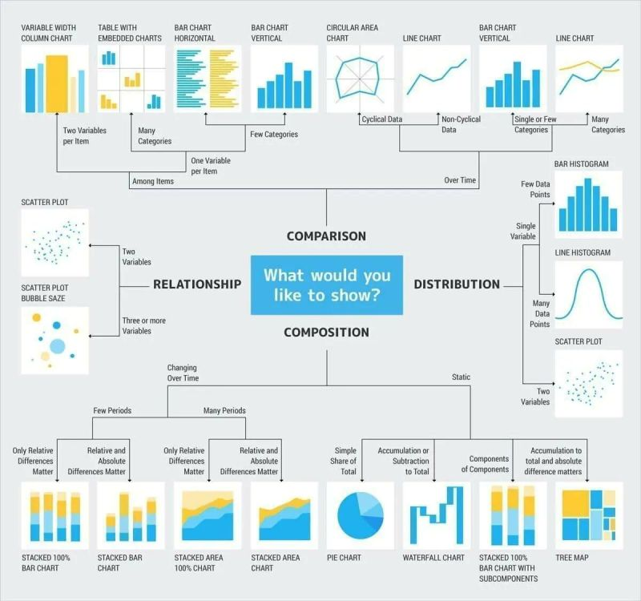 

## Resumen del capítulo

La visualización gráfica es la herramienta más directa para explorar un conjunto de datos antes de aplicar cualquier análisis estadístico. El stemplot permite obtener una visión rápida de la distribución de datos pequeños manteniendo los valores originales, aunque su uso ha quedado desplazado por herramientas gráficas más potentes. Las tablas de distribución de frecuencias organizan los datos en intervalos y permiten calcular frecuencias absolutas, relativas y acumuladas; pueden construirse en Excel mediante tablas dinámicas, o en Python y R mediante código reproducible y auditable.

El histograma es el gráfico estándar para representar la distribución de variables continuas. La forma del histograma nos informa sobre la naturaleza de los datos: una distribución simétrica indica homogeneidad, una distribución asimétrica señala que los valores extremos son frecuentes en uno de los lados, y una distribución bimodal revela la presencia de dos grupos distintos mezclados en los datos. El diagrama de barras se reserva para variables discretas o categóricas. El boxplot resume la distribución mediante cinco números (mínimo, Q1, mediana, Q3, máximo), refleja la forma de la distribución a través de la posición de la mediana y la longitud de los bigotes, y señala automáticamente los valores atípicos; con pocos datos es preferible usar el dotplot, que muestra los valores individuales. Para conjuntos de datos mayores pueden utilizarse alternativas como el beeswarm, el stripplot o el violin plot, que combinan el resumen estadístico con la visualización de los puntos individuales.

Los gráficos de densidad, disponibles en Python mediante seaborn y en R mediante ggplot2, ofrecen una representación suavizada de la distribución y resultan especialmente útiles para comparar grupos. Los gráficos de dispersión permiten visualizar la relación entre dos variables numéricas e identificar correlaciones, relaciones no lineales y valores atípicos; Python y R facilitan la segmentación por una tercera variable, lo que en Excel requiere un trabajo manual adicional. Los gráficos de series temporales representan la evolución de una variable en el tiempo y permiten identificar simultáneamente la estacionalidad y la tendencia a largo plazo; pandas en Python proporciona funciones de remuestreo que simplifican este análisis, con equivalentes en R mediante dplyr y lubridate. El capítulo concluye con referencias a galerías de ejemplos en Python y R y a guías de selección del tipo de gráfico según el objetivo del análisis.
