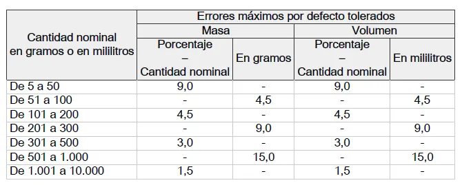
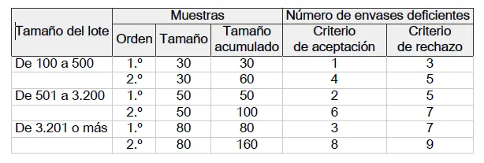
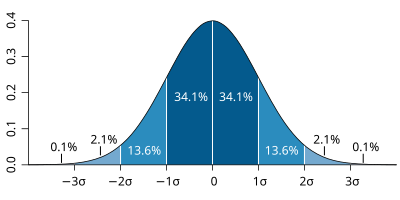
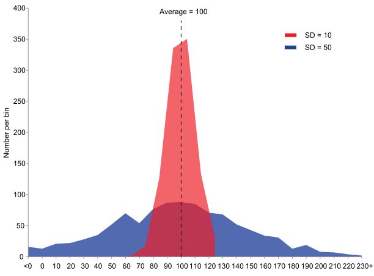

::: callout-note
## Objetivos de aprendizaje

Al finalizar este capítulo, el alumno será capaz de:

- Identificar los conceptos clave del RD 1801/2008: peso nominal, error máximo tolerado, límites T1 y T2.
- Explicar la relación entre la dispersión del proceso de llenado y la necesidad de sobredosificación para cumplir la legislación.
- Calcular la proporción de envases defectuosos a partir de los parámetros de la distribución normal.
- Determinar el peso medio óptimo de llenado en función de la dispersión del proceso.
- Cuantificar el coste económico de la sobredosificación y el beneficio de reducir la variabilidad.

Conceptos clave: **contenido efectivo, peso nominal, error máximo tolerado (EMDT), límite T1, límite T2, sobredosificación, capacidad de proceso**.
:::

::: {.callout-warning}
## Conocimientos requeridos para este capítulo
El contenido que se presenta a continuación requiere una buena comprensión previa de los capítulos 6 (Medidas centrales y medidas de dispersión: la media y la varianza), 7 (Distribuciones de probabilidad y la distribución normal) y 9 (Control estadístico de procesos).
:::

::: {.callout-tip}
## Sobre el código de este capítulo
Los bloques de código que generan gráficos complejos aparecen **ocultos por defecto**. Puedes mostrarlos haciendo clic en "Mostrar código". Si quieres entender qué hace un bloque, cópialo y pégalo en un asistente de IA como Gemini, ChatGPT o Claude y pregúntale: *"Explícame este código línea a línea, en lenguaje sencillo"*.
:::

## Introducción

En la industria alimentaria es frecuente que, con el fin de facilitar el acto de compra y el consumo, el fabricante ofrezca sus productos envasados en envases individuales (por ejemplo, yogures), o dividiendo productos más grandes (por ejemplo, mediante porcionado de queso en cuñas).

Cuando un fabricante comercializa un producto envasado o porcionado, puede hacerlo de dos formas:

- **A peso variable**: El consumidor adquiere una cantidad que se pesa en el momento de la venta (por ejemplo, queso al corte o jamón en lonchas en el mostrador). El precio final depende del peso real entregado, el cual se indica en una etiqueta impresa tras el pesaje.

- **A peso fijo**: El envase se presenta cerrado y etiquetado por el fabricante con un **peso nominal declarado** (como un yogur de 125 g o un queso fresco de 500 g). El contenido físico del envase se denomina **peso real** o **contenido efectivo**. Este es el escenario regulado por el RD 1801/2008, conocido como la **normativa de contenido efectivo**.

## El RD 1801/2008: qué regula y a quién afecta

El Real Decreto 1801/2008, de 3 de noviembre, establece las normas relativas a las cantidades nominales y al control del contenido efectivo en España. Esta normativa transpone la Directiva europea 2007/45/CE y es de aplicación obligatoria para cualquier empresa que comercialice productos con un peso o volumen nominal indicado en el envase.

En la industria láctea, esta norma afecta directamente a productos como yogures, quesos frescos, leche o nata. Ya sea un yogur de 125 g, un bote de nata de 200 ml o un queso de 500 g, todos están sujetos a estas disposiciones.

La norma parte de un principio de protección: el consumidor tiene derecho a recibir la cantidad indicada; sin embargo, reconoce una realidad técnica: ningún proceso de llenado industrial es perfecto. Siempre existirá una dispersión natural alrededor del valor objetivo. Por ello, el RD no exige que cada envase pese exactamente lo mismo, sino que define unas tolerancias estadísticas que el fabricante debe gestionar mediante el **control de procesos**.

La legislación garantiza el rigor del fabricante al declarar el peso para evitar fraudes al consumidor. Las autoridades competentes son las responsables de supervisar que las empresas cumplan con estos estándares. Para ello, se realizan inspecciones aleatorias tanto en los puntos de venta como en las propias plantas de envasado, verificando que los lotes de producción respetan las tolerancias permitidas por la ley.

## Declaración del peso en el envase

Existen dos modalidades para que un fabricante declare el peso de sus productos:

- **Sin signo de estimación**: El fabricante declara el peso nominal pero no se acoge al sistema de control estadístico de la Unión Europea. En este caso, debe garantizar que todos y cada uno de sus envases cumplen estrictamente con el contenido declarado. Al no seguir el protocolo específico de promedios y tolerancias del RD, no puede mostrar la letra "e" en su etiquetado.

- **Bajo la norma de contenido efectivo (Signo  )**: El fabricante realiza controles estadísticos de peso en cada lote para demostrar que cumple con las tolerancias legales. Este sistema le permite imprimir el **signo de estimación** (una letra **e** minúscula) en el etiquetado. Este símbolo funciona como un "pasaporte" que garantiza que el producto cumple con los estándares europeos, facilitando su comercialización en todo el mercado común.

{.column-margin}

## Los conceptos clave

### Peso nominal ($Q_n$)

Es el peso o volumen declarado en el envase por el fabricante.

### Los límites de tolerancia: Error máximo por defecto tolerado (EMDT)
 Para gestionar la dispersión inevitable del envasado, el RD 1801/2008 define el **Error Máximo por Defecto Tolerado (EMDT)**. Este valor es la diferencia máxima por defecto permitida entre el peso nominal etiquetado y el contenido real del envase (peso de menos).

La siguiente tabla del RD nos indica cuál es el **EMDT** para envases de diferentes pesos o volúmenes nominales:



La norma establece también que cuando el tamaño del lote sea inferior a 100 envases, el control no destructivo se realizará sobre la totalidad del mismo.
 
Vemos que el EMDT no es un valor fijo para todos los productos; se calcula en función del peso nominal ($Q_n$) siguiendo una escala establecida por la ley. Por ejemplo:

- Para un envase de 150 g, el EMDT es el 4,5 % del peso (6,75 g).
- Para un envase de 500 g, el EMDT es de 15 g (un valor fijo en ese tramo).

A partir de este valor, la normativa establece dos umbrales críticos de control que todo fabricante debe monitorizar en sus gráficos:

- **Umbral de Tolerancia** ($Q_n - \text{EMDT}$): Los envases que pesan menos de este valor se consideran **deficientes**. Solo se permite un máximo del 2,5 % de estos envases en cada lote.
- **Umbral de Defecto Crítico** ($Q_n - 2 \times \text{EMDT}$): Es el **límite de rechazo**. Ningún envase puede pesar menos de este valor; de lo contrario, el lote es rechazado automáticamente y no puede ser comercializado.

La norma define también el tamaño de muestra necesario para hacer el control según el tamaño del lote, y los criterios de aceptación o rechazo.



Para facilitar el control, la norma establece un muestreo en dos etapas: en una primera etapa tomamos una muestra que es la mitad de la muestra máxima, y verificamos el resultado. Si los criterios de aceptación no se cumplen, tomamos una segunda muestra y acumulamos los valores de ambas para determinar la aceptación o rechazo. El muestreo en dos etapas funciona como una "segunda oportunidad": si con la primera muestra el resultado es dudoso, la ley nos obliga a ampliar la inspección antes de decidir si rechazamos todo el lote.

En resumen, entregar menos peso de lo permitido por la norma constituye un **fraude** y es sancionable. Entregar peso por encima del peso nominal tiene un coste económico: estamos *regalando* producto. 

::: callout-tip
## Las tres reglas del envasador

Para que un lote de productos de peso fijo se considere conforme a la ley, el fabricante debe garantizar que su proceso de envasado cumple simultáneamente tres requisitos estadísticos:

- **Criterio de la Media**: El contenido efectivo (peso real) medio de los envases del lote no debe ser inferior al contenido nominal ($Q_n$) marcado en la etiqueta. Es decir, el promedio de lo que entregas al mercado debe ser, como mínimo, lo que prometes.
- **Criterio de Tolerancia Individual ($EMDT$)**: La proporción de envases que presentan un error negativo superior al Error Máximo por Defecto Tolerado ($EMDT$) debe ser lo suficientemente pequeña (menos del 2,5 % del lote) para que sea aceptable en una inspección por muestreo.
- **Criterio de Defecto Crítico**: No se permite la comercialización de ningún envase que tenga un error negativo superior al doble del error máximo tolerado ($2 \times EMDT$). Estos envases se consideran defectuosos de forma individual y deben ser retirados de la cadena.
:::


## Ejemplo práctico: el caso de un proceso de envasado de yogur

Supongamos una linea de envasado de yogures de 150 g, con una cadencia de llenado de un envase cada 3 segundos.

Según la tabla anterior, para productos entre 100 g y 200 g, el EMDT es el **4,5%** del peso nominal:
$$
\text{EMDT} = 4{,}5\% \times 150 = 6{,}75 \text{ g} 
$$

### Límite T1: envase defectuoso

Un envase se considera **defectuoso** cuando su contenido es inferior a $Q_n - \text{EMDT}$:

$$T_1 = 150 - 6{,}75 = 143{,}25 \text{ g}$$

La norma permite un máximo del **2,5%** de envases defectuosos (por debajo de T1) en un lote.

### Límite T2: envase no conforme

Un envase se considera **no conforme** (prohibido comercializar) cuando su contenido es inferior a $Q_n - 2 \times \text{EMDT}$:

$$T_2 = 150 - 2 \times 6{,}75 = 136{,}5 \text{ g}$$

La norma **no permite ningún envase** por debajo de T2. Un solo envase no conforme en una inspección puede dar lugar a sanción.

::: {.callout-note}
## Resumen de límites para yogur de 150 g

| Concepto | Valor |
|----------|-------|
| Peso nominal ($Q_n$) | 150,0 g |
| Error máximo tolerado (EMDT) | 6,75 g |
| Umbral de tolerancia (límite T1) (defectuoso) | 143,25 g |
| Umbral crítico (límite T2) | 136,5 g |
| Máximo de envases bajo T1 | 2,5% del lote |
| Envases bajo T2 | 0 (ninguno permitido) |
:::

### El procedimiento de muestreo del RD

La norma no evalúa el cumplimiento envase a envase sino mediante un **muestreo estadístico** del lote. Para un lote de producción de hasta 10.000 unidades (el caso habitual en una línea de yogures), el procedimiento es el siguiente:

**Primera etapa:** se toman **80 envases** al azar del lote y se pesan individualmente. El lote se **acepta** en esta etapa si:

- Ningún envase tiene un peso inferior a T2 (136,5 g), **y**
- 3 o menos envases tienen un peso inferior a T1 (143,25 g)

El lote se **rechaza** directamente si:

- Algún envase tiene un peso inferior a T2, **o**
- 7 o más envases tienen un peso inferior a T1

Si el número de envases bajo T1 está es superir a 3 e inferior a 7, se pasa a la segunda etapa.

**Segunda etapa:** se toman **otros 80 envases** y se acumulan con los de la primera (160 en total). 

- El lote se acepta si no hay ningún envase bajo T2 y hay 8 o menos bajo T1. 
- El lote se rechaza si hay alguno bajo T2 o 9 o más bajo T1.

::: {.callout-note}
## Rechazo: cualquiera de las dos condiciones; aceptación: las dos a la vez
Para **rechazar** el lote basta con que se cumpla **cualquiera** de las dos condiciones de rechazo. Para **aceptar** el lote deben cumplirse **las dos** condiciones de aceptación simultáneamente. Es un criterio conservador que protege al consumidor.
:::

### Control mediante muestra consolidada (n = 160)
En líneas de producción de alto rendimiento, es frecuente optar por un muestreo consolidado en lugar de las dos etapas. En este caso, se extrae directamente una muestra de 160 unidades (equivalente a la suma de las dos etapas legales) para tomar una decisión única sobre el lote. Bajo esta modalidad, los criterios de decisión para un lote de 9.600 unidades son directos:

- **Rechazo por defecto crítico**: El lote se rechaza inmediatamente si aparece 1 solo envase con un peso inferior a 136,5 g ($Q_n - 2 \times EMDT$).
- **Rechazo por envases deficientes**: El lote se rechaza si se contabilizan 9 o más envases con un peso inferior a 143,25 g ($Q_n - EMDT$).
- **Aceptación del lote**: El lote se acepta únicamente si no hay ningún envase crítico y el número de envases deficientes es 8 o inferior.

## El problema estadístico: dispersión y sobredosificación

Aquí es donde entra la distribución normal que estudiamos en el capítulo dedicado a las distribuciones de probabilidad. Si el proceso de llenado sigue una distribución normal con media $\mu$ y desviación típica $\sigma$, la proporción de envases por debajo de T1 es el área bajo la curva a la izquierda de T1:

$$P(\text{peso} < T_1) = P\left(Z < \frac{T_1 - \mu}{\sigma}\right)$$

Para cumplir la norma, esa proporción debe ser inferior al 2,5%. En una distribución normal, el 2,5% en la cola izquierda corresponde a $Z = -1{,}96$. Esto significa que T1 debe estar al menos 1,96 desviaciones típicas por debajo de la media:

$$\mu \geq T_1 + 1{,}96 \times \sigma = 145{,}5 + 1{,}96 \times \sigma$$

Si $\sigma = 1{,}5$ g (proceso preciso): $\mu \geq 145{,}5 + 2{,}94 = 148{,}44$ g

Si $\sigma = 3{,}0$ g (proceso impreciso): $\mu \geq 145{,}5 + 5{,}88 = 151{,}38$ g

La diferencia es enorme: con un proceso impreciso hay que dosificar casi 3 gramos más por envase solo para cumplir la norma. Esto es la **sobredosificación**: producto que se entrega al consumidor por encima del peso nominal sin cobrar por ello.

En el capítulo dedicado al control estadístico de procesos vimos cómo medir y seguir la variabilidad de un proceso de llenado mediante gráficos de control, y cómo los índices de capacidad $C_p$ y $C_{pk}$ cuantifican la relación entre la variabilidad natural del proceso y los límites de especificación. En este capítulo aplicamos esos conceptos al caso concreto del RD 1801/2008: el límite T1 es el límite de especificación inferior, y la capacidad del proceso determina directamente cuánta sobredosificación es necesaria para cumplirlo.

Para este ajuste, usaremos el **Peso Nominal ($Q_n$) de 150 g**. 

Como vimos antes, para este tramo (100 a 200 g), el **EMDT es el 4,5%**, lo que equivale a **6,75 g**. 

* El primer límite (antes llamado T1) es $150 - 6,75 = \mathbf{143,25\ g}$.
* El segundo límite o "Defecto Crítico" (antes T2) es $150 - (2 \times 6,75) = \mathbf{136,5\ g}$.

### Procedimiento de Control de Lote ($Q_n = 150\ g$)

En nuestro caso, consideramos **lote** la producción realizada en un día, que es de **9.600 unidades**. Al ser un lote superior a 3.201 unidades, la norma establece que cada etapa de muestreo debe ser de **80 unidades**. Nuestro **EMDT** es **6,75 gramos**, luego:

* **Envase deficiente:** Aquel que tiene un peso inferior a **143,25 g**.
* **Límite Crítico ($2 \times EMDT$):** No puede aparecer **ningún** envase con peso inferior a **136,5 g**.

El procedimiento que seguimos es el siguiente:

**Rechazamos** el lote si en la primera muestra de **80 unidades** nos aparecen:
* **1** o más envases con un peso inferior a **136,5 g**, o
* **7** o más envases con un peso inferior a **143,25 g** (envases deficientes).

**Aceptamos** el lote si en la primera muestra de **80 unidades** nos aparecen:
* **Ningún** envase con un peso inferior a **136,5 g**, y
* **3** o menos envases con un peso inferior a **143,25 g** (envases deficientes).

Si en la primera muestra aparecen **entre 4 y 6 envases deficientes** (la zona de duda entre el $Ac=3$ y el $Re=7$), tomamos una segunda muestra de **80 unidades** y acumulamos los resultados.

**Rechazamos** el lote si en el total de las dos muestras (**160 unidades**) nos aparecen:
* **1** o más envases con un peso inferior a **136,5 g**, o
* **9** o más envases con un peso inferior a **143,25 g** (envases deficientes).

**Aceptamos** el lote si en el total de las dos muestras (**160 unidades**) nos aparecen:
* **Ningún** envase con un peso inferior a **136,5 g**, y
* **8** o menos envases con un peso inferior a **143,25 g** (envases deficientes).

Es importante recordar que el lote se rechaza si se incumple **cualquiera** de las dos condiciones (ya sea por encontrar un solo envase crítico o por exceder el número de deficientes).

---

### Resumen de Criterios (Tabla del RD para Lote > 3.200)

| Etapa | Muestra | Ac (Aceptación) | Re (Rechazo) |
| :--- | :--- | :--- | :--- |
| **1ª Etapa** | 80 uds | **3** deficientes | **7** deficientes |
| **Total (1ª+2ª)** | 160 uds | **8** deficientes | **9** deficientes |
| **Cualquier etapa** | - | **0** críticos ($< 136,5$) | **1** crítico ($< 136,5$) |

Es importante insistir en que **rechazamos** el lote si se cumple **una cualquiera** de las dos condiciones de rechazo; y que para **aceptar** el lote, deben darse **las dos** condiciones de aceptación.


```{r echo = TRUE}
df <- read.csv("datos/simulacion_envasado_yogur.csv")
```


Como siempre, lo primero que hacemos es un resumen de los datos:
```{r echo = TRUE}
summary(df)
```

El peso medio es $151,6 g$, con un mínimo de $135.8 g$ y un máximo de $162,8 g$.

La desviación típica es:

```{r echo = TRUE}
sd(df$peso)
```

Verificamos la distribución mediante el histograma y el diagrama de caja:

```{r echo = TRUE}
par(mfrow=c(1,2))
hist(df$peso)
boxplot(df$peso)
par(mfrow=c(1,1))
```

Los datos son aproximadamente simétricos y el aspecto del histograma es el de la distribucón normal, lo cual nos indica que la utilización de la media y la desviación típica como descriptores de la distribución parece correcta. $R$ tiene métodos precisos para hacer estas comprobaciones, que podremos ver en detalle en otro momento.

## Comprobación de la adecuación de nuestros datos de peso a la normativa legal

La norma nos indica las cantidades en dos muestras sucesivas de $50$ unidades, haciendo un total de 100. Podemos ponernos en el caso más desfavorable y calcular una muestra de $100$ unidades a partir de nuestras $9.600$ observaciones de peso.

Para calcular una muestra, podemos utilizar la función `sample()`, que extrae una muestra aleatoria de un vector; indicamos el vector y el tamaño de la muestra:

```{r echo = TRUE}
muestra <- sample(df$peso, 100)
```

Una vez que hemos importado los datos y hecho nuestra muestra, el cálculo de los criterios de rechazo y la comparación con la norma es ya muy sencillo:

```{r echo = TRUE}
sum(muestra < 232)
sum(muestra < 241)
```

Nuestra muestra tiene `r sum(muestra < 232)` elementos por debajo del criterio de rechazo del valor nominal menos dos veces el EMDT (`232`). Por lo tanto, según este criterio, **`r ifelse (sum(muestra < 232) > 0, "rechazamos", "aceptamos")`** el lote como válido.

Además tiene `r sum(muestra<241)` envases deficientes, lo que es  `r ifelse(sum(muestra<241) >= 7, "superior o igual", "inferior")` al criterio de rechazo de  `7`envases deficientes; por lo tanto, según este criterio, **`r ifelse (sum(muestra<241) >= 7, "rechazamos", "aceptamos")`** el lote como válido. 

## El trabajo de mejora

Hasta aquí hemos conseguido determinar la validez de un lote de producto envasado de acuerdo con la ley de contenido efectivo. Si nos quedásemos aquí, habríamos hecho razonablemente bien el papel de inspector o inspectora del Ministerio de Consumo, pero de nosotros se espera algo más. Si el lote no es válido, ¿qué podemos hacer para que en el futuro nos ajustemos a la ley? ¿Cuál es el sobrepeso que estamos entregando y cuánto cuesta a la empresa? ¿Podemos conseguir algún ahorro en el proceso de dosificación manteniendo el proceso dentro de las especificaciones legales? ¿Cómo estableceríamos las etapas básicas de la mejora? Este es el papel que la empresa espera que desempeñemos, ¡no el de un mero fiscalizador!

Para entrar en esta parte apasionante de nuestro trabajo, neesitamos repasar algunos conceptos y descubrir algunas nuevas herramientas, ¡no muchas!

## Cómo determinamos los límites de  tolerancia de un proceso

Hemos visto que, en determinadas condiciones, una distribución de frecuencias puede ser descrita de forma aproximada mediante una distribución normal, que utiliza como parámetros $\mu$  y $\sigma$ la media $\overline{x}$ y la [desviación típica](https://es.wikipedia.org/wiki/Desviaci%C3%B3n_t%C3%ADpica) $s$ de la distribución. La *aproximación normal* nos permite usar una propiedad de la *curva normal*, que ya hemos visto: el porcentaje de casos que esperamos encontrar en los intervalos definidos por la desviación típica:




Recordemos que, en una distribución concreta, 

- en el intervalo $\mu\pm1\text{ }\sigma$ encontraremos el $68,2\%$ de los datos
- en el intervalo $\mu\pm2\text{ }\sigma$ encontraremos el $95,4\%$ de los datos
- en el intervalo $\mu\pm3\text{ }\sigma$ encontraremos el $99,6\%$ de los datos

La magnitud de la desviación típica nos define la amplitud de la dispersión, es decir, el aspecto más o menos aplanado de la distribución:



La gráfica anterior nos representa dos procesos con valor medio $100$ y con dos valores distintos de desviación típica. La distribución representada en rojo tiene una $s_1=10$, mientras que la distrobución representada en azul tiene una $s_2=50$

Si ambas gráficas representasen dos procesos de llenado de envases de 100 gramos, el primer proceso tendría el 99,6% de los casos en el intervalo $\overline{x_1}\pm3*s_1=(70, 130)$. Sin embargo, el segundo proceso tendría en este intervalo $(70,130)$ solamente en torno al 70% (aproximadamente) de los datos, ya que el intervalo de $\overline{x_2}\pm1*s_2=(50, 150)$

Supongamos ahora que la especificación de calidad del proceso de envasado tuviese como límite inferior de peso los 50 gramos. En el primer caso, estaríamos prácticamente seguros de que ninguno de nuestros envases estaría por debajo de ese peso, y por tanto cumpliríamos la especificación sin ningún problema. En el segundo caso, en cambio, $50$ es el límite inferior de *una* desviación típica, por lo que, según lo que vemos en nuestra curva normal, el $(13,6\% + 2,1\% + 0,1\%)$ de los casos estarían por debajo de esta cantidad, es decir, tendríamos un $15,7%$ fuera de la especificación.

Esto tiene dos lecturas diferentes:

- Para construir los límites de nuestro proceso, necesitamos conocer su desviación típica, con ella podemos construir los intervalos dentro de los cuales debe mantenerse el proceso.
- Si nuestro proceso debe ajustarse a una especificación externa, ya sea una especificación del cliente o una normativa legal, podremos hacerlo solamente si la desviación típica se ajusta a lo que se nos exige. 

En un proceso de envasado, no hay límite legal superior al peso que entregamos, sólo límite inferior. Por eso, cuando no somos capaces de reducir nuestra variabiidad, nos vemos obligados a subir el peso dosificado para que el límite inferior esté dentro de la especificación.


### Introducción a la capacidad de un proceso

Cuando un proceso se ajusta a los límites especificados, se dice que es un **proceso capaz**. Si nuestro proceso **no es capaz**, nuestro trabajo consiste en reducir la variabilidad hasta que el proceso *entre* en la especificación. La reducción de la variabilidad es uno de los principales objetivos de los procesos **Seis Sigma**.

Existen medidas concretas para definir la [capacidad del proceso](https://es.wikipedia.org/wiki/Capacidad_del_proceso), que pueden revisarse en la bibliografía; no las veremos aquí por el momento.

$R$ proporciona gráficos específicos para analizar la capacidad de un proceso, y para hacer el seguimiento de un proceso y analizar sus desviaciones.

Vamos a analizar la primera de ellas, estudiando la capacidad de nuestro proceso de envasado de acuerdo con la normativa legal.

Utilizaremos dos funciónes de la [librería `qcc`](https://cran.r-project.org/web/packages/qcc/vignettes/qcc_a_quick_tour.html), la propia función `qcc()` y la función   `process.capability()`

La primera función nos calcula un gráfico de control, como hemos visto en la introducción. En este caso analizaremos el proceso completo de envasado que hemos realizado en el día, y que consta de 9.600 envases. PAra evitar colapsar el gráfico y además obtener intervalos de control, agrupamos los datos por intervalos de 3 minutos.

```{r echo = TRUE,results = 'hide'}
library(dplyr)
library(lubridate)
library(qicharts2)

# Convertir la columna de texto a formato Fecha-Hora real
df <- df %>%
  mutate(
    hora_envasado = ymd_hms(hora_envasado) 
  )
# intervalo de muestreo
df$intervalo <- lubridate::floor_date(df$hora_envasado, "3 minutes")
qic(peso_g, 
    x          = intervalo, 
    data       = df, 
    chart      = "xbar",
    point.size = 0.9,
    title      = "Control de Peso (Media cada 3 min)",
    ylab       = "Gramos (g)",
    xlab       = "Hora de Envasado")
```

```{r}
qic(peso_g, 
    x          = intervalo, 
    data       = df, 
    chart      = "s",
    point.size = 0.9,
    title      = "Control de Peso (DEsviación típica cada 3 min)",
    ylab       = "Gramos (g)",
    xlab       = "Hora de Envasado")

```

La [función `process.capability()`](https://luca-scr.github.io/qcc/reference/process.capability.html) utiliza la información almacenada en esta estructura para hacer sus cálculos. Veamos el gráfico de capacidad de proceso:


```{r echo = TRUE, results= 'hide'}
library(dplyr)
library(lubridate)
library(qcc)

# 1. Conversión y creación de grupos de 5 min
df_preparado <- df %>%
  mutate(
    hora_envasado = ymd_hms(hora_envasado),
    intervalo = floor_date(hora_envasado, "5 minutes")
  ) %>%
  group_by(intervalo) %>%
  # Creamos un índice dentro de cada grupo para poder ensanchar la tabla
  mutate(obs_id = row_number()) %>% 
  ungroup()

# 2. Transformar a formato Matriz (Ancho)
# Cada fila será un intervalo de 5 min, cada columna una observación
datos_matriz <- df_preparado %>%
  select(intervalo, obs_id, peso_g) %>%
  tidyr::pivot_wider(names_from = obs_id, values_from = peso_g) %>%
  select(-intervalo) %>% # Quitamos la columna de tiempo para la matriz
  as.matrix()

# Creamos el objeto xbar (si no lo tienes ya)
obj_xbar <- qcc(datos_matriz, type = "xbar", plot = FALSE)
# Calculamos y dibujamos la capacidad
capacidad <- process.capability(obj_xbar, 
                                spec.limits = c(143.25, 156,75), 
                                target = 150)


```

Este gráfico nos presenta un histograma con los valores de peso de la muestra, una curva normal ajustada a estos valores (construida a partir de la media y la desviación típica de la muestra). Si proporcionamos los límites superior (*upper specification limit*) e inferior (*lower specification limit*), el gráfico nos dibuja estos límites, lo que nos permite una comparación visual muy conveniente.

Hemos suministrado a la función como límites del proceso los de la media $\overline{x}\pm2*EMDT$; sabemos que no podemos tener ningún peso por debajo del límite inferior de este intervalo ($232$).

EL gráfico nos imprime además otros valores estadísticos, de los cuales por el momento sólo utilizaremos:

- Center: es el valor promedio de la muestra ($250,00$)
- StdDev: es la desviación típica de la muestra ($8,11$)
- Obs<LSL: el porcentaje de casos por debajo del límite inferior de la especificación que hemos indicado, en este caso $\overline{x}-2*EMDT=232$, que es el límite de rechazo.
- Obs>USL: el porcentaje de casos por encima del límite superior de la especificación que hemos indicado, en este caso, $\overline{x}+2*EMDT=268$.

En nuestro caso, no deberíamos encontrar ningún valor por debajo del LSL. Sin embargo tenemos un $1,3\%$ de valores en esta zona. Esto quiere decir que nuestro proceso *no es capaz* de mantenerse dentro de los límites de la especificación.

Podemos repetir el gráfico, esta vez utilizando los valores de $\overline{x}\pm1*EMDT=(241, 259)$ como límites de especificación La ley de contenido efectivo nos dice que con nuestro tamaño de lote, rechazamos el lote si en nuestra muestra de 100 tenemos 7 o más valores por debajo de este límite, lo que es lo mismo, debemos tener una cantidad de valores por debajo de $241$ que debe ser **menor** de 7 casos en 100, es decir, del $7\%$ de los casos.


Nuestro gráfico de capacidad de proceso, con los nuevos límites, nos dice que tenemos un $13\%$ de casos por debajo del valor límite, lo que de nuevo nos sitúa fuera de la especificación: debemos rechazar el lote.

## Plan de mejora: dispersión objetivo y peso a dosificar

Como hemos visto, nuestro proceso no está dentro de las especificaciones que nos exige la normativa legal. tenemos dos opciones para corregir esta situación:

1. Subir el peso medio dosificado, lo lo que nos llevará a sobredosificar, y esto aumentará nuestros costes de producción. Si no podemos aumentar el precio de venta, sobredosoficar nos ocasionará *pérdidas no previstas*.
2. Reducir la variabilidad (la desviación típica), de manera que nuestro proceso *sea capaz* de entrar en la especificación

De forma inmediata no podemos asegurar una reducción de la variabilidad porque todavía no conocemos las condiciones que han producido la desviación típica de $s=7,5$ entre las 14:00 y las 15:00 horas.

Lo que sí podemos (y tenemos) que hacer de manera inmediata para cumplir la ley es aumentar el peso dosificado, y, una vez dentro de la ley, pondremos en marcha nuestro plan de mejora. Haremos todo esto en varias etapas:

1. Subiremos lo necesario para evitar los pesos por debajo de $232\text{ }g$
2. Verificaremos si con el nuevo peso, se reduce el número de envases deficientes (por debajo de $241\text{ }g$) hasta situarnos en los límites de tolerancia.
3.  En caso de que la subida de peso no consiga el efecto que buscamos en el punto 2, procederemos a una nueva subida del peso medio hasta que cumplamos con ambas especificaciones.
4. Sólo entonces, una vez dentro de la ley, pondremos en marcha un plan de mejora de la variabilidad con el objetivo de alcanzar una desviación típica de $7,5$ o inferior. Esto nos permitirá recorrer el camino inverso, es decir, bajar el peso medio de nuevo hasta el límite que sea posible sin incumplir la norma.

Una vez que hayamos dado los tres primeros pasos, nos encontraremos en una situación de **sobredosificación**. Calcularemos el sobrepeso real que estamos entregando y su coste, de forma que podamos estableer un objetivo económico para el punto 4º.

Puesto que no debemos tener ningún valor por debajo de $232\text{ }g$, y nuestro valor mínimo es de `r min(df$peso)`, debemos aumentar la dosificación en más de `r 232 - min(df$peso)` gramos. Simularemos el proceso en $R$ simplemente sumando a los valores originales este aumento de dosificación; guardaremos los pesos modificados en una nueva columna de nuestro *dataframe* que llamaremos `peso2`:

```{r echo = TRUE}
# incremento_peso <- 232 - min(df$peso) + 1 # añadimos un margen de confianza como seguridad
# df$peso2 <- df$peso + incremento_peso
```

Más adelante veremos cómo construir un nuevo vector de peso de forma diferente, mediante una simulación probabilística,

```{r echo = FALSE}
#para que la simulación no me toque los cojones
# df$peso2[df$peso2 <= 232] <- df$peso2[df$peso2 <= 232] + (232 - df$peso2[df$peso2 <= 232] + 0.01)
```

Hemos aumentado nuestro peso en `X` gramos. Veamos la media y desviación típica de nuestro nuevo peso simulado, y el sumario de $R$:

```{r echo = TRUE}
#mean(df$peso2)
#sd(df$peso2)
#summary(df$peso2)
```

Como vemos, la desviación típica no se ha modificado.

Comparemos la distribución de pesos original con la que hemos modificado mediante un diagrama de caja de las dos columnas. En este caso, utilizamos la función básica `boxplot()` 

```{r echo = TRUE, fig.height = 4, fig.width=5}
#boxplot(df$peso, df$peso2)
```

El diagrama de caja nos permite comprobar el aumento de peso que hemos aplicado a la nueva variable `peso2`.

La comparación de los histogramas de las dos distribuciones no puede hacerse con la función básica `hist()` porque no puede imprimir dos histogramas solapados, necesitamos utilizar `ggplot()`, y también cambiar el formato de nuestro dataframe a formato ordenado, Si verificamos el *dataframe*. vemos que ahora la medida de peso no está en una columna única, sino en dos:
```{r echo = TRUE}
#head(df)
```

La estructura de *datos ordenados* nos exige que cada tipo de variable (en este caso el peso) esté en una sola columna. Para modificar la tabla, necesitamos *pivotar" las medidas de peso a una sola columna, y colocar las descripciones en una nueva columna que llamaremos $caso$. Lo hacemos con la [función `pivot_longer()`](https://tidyr.tidyverse.org/reference/pivot_longer.html) de la librería `dplyr`:


```{r echo = TRUE}
# df |>
    # pivot_longer(cols = c(peso,peso2), names_to = "caso", values_to = "peso") |>
    # head()
```

Con esta estructura, `ggplot` nos permite varias alternativas para nuestro histograma. No necesitamos hacer permanente la estructura del *dataframe*. podemos pasarla a `ggplot`mediante un `pipe` sin guardarla en un dataframe, los cálculos se hacen instantáneamente. veamos en primer lugar el diagrama de caja en versión `ggplot`:

```{r echo = TRUE, fig.height = 3, fig.width=4}
# df |>
#     pivot_longer(cols = c(peso,peso2), names_to = "caso", values_to = "peso") |>
#     ggplot(aes(x = caso, y = peso))+
#       geom_boxplot()
```


Ahora podemos hacer la comparación de los histogramas, añadiendo un poco de color para diferenciarlos:

```{r echo = TRUE, fig.height = 3, fig.width=4}
# df |>
#     pivot_longer(cols = c(peso,peso2), names_to = "caso", values_to = "peso") |>
#     ggplot(aes(x = peso, colour= caso,  fill = caso))+
#       geom_histogram(position = "identity", alpha = 0.4) 
```

A título informativo, otra presentación que puede tener interés en otras situaciones es la presentación de los gráficos clasificados lado a lado:

```{r echo = TRUE,fig.height = 3, fig.width=8}
# df |>
#     pivot_longer(cols = c(peso,peso2), names_to = "caso", values_to = "peso") |>
#     ggplot(aes(x = peso, colour = caso,  fill = caso))+
#       geom_histogram(alpha = 0.4) +
#       facet_wrap(~caso)
```

Volviendo a nuestro caso, 

Si nuestros cálculos han sido correctos, los pesos de la nueva columna no deben tener valores por debajo de 232:


```{r echo = TRUE}
# sum(df$peso2<=232)
```

Veamos cuántos valores tenemos por debajo del límite que define los envases deficientes:
```{r echo = TRUE}
# sum(df$peso2 <= 241)
```

La ley nos dice que en una muestra de 100 debemos tener menos de 7 envases deficientes. Verificamos que el porcentaje de envases deficientes es inferior al 7%:

```{r echo = TRUE}
# pct_deficientes <- sum(df$peso2 < 241) / length(df$peso2) *100
# pct_deficientes
```

El porcentaje de unidades defectuosas es del `X`%, con lo que podemos estar razonablemente seguros de que el número de defectuosos en cualquier muestra que podamos tomar no excederá las 7 unidades defectuosas de cada 100.

### Análisis económico

Con la sobredosificación hemos conseguido que nuestro lote esté dentro de la ley.
¿Cuál es el coste de la decisión?

No tenemos más que calcular el peso real que hemos dosificado y el peso calculado en la simulación:

¿Qué peso real total en kilos hemos dosificado inicialmente?

```{r echo = TRUE}
# peso_real <- sum(df$peso) /1000
# peso_real
```

¿Qué peso total teórico en kilos habríamos dosificado con la propuesta de subir el peso en r round(incremento_peso, 2) g por envase?

```{r echo = TRUE}
# peso_simul <- sum(df$peso2) /1000
# peso_simul
```

Es decir, la decisión de incrementar el peso dosificado en r round(incremento_peso, 2) g nos hará dosificar r round((peso_simul - peso_real), 2) kg más. Suponiendo que el coste de producción de 1 kg sea de 0,85 euros, el coste del sobrepeso es de 

```{r echo = TRUE}
# peso_mas <- peso_simul - peso_real
# coste_unitario <- 0.85
# coste_total2 <- peso_mas * coste_unitario
# coste_total2
```


En resumen, nuestra decisión de aumentar la dosificación en r round(incremento_peso,2) g por envase para que el peso medio de nuestro lote de 3000 unidades cumpla con la normativa de contenido efectivo ha aumentado el coste del producto que entregamos como sobrepeso (gratuitamente) en r round(coste_total2,2) euros por cada lote de 3000 unidades. Si envasamos diariamente durante un año, y suponiendo 250 días útiles, el coste anual que estaríamos asumiendo con esta decisión sería de r round(coste_total2 * 250, 2) euros.

## Un plan de ahorro

Si fuésemos capaces de reducir la dispersión de peso, reduciendo la desviación típica de r round(sd(df$peso),2) a 6, mejorando ligeramente la mejor situación actual, podríamos bajar el peso medio, teniendo como límite el marcado por el peso mínimo de 232 g, lo que nos permitiría obtener un ahorro sobre esta cantidad.


Para simular esta nueva columna, con una desviación típica más reducida, utilizaremos una *función de probabilidad*

Para entender su uso, volvamos al histograma.

Hemos visto que cuando construimos un histograma, agrupamos el número de observaciones en lo que hemos llamado intervalos de frecuencia. la función básica de histograma de R hace estos cálculos automáticamente y los guarda dentro de la estructura del histograma, presentándonos sólo el gráfico. Podemos repasar la [construcción básica de un histograma](https://www.r-bloggers.com/2015/03/how-to-make-a-histogram-with-basic-r/) [aquí](https://www.r-bloggers.com/2015/03/how-to-make-a-histogram-with-basic-r/)

Nosotros podemos recuperar estos datos guardando el *objeto+ histograma en una variable e inspeccionando su estructura, cmomo hemos hecho otra veces:

```{r echo = TRUE, fig.height = 3, fig.width=4}
 # h <- hist(df$peso)
```

Hemos "guardado" nuestro histograma en un *objeto $R$*, que podemos reusar para ver la gráfica

```{r echo = TRUE, fig.height = 3, fig.width=4}
# plot(h)
```

Veamos su estructura:

```{r echo = TRUE}
# str(h)
```

La variable `breaks` contiene los límites de los intervalos, mientras que la variable `mids`contiene los puntos medios de esos mismos intervalos. Podemos acceder a estos elementos del histograma usando la notación habitual de $R$:

```{r echo = TRUE}
# h$breaks 
# h$mids
```
Podríamos utilizar las opciones de la función `hist()`para definir los intervalos que nos interesan, y recuperarlos utilizando estas variables (queda como ejercicio voluntario).

Como alternativa, vamos a utilizar las funciones de la biblioteca `dplyr`para hacer el cálculo de una tabla de frecuencias. Para ello, vamos a agrupar los valores originales de peso en grupos definidos por la parte entera del peso, y calcularemos el número de valores en cada clase:

```{r echo = TRUE}
# df |>
#   mutate (intervalo = cut(peso, c(0,232,241,250,max(peso)))) |>
#   group_by(intervalo) |>
#   summarize (frecuencia = n()) |>
#   mutate(frecuencia_relativa = round(frecuencia/ sum(frecuencia) * 100,2))

```

La notación $(a,b]$ significa $>a\text{ }$ y $\text{ }<=b$ (intervalo abierto a la izquierda y cerrado a la derecha): el primer intervalo, (0,232], incluye todos los valores mayores que cero y menores o iguales que 232, y así sucesivamente.

```{r echo = FALSE, results = 'hide'}
# pct_rechazos <- round(sum(df$peso<=232)/length(df$peso)*100,0)
# pct_deficientes <- round(sum(df$peso<=241)/length(df$peso)*100,0)

```

La tabla nos dice que en el peso original (columna `peso`) tenemos 

- un r pct_rechazos`% de valores iguales o menores que 232 (criterio de rechazo), y 
- un r pct_deficientes`% de valores iguales o menores que 241 (criterio para envases deficientes). 

Ambos valores están fuera de los límites de aceptación del lote,  es decir, el lote está fuera de la norma, como hemos visto antes.

En nuestra nueva columna, con el peso modificado, la distribución de frecuencias es la siguiente:

```{r echo = TRUE}
# df |>
#   mutate (intervalo = cut(peso2, c(0,232,241,250,max(peso)))) |>
#   group_by(intervalo) |>
#   summarize (frecuencia = n()) |>
#   mutate(frecuencia_relativa = round(frecuencia/ sum(frecuencia) * 100,2))

```


```{r echo = FALSE, results = 'hide'}
# pct_rechazos <- round(sum(df$peso2<=232)/length(df$peso2)*100,0)
# pct_deficientes <- round(sum(df$peso2<=241)/length(df$peso2)*100,0)

```

La nueva tabla nos dice que en el peso modificado (columna `peso2`) tenemos 

- un r pct_rechazos`% de valores iguales o menores que 232 (criterio de rechazo), y 
- un r pct_deficientes`% de valores iguales o menores que 241 (criterio para envases deficientes). 

## La distribución normal y el cálculo de probabilidad: introducción

Para hacer los cálculos anteriores, hemos utilizado la distribución de frecuencias de las dos columnas de peso. 

Si suponemos que nuestra distribución de pesos se ajusta a una *distribución normal*, que ya conocemos, podemos construir una *curva normal* que se ajuste a nuestros datos:

```{r, echo=FALSE, fig.height = 3, fig.width=4}
# ggplot(df, aes(x = peso2)) + 
#     geom_histogram(aes(y =..density..),
#                    breaks = seq(230, 280, by = 2), 
#                    colour = "black", 
#                    fill = "lightgrey") +
#     stat_function(fun = dnorm, args = list(mean = mean(df$peso2), sd = sd(df$peso2))) +
#     geom_vline(xintercept = mean(df$peso2), colour = "red") +
#     annotate("text", 
#            mean (df$peso2),
#            -0.01,
#            label = format(round(mean(df$peso2), 2), nsmall = 1),
#            color = "darkred") +
#     theme(axis.text.y=element_blank(),
#             axis.title.y = element_blank())
  
```

Esta [curva o distribución normal](https://es.wikipedia.org/wiki/Distribuci%C3%B3n_normal) es una distribución de probabilidad que se construye utilizando la media y la desviación típica; el área bajo la curva nos da la probabilidad de ocurrencia de un suceso. No entraremos en los aspectos estadísticos de la construcción de la función de probabilidad y el cálculo de probabilidades, sólo necesitamos saber que $R$ tiene dos funciones que nos son útiles:

- [La función `rnorm()`](https://www.rdocumentation.org/packages/compositions/versions/1.40-3/topics/rnorm) permite construir un conjunto de valores que se ajusta a una distribución normal
- [La función `pnorm()`](https://www.rdocumentation.org/packages/stats/versions/3.6.2/topics/Normal) calcula la probabilidad de que en una muestra podamos encontrar un valor determinado.

Veamos el uso de cada función, empezando por la segunda: 

Si la media de nuestro conjunto de valores de $peso$ es de $\overline x=$ r round(mean(df$peso),2)` y la desviación típica $s=$ r round(sd(df$peso),2)`, podemos calcular la probabilidad de que encontremos un valor inferior o igual a $232$:


```{r echo = TRUE}
# p1 <- pnorm(232, mean(df$peso), sd(df$peso))
# p1

```

aproximadamente,  r round(p1*100,0)`$\%$.

La probabilidad de encontrar envases deficientes, con un peso inferior o igual a $241$ es de
```{r echo = TRUE}
# p2 <- pnorm(241, mean(df$peso), sd(df$peso))
# p2

```

Aproximadamente, del r round(p2*100,0)`$\%$.

Es decir, según el cálculo de probabilidad, en una muestra de 100 unidades, cabe esperar que encontremos r round(p1*length(df$peso),0) envases por debajo del límite de rechazo 232 g y r round(p2*length(df$peso),0)` envases deficientes. Comparemos con el resultado de la tabla de frecuencias, más arriba.

Veamos ahora la situación en nuestra columna de peso modificada:

```{r echo = TRUE}
# p1 <- pnorm(232, mean(df$peso2), sd(df$peso2))
# p2 <- pnorm(241, mean(df$peso2), sd(df$peso2))

```

En una muestra de 100 unidades, esperamos encontrar r round(p1*length(df$peso2),0)` envases por debajo del límite de rechazo 232 g y r round(p2*length(df$peso2),0)` envases deficientes.
, lo que coincide bastante aproximadamente en ambos casos con los cálculos que habíamos realizado sobre la tabla de frecuencias, de forma mucho más sencilla.

La **suposición de normalidad** nos ha simplificado enormemente nuestros cálculos, y en vez de la engorrosa tabla de frecuencias, sólo tenemos que utilizar una simple fórmula.

La distribución normal tiene otra utiidad poderosa: podemos construir una distribución de valores que se ajuste a una distribución normal, dada la media y la desviación típica.

En nuestro ejemplo, intentamos encontrar los ahorros que se pueden deducir de una reducción de la variabilidad. Vamos a suponer que reducimos nuestra desviación típica de 8 a 6.

Construyamos un nuevo conjunto de datos con el peso medio de nuestra distribución de peso modificada y la nueva desviación típica:

```{r echo = TRUE}
# df$peso3 <- rnorm (3000, mean(df$peso2), 6)
# 

```

Comparemos las distribuciones de las tres columnas de peso, la original, $peso$, la modificada que hemos obtenido sumando un peso fijo, $peso2$, y la tercera que hemos calculado mediante la función de distribución normal, $peso3$, utilizando la función de densidad:

```{r echo = TRUE, fig.height = 3, fig.width=4}
# df |>
#     pivot_longer(cols = c(peso,peso2, peso3), names_to = "caso", values_to = "peso") |>
#     ggplot(aes(x = peso, colour= caso,  fill = caso))+
#       geom_density(alpha = 0.3) 

```

y el diagrama de caja:

```{r echo = TRUE, fig.height = 3, fig.width=4}
# df |>
#     pivot_longer(cols = c(peso,peso2, peso3), names_to = "caso", values_to = "peso") |>
#     ggplot(aes(y = peso, x= caso, colour = caso))+
#       geom_boxplot() 

```

Con alguna instrucción adicional, podemos mostrar las curvas de densidad y los diagramas de caja lado a lado:

```{r echo = TRUE, fig.width = 10, fig.height=4}
# df2 <- df |>
#     select(peso,peso2, peso3) |>
#     pivot_longer(cols = c(peso,peso2,peso3), names_to = "caso", values_to = "peso")
# 
# graf1 <- ggplot(df2, aes(x = peso, colour = caso, fill = caso)) +
#         geom_density(alpha=0.3)
# 
# df2 <- df |>
#     select(peso,peso2, peso3) |>
#     pivot_longer(cols = c(peso,peso2, peso3), names_to = "caso", values_to = "peso")
# 
# graf2 <- ggplot(df2, aes(x = caso, y = peso, colour = caso)) +
#         geom_boxplot()
# 
# gridExtra::grid.arrange(graf1, graf2, ncol=2)

```

La distribución de $peso3$ es más estrecha, como corresponde a la reducción de variabilidad. Ahora el valor mínimo está alejado del valor de rechazo $232$, por lo que podemos bajar el peso medio

Repetimos la simulación, creando nuestro conjunto de peso $peso3$ con una media de peso con 4 gramos menos que $peso2$ y una desviación típica de 6:

```{r echo = TRUE}
# df$peso3 <- rnorm (3000, mean(df$peso2)-4, 6)

```

Veamos el número de envases por debajo del valor de rechazo en el total del lote. Debe ser cero; si encontramos algún valor, debemos revisar la propuesta de recuperación de 4 g y reducirla un poco (lo comparamos conla funcion de probabilidad):

```{r echo = TRUE}
# sum(df$peso3 <= 232)
# pnorm(232, mean(df$peso3), 6 )

```

En ambos casos, el resultado es aproximadamente cero.

Y ahora el número de envases deficientes:

```{r echo = TRUE}
# sum(df$peso3 <= 241)
# pnorm(241, mean(df$peso3), 6 ) * length(df$peso3)

```

(el número de envases deficientes esperado es igual a la probabilidad de tener un envase deficiente por el número total de envases)`

Ambos valores coinciden aproximadamente (lo que no es extraño puesto que hemos construido nuestro ejemplo de la distribución de pesos a partir de la función normal, por supuesto)

Comparando las tres columnas de peso, 
```{r echo = TRUE, fig.height=4, fig.width=10}
# df |>
#   select(peso,peso2, peso3) |>
#   pivot_longer(cols = c(peso,peso2,peso3), names_to = "caso", values_to = "peso") |>
#   group_by(caso) |>
#   summarize (peso_medio = mean(peso), desv_t = sd(peso))

```
Ahora calcularemos el ahorro conseguido:

```{r echo = TRUE, fig.height=4, fig.width=10}
# peso_simul2 <- sum(df$peso3) /1000
# peso_mas <- abs(peso_simul2 - peso_simul)
# coste_unitario <- 0.85
# coste_total3 <- peso_mas * coste_unitario
# coste_total3

```

La reducción de la variabilidad a una $s=6$ nos permitiría reducir en 4 gramos el valor de sobrepeso dosificado, con lo cual obtendríamos una mejora de r round(coste_total3, 2)` euros por lote, o lo que es lo mismo, una recuperación de r round(coste_total3 * 250, 0)` euros anuales frente a nuestra pérdida anterior.

Veamos la distribución de pesos con los diagramas de densidad y de caja, incluyendo la nueva simulación:

```{r echo = TRUE, fig.width = 10, fig.height=4}
# df2 <- df |>
#     select(peso,peso2, peso3) |>
#     pivot_longer(cols = c(peso,peso2,peso3), names_to = "caso", values_to = "peso")
# 
# graf1 <- ggplot(df2, aes(x = peso, colour = caso, fill = caso)) +
#         geom_density(alpha=0.3)
# 
# df2 <- df |>
#     select(peso,peso2, peso3) |>
#     pivot_longer(cols = c(peso,peso2, peso3), names_to = "caso", values_to = "peso")
# 
# graf2 <- ggplot(df2, aes(x = caso, y = peso, colour = caso)) +
#         geom_boxplot()
# 
# gridExtra::grid.arrange(graf1, graf2, ncol=2)

```

Vemos claramente la reducción de la variabilidad en nuestra hipótesis 3 y cómo hemos podido reducir el peso medio manteniendo nuestra distribucion de pesos dentro de la norma.

En un artículo posterior veremos cómo optimizar aún más este ahorro mediante la correcta utilización de un *discriminador de peso*, que es un sistema de peso en continuo y un expulsor que nos permite apartar envases bajos de peso en función del criterio de configuracion que establezcamos. $R$ nos permite también optimizar este sistema.

Las acciones para reducir la variabilidad en el proceso constituyen uno de los objetivos de los proyectos Seis Sigma, e incluyen técnicas diversas que incluyen las gráficas de control de proceso y otras herramientas.

## Resumen del capítulo

El RD 1801/2008 establece que la proporción de envases con contenido inferior al límite T1 ($Q_n - \text{EMDT}$) no puede superar el 2,5% del lote, y que ningún envase puede estar por debajo del límite T2 ($Q_n - 2 \times \text{EMDT}$). El cumplimiento de estos límites no depende solo del peso medio de llenado sino fundamentalmente de la dispersión del proceso.

La distribución normal permite calcular con precisión el peso medio mínimo necesario para cumplir la norma en función de σ: a mayor dispersión, mayor sobredosificación necesaria y mayor coste económico. En el dataset del turno de producción hemos visto que el cumplimiento global puede ocultar incumplimientos en períodos concretos, lo que subraya la importancia del seguimiento continuo del proceso en lugar del análisis puntual.

La conclusión práctica es que invertir en reducir la variabilidad del proceso de llenado tiene un retorno económico directo y cuantificable, independientemente de cualquier otra consideración de calidad.
