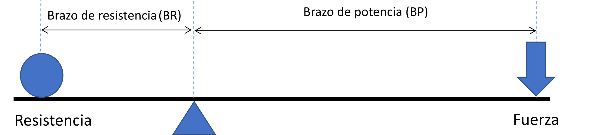

# Introducción

Este documento trata sobre el análisis de datos industriales utilizando tanto la hoja de cálculo como dos lenguaje de programación modernos, como son [Python](https://www.python.org/) (@python_website) y [R](https://www.r-project.org/). El uso de las técnicas estadísticas se ha reducido al mínimo, orientando el análisis al uso de métodos gráficos descriptivos sencillos.

En la industria alimentaria actual se produce un constante flujo de datos como resultado tanto de la implantación de sistemas de captura automáticos como de la tecnificación de los puestos de trabajo; se requiere por parte de los profesionales industriales que sean capaces de analizar esta enorme cantidad de datos para transformarlos en información para la decisión. En la empresa industrial media actual, son los ingenieros y técnicos de planta, y no estadísticos o ingenieros informáticos, quienes participan diariamente en la presentacion y discusion de los datos y en la toma de decisiones operativas, tanto en los equipos de trabajo como ante la Dirección. Por esta razón, es necesario proporcionar a los estudiantes de la Formación Profesional un conocimiento básico de los conceptos, herramientas y métodos del análisis de datos, así como de algunas técnicas de presentación y comunicación de la información.

La experiencia industrial muestra que en las situaciones reales, sobre el terreno, la comprensión práctica de los conceptos es más importante que su rigurosa formulación matemática. Por esta razón, en el desarrollo del contenido de este documento se insiste más en la forma de aplicar las herramientas y entender los análisis que en el conocimiento formal de las fórmulas estadísticas y su deducción matemática, o de la programación informática en sí. 

A lo largo del contenido, se hace especial hincapié en la utilización de herramientas sencillas, casi siempre gráficas, que son una ayuda valiosa para comprender la información contenida en un conjunto de datos. El objetivo es proporcionar al estudiante de industrias alimentarias las bases de la metodología para análisis de sus datos y su aplicación a la resolución de problemas técnicos concretos, más que el conocimiento de la teoría matemática de la estadística o de la programación informática. En este sentido, se ha intentado que el alumno aprenda bien la diferencia entre "en qué consiste" un estadístico, y "cómo se calcula". Comprender la diferencia entre el concepto y su fórmula de cálculo es fundamental para entender cómo aplicarlo.

Se evitan las explicaciones formales sobre temas estadísticos. Así, por ejemplo, al explicar la media de un conjunto de datos, es más importante entender el concepto físico de "centro de gravedad" que los conceptos estadísticos de esperanza matemática, que no se tocan en este texto. Veremos cómo el modo de cálculo de la media aritmética hace que su valor sea equivalente al centro de gravedad de un conjunto de datos; si aproximamos esta idea a la de un sistema de palanca en equilibrio sobre un fulcro, será muy fácil entender y hacer entender por qué los valores anómalos extremos desvían notablemente la media y deben analizarse con cuidado: una pequeña desviación en un item muy lejos del centro de gravedad tiene un gran efecto sobre el punto de equilibrio del sistema, debido a la longitud del brazo de palanca; de la misma manera, los valores extremos pueden introducir desviaciones en el valor de la media aritmética que siempre hay que considerar.

También será fácil comprender que otros estadísticos, como la mediana, que se calculan de forma diferente (la mediana es, simplemente, el valor central del conjunto de datos) resultan menos o nada afectados por los valores extremos,; veremos en la práctica las ventajas e inconvenientes de cada uno.

::: {#fig-intro-media layout-ncol="2" layout-valign="bottom"}
{#fig-media}

{#fig-palanca}

Comparación gráfica del significado de la media en un diagrama de puntos (*dotplot*) con una palanca de primer grado.
:::

Un curso de introducción al análisis de datos industriales debe ser, ante todo, práctico y orientado a su aplicación en el entorno industrial real. Los principales temas de trabajo de análisis de los datos en la industria tienen que ver con su captura, su almacenamiento y su depuración, su descripción utilizando gráficos, la inferencia (intervalos de confianza y tests), la construcción de modelos explicativos, el diseño de los experimentos industriales, el control estadístico de la calidad y la exposición y presentación de resultados. Dado el alcance limitado de este documento, no se entrará en los métodos estadísticos en sí, y necesitarán de un estudio posterior si el alumno tiene interés en profundizar en ellos.

A pesar de que los temas más especializados puedan ser importantes en algunas aplicaciones específicas, no preparan al estudiante para lo que se va a encontrar en el terreno en la mayor parte de las ocasiones. En cambio, la resolución de problemas en equipo en un entorno de aprendizaje dinámico enfrentándose a problemas exigentes, y el desarrollo de las habilidades de análisis, de síntesis y de comunicación, tendrán un impacto mucho más positivo.

Es importante que los estudiantes comprendan y apliquen el método científico en el entorno industrial, y no sólo apliquen un recetario de procedimientos de manera automática. Son mucho mas importantes la comprensión y la utilización adecuada del método científico y de las herramientas y gráficos básicos, antes que la aplicación rutinaria y mecánica de determinadas fórmulas matemáticas o métodos sofisticados y complejos (como la IA) que el alumno puede no comprender en toda su profundidad.

Las industrias líderes destacan por la aplicación intensiva de métodos tales como *Six Sigma*, *Lean Manufacturing*, diseño robusto de productos y otros, que hacen un uso intensivo de los datos, tanto de los obtenidos en producción como de los obtenidos en la realización de experimentos diseñados. Pero la mejora de la competitividad en estas empresas no se debe tanto a la aplicación de unos u otros métodos, como al desarrollo del juicio analítico de sus equipos humanos y a la aplicación de lo aprendido a la mejora continua de los procesos industriales. Veremos que la experiencia y el conocimiento tecnológico de estos procesos son fundamentales para el desarrollo del buen juicio analítico, y, en consecuencia, para la buena interpretación de los resultados que se obtienen con las herramientas estadísticas y de análisis.

Tratándose de un libro para el uso en la Formación Profesional, es prioritario que su estudio se oriente al desarrollo de habilidades que sean de aplicación práctica directa en el puesto de trabajo y además faciliten la empleabilidad del estudiante, y no a la obtención de conocimiento abstracto. En la última edición del *Informe sobre el futuro del empleo* disponible cuando se edita este libro, publicada por el [Foro Económico Mundial](https://www.weforum.org/) (WEF) en junio de 2025 [@wef2025], el WEF considera que:

> ...al igual que en las dos ediciones anteriores de este informe, el **pensamiento analítico** sigue siendo la principal habilidad básica para los empleadores, ya que siete de cada 10 empresas lo consideran esencial. A esto le siguen la resiliencia, la flexibilidad y la agilidad, junto con el liderazgo y la influencia social, lo que subraya el papel fundamental de la adaptabilidad y la colaboración junto con las habilidades cognitivas. El pensamiento creativo y la motivación y la autoconciencia ocupan el cuarto y quinto lugar, respectivamente. Esta combinación de habilidades cognitivas, de autoeficacia e interpersonales dentro de los cinco primeros enfatiza la importancia atribuida por los encuestados a tener una fuerza laboral ágil, innovadora y colaborativa, donde tanto la capacidad de resolución de problemas como la resiliencia personal son críticas para el éxito.

A estas habilidades se suman las dos que más crecen en estos dos últimos años: la **inteligencia artificial (IA)** y el **análisis de datos**. El objetivo de este documento es proporcionar conocimientos que ayuden al estudiante a desarrollarse en esta dirección, y servir de apoyo a los docentes para conseguir ese objetivo. En este sentido, se incluyen casos de análisis con ejemplos prácticos de la metodología presentada aplicada al análisis, y con propuestas de ejercicios a resolver, apoyándose en las herramientas de IA.

## Por qué es recomendable el aprendizaje de lenguajes de programación como Python y R

¿No es suficiente hoy día con aprender y manejar la hoja de cálculo? La ventaja de un lenguaje de programación sobre la hoja de cálculo es que el código de un script, si está bien documentado, muestra cada paso realizado, y esto permite que otras personas puedan verificar el resultado y reproducirlo a partir de los datos originales, e incluso reutilizar los procedimientos. Utilizar código en vez de clicks de ratón es esencial para asegurar la **reproducibilidad de los análisis de datos**^[El concepto de reproducibilidad, cada vez más importante, se desarrolla en el capítulo 3]. Por esta razón, se recomienda el aprendizaje de uno o los dos lenguajes, Python y R, como complemento o alternativa a la hoja de cálculo, tanto para analizar como para visualizar datos. Sin embargo, como la realidad del mundo de la empresa es que estos lenguajes están todavía poco introducidos, es inevitable mantener el uso de la hoja de cálculo; en el libro se explicarán algunas *mejores prácticas*, que permitirán el uso simultáneo de ambas herramientas de forma óptima.

Además, hay varias razones a considerar:

-  Python es actualmente el lenguaje de programación más extendido, tal como muestra el [índice TIOBE](https://www.tiobe.com/tiobe-index/), y el más utilizado en los nuevos campos de la inteligencia artificial (IA). Su conocimiento, aunque sea de forma básica, aportará un plus a los alumnos en su *curriculum*. El lenguaje R también está entre los diez lenguajes más utilizados, cun uno de los mayores índices de crecimiento, lo que es bastante impresionante dado su uso en áreas muy especializadas y no de aplicación general.

-  El Principado de Asturias ha establecido una línea prioritaria de desarrollo de conocimientos en las áreas relacionadas con la IA para los estudiantes de Formación Profesional. Esto, unido al hecho de que algunas empresas de la región ya están implantando algunas experiencias en esta dirección, parece indicar la conveniencia de que los alumnos empiecen a familiarizarse con estos ámbitos de conocimiento.

-  Python y R poseen los elementos necesarios para construir los gráficos que se necesitan para una explicación sencilla de un conjunto de datos de producción alimentaria, y su sintaxis resulta fácil de comprender. Por su parte, el lenguaje R es el más utilizadas en el análisis estadístico y de datos.

-   Tener un contacto práctico con estos lenguajes facilitará la adquisición de conocimientos suplementarios, ya sea en el ámbito del análisis estadístico de datos, de los métodos cuantitativos de mejora de procesos (*Six Sigma*), en la programación informática, o en la introducción a la IA.

-  Python y R son herramientas gratuitas, y tanto el lenguaje como las herramientas para trabajar  están a disposición libre en la web. En nuestro caso, utilizaremos una aplicación de Google, llamada [Google Colaboratory](https://colab.research.google.com/){target="_blank" rel="noopener noreferrer"} conocido coloquialmente como **Colab**, que permite utilizar scripts **Python** mediante la interfase [**Jupyter**](https://jupyter.org/)(@jupyter_web). Colab se usa en el navegador web, Google Chrome u otro, y no es necesario hacer ninguna instalación de software. Para los objetivos de la enseñanza, Google Colab resulta conveniente y suficiente ([ver uso de **Jupyter** en educación](https://docs.jupyter.org/es/stable/projects/education.html)). 

Respecto a la **programación informática**, en el libro no se hace énfasis en la programación más que como sucesión de órdenes individuales en scripts sencillos. No se busca la eficiencia computacional ni la rapidez en el cálculo, sino la comprensión de la metodología de resolución de problemas y cómo ésta se apoya en las herramientas presentadas. De la misma manera, tampoco se hace ningún uso de la programación en Excel, ya sea con **macros** o con **Visual Basic**; estos temas quedan fuera del perímetro de este libro.

Un paso en la dirección de la implantación de **flujos de trabajo reproducibles** es la elaboración de informes automatizados. Estos informes incluyen el código R o Python, los comentarios del autor en forma de texto formateado en [*markdown*](https://es.wikipedia.org/wiki/Markdown), y los resultados del código. Herramientas como [Quarto](https://quarto.org/), o [Google Colaboratory](https://colab.research.google.com/), que usa la interface Jupyter, son nuevas formas de elaborar y presentar los informes y resultados estadísticos. En el entorno docente, estas herramientas abren posibilidades muy interesantes en la presentación de un ejercicio o un exámen escrito, ya que el alumno puede detallar perfectamente todos los pasos hasta llegar al resultado final, y facilita la revisión por sus compañeros o por el profesor a cargo de la asignatura.

## Recursos adicionales

En este libro se hace una introducción muy general a Python y a Microsoft Excel. Si no tiene ninguna formación sobre estos lenguajes de programación, hay numerosos recursos de calidad en internet que permiten formación complementaria, básica y avanzada. [Datacamp](https://www.datacamp.com/), [edX](https://www.edx.org/), [Udemy](https://www.udemy.com) y [Coursera](https://es.coursera.org/), tienen muchos cursos gratuitos. El Gobierno de España, dentro de una de sus iniciativas de transformación digital, la [iniciativa de datos abiertos](https://datos.gob.es/es), incluye también una amplia referencia a [cursos de formación sobre R](https://datos.gob.es/es/noticia/cursos-para-aprender-mas-sobre-r).

Una fuente de documentos de gran calidad y de acceso libre es [OpenStax](https://openstax.org/), que es una organización global sin fines de lucro en la [Universidad Rice](https://www.rice.edu/) de los Estados Unidos de América. Es la mayor editorial mundial de recursos educativos abiertos (REA) y proveedora de tecnologías de aprendizaje integradas e investigación educativa para escuelas secundarias y universidades. Tienen publicaciones que incluyen recursos para docentes y alumnos. Algunos de estos recursos pueden resultar de utilidad en la preparación y el estudio de los temas desarrollados en este documento, aunque están desarrollados con mucho más detalle del que se considera necesario aquí. Entre estos recursos, algunos en español, pueden resultar útiles los siguientes:

- [Workplace Software and Skills](https://openstax.org/details/books/workplace-software-skills)
- [Principles of Data Science](https://openstax.org/details/books/principles-data-science)
- [Introduction to Python Programming](https://openstax.org/details/books/introduction-python-programming)
- [Introducción a la estadística empresarial](https://openstax.org/details/books/introducci%C3%B3n-estad%C3%ADstica-empresarial)
- [Introductory Business Statistics 2e](https://openstax.org/details/books/introductory-business-statistics-2e)

Todos los datos presentados en los ejemplos se incluyen en hojas de cálculo y ficheros de texto en formato CSV, que están disponibles en GitHub y son accesibles mediante enlaces directos en el texto. También se incluyen fuentes de datos adicionales que pueden permitir plantear nuevos ejercicios.

Al final del libro se incluye una bibliografía completa.